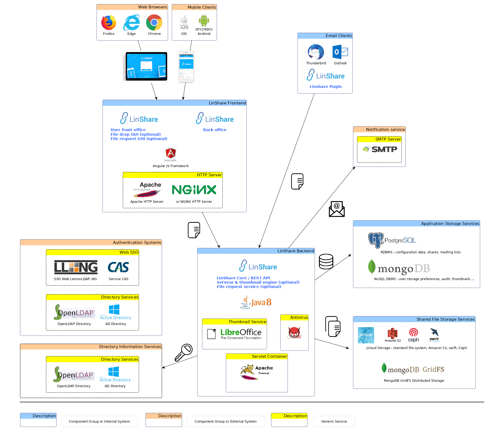
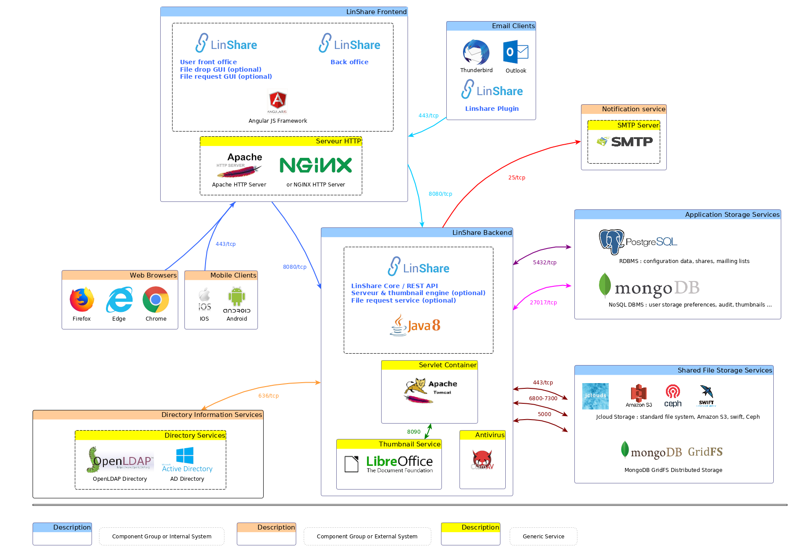

# Exploitation and Administration

   * [Architecture & Plateform](#aap)
       * [Systeme Requirements](#sr)
       * [Global Architecture](#ga)
       * [Components, Services and Logs](#csal)
       * [Network Architecture](#na)
   * [System Configuration](#sc)
       * [System Settings](#ss)
           * [Java](#ssj)
           * [PostgreSQL](#sssgbd1)
           * [MongoDB](#sssgbd2)
           * [Tomcat](#sst)
           * [Web Server : apache or nginx](#ssws)
           * [Parefeu](#fw)
       * [Application Settings](#as)
           * [Session Live Time](#sd)
           * [LinShare Skin (Theming)](#ls)
           * [Java properties file](#jpf)
           * [log4j properties file (only CentOS)](#jl4jpf)
   * [Management & Exploitation](#mae)
       * [Maintenance Mode](#mm)
       * [Services & Components](#sac)
           * [Start, Check and Stop a Service](#scss)
           * [File Utilization & Services](#fuas)
       * [Queries & Statistics](#qas)
           * [Plateform Statistics](#ps)
           * [User Statistics](#us)
   * [Application Updates](#au)

## <a name="aap">Architecture & Plateform</a>

### <a name="sr">Systeme Requirements</a>

>Note :<br/>
The version suffix `+` means that the application is compatible with any higher version. Otherwise, the application is only compatible with the specified version.

| Description | Value |
| ---------- | ------- |
| Arch. | x64/x86 |
| CPU | ? |
| RAM | ? |
| Disk Space | 1 GB for the application + as much space as necessary for the files |
| OS | Linux CentOS 7+ or Debian 8+ |
| Kernel | 3.10+ (CentOS) |

#### Dependencies :

| Dependency | Version |
| ---------- | ------- |
| Java (openjdk) | 8 (linshare 2.0 to 2.3) or 11 (from linshare 2.4) |
| PostgreSQL | 9.2.24+ |
| MongoDB | 3.2.22+ |
| apache | 2.4.6+ |
| tomcat | 7 (CentOS) / tomcat 8 (Debian) |
| libreoffice | 6.2 |

### <a name="ga">Global Architecture</a>



### <a name="csal">Services, Components and Logs</a>

The LinShare application consists in several components; each component is matching a service. Being able to manage those services and analysing the logs helps to quickly troubleshoot issues.

This table gives an overview of all the services that are used by the LinShare application.

| Component | Service | Configuration file | Log file |
| --------------- |:-------------|------------|:---------------:|
| Servlets Container | tomcat8 (Debian) | /var/lib/tomcat8/conf/catalina.properties | /var/log/tomcat8/catalina.out |
| | tomcat (CentOS) | /etc/httpd/conf.d/ | /var/log/tomcat/catalina.out |
| Web Server | apache2 (Debian) | /etc/apache2/sites-available/ | /var/log/apache2/linshare* |
| | httpd (CentOS) | /usr/share/tomcat/conf/catalina.properties | /var/log/httpd/linshare* |
| PostgreSQL | postgresql | /var/lib/pgsql/data/pg_hba.conf | /var/lib/pgsql/data/pg_log/ |
| MongoDB | mongod | /etc/mongod.conf | /var/log/mongodb/mongod.log |
| Thumbnail engine | linshare-thumbnail-server | /etc/linshare/linshare-thumbnail-server.yml | /var/log/thumbnail-server.log |

>Note :<br/>
See the appropriate section [Services & Components](#sac) for the way to start, stop, see the status of any service.

### <a name="na">Network Architecture</a>

| Port | Transport | Service/Component | Protocol | Description |
| ---- | --------- | ----------------- | --------- | ----------- |
| 25 | tcp | postfix | SMTP | Outgoing mail server |
| 636 | tcp | slapd | LDAPS | Directory services |
| 443 | tcp | httpd or apache2 / nginx | HTTPS | Client interface (web browser or email client extension) with LinShare font-end |
| 8080 | tcp | tomcat8 or tomcat | HTTP | Interface between LinShare front-end and back-end |
| 8005 | tcp | tomcat8 or tomcat | AJP | Tomcat `Shutdown` port |
| 8009 | tcp | tomcat8 or tomcat | AJP | Internal Tomcat management interface to manage application servlets |
| 443 / 6800->7300 / 500 | tcp | jCloud Storage | HTTPS | Optional Storage : Amazon S3 / ceph / swift |
| 5432 | tcp | postgresql | PostgreSQL Wire Protocol | PostgreSQL connection socket |
| 27017 | tcp | mongod | MongoDB Wire Protocol | MongoDB connection socket |
| 8090 | udp | linshare-thumbnail-server | ? | libreoffice thumbnail socket (optional) |



## <a name="sc">System Configuration</a>

### <a name="ss">System Settings</a>

#### <a name="ssj">Java</a>

See the installation process dedicated to this configuration : [CentOS](../installation/linshare-install-centos.md#openjdk-java-jre-installation) or [Debian](../installation/linshare-install-debian.md#openjdk-java-jre-installation).

#### <a name="sssgbd1">PostgreSQL</a>

See the installation process dedicated to this configuration : [CentOS](../installation/linshare-install-centos.md#postgresql-installation) or [Debian](../installation/linshare-install-debian.md#postgresql-installation).

#### <a name="sssgbd2">MongoDB</a>

See the installation process dedicated to this configuration : [CentOS](../installation/linshare-install-centos.md#mongodb-installation) or [Debian](../installation/linshare-install-debian.md#mongodb-installation).

#### <a name="sst">Tomcat</a>

See the installation process dedicated to this configuration : [CentOS](../installation/linshare-install-centos.md#tomcat-installation) or [Debian](../installation/linshare-install-debian.md#tomcat-installation).

#### <a name="ssws">Web Server</a>

See the installation process dedicated to the Apache configuration : [CentOS](../installation/linshare-install-centos.md#web-server-installation) or [Debian](../installation/linshare-install-debian.md#web-server-installation).

>Note:<br/>Nginx configuration is not part of this documentation.

#### <a name="fw">Firewall</a>

See the installation process dedicated to the `firewalld` configuration : [CentOS](../installation/linshare-install-centos.md#firewall-configuration).

### <a name="as">Application Settings</a>

#### <a name="sd">Session Live Time</a>

This configuration can be changed in the following file:
- Debian : `/usr/local/tomcat/conf/web.xml`
- CentOS : `/etc/tomcat/web.xml`

Replace by the desired value (time is in minutes!)
```xml
    <session-config>
        <session-timeout>1</session-timeout>
    </session-config>
```

Save the file and restart tomcat:
On Debian:
```bash
service tomcat8 reload
```
On CentOS:
```bash
systemctl reload tomcat
```

#### <a name="ls">LinShare Skin (Theming)</a>

LinShare contains a list of preformatted themes :
* default : a blue theme
* darkgreen
* red


> Note:<br />
It is possible to create your own theme. Please see [creating_a_theme_for_linshare](../development/linshare-ui-user/creating_a_theme_for_linshare.md) for more details.

To switch between themes, it is necessary to define a redirection rule for the css theme file : it has to be done at the web server level (Apache or nginx), but only for the front-office.
The Apache configuration file to edit is in:
* `/etc/httpd/conf.d/linshare-ui-user.conf` on CentOS
* `/etc/apache2/sites-available/linshare-ui-user.conf` on Debian.

The following example shows an Apache redirection. The Apache configuration was taken from a standard configuration (see the appropriate installation page : [CentOS](../installation/linshare-install-centos.md#ui-user) or [Debian](../installation/linshare-install-debian.md#ui-user)).
Here is a full Apache configuration example for the LinShare front-office, in order to get the `red` theme:

```xml
<VirtualHost *:80>
...
ServerName linshare-user.local
...
<Directory /var/www/linshare-ui-user/styles>
    RewriteEngine On
    RewriteRule "theme\.default\.(.*)\.css$" theme.red.$1.css
</Directory>
...
</Virtualhost>
```

> Warning:<br />
Never manually edit the `stylesheet` reference in the file `linshare-ui-user/index.html`. Indeed, the file suffix name will change at each new LinShare version.

> Note:<br>
For Docker images, there is an environment variable to set for overriding the theme: `LINSHARE_THEME`. This variable can take one of those values: `default`, `darkgreen`, `red`, or any other installed theme name.

##### Advanced theming
In the config/config.js file, you also have the possibility to override some images:
```js
// To override the application logo set the url of the image corresponding to the sizes (small 155x29 and big 500x192)
applicationLogo : {
      small : 'images/common/linshare-logo-white.png',
      large : 'images/ls-logo-big.png'
},

// To override the background image of the login screen set the url of the image
loginBackground : 'images/bg-linshare-desktop.png',

```

#### <a name="jpf">Java properties file</a>

Please refer to the [dedicated page](./configuration-administration.md).

#### <a name="jl4jpf">log4j properties file (only CentOS)</a>

> Warning:<br/>
This section only applies to CentOS, since Debian is using `logrotate`.

LinShare is using the Java-based logging utility `log4j 2` **for CentOS**. Its configuration is located in the file `/etc/linshare/log4j.properties`.

##### Log levels

The utility `log4j 2` defines the built-in log levels and messages, in decreasing order of severity :

| Level | Description |
| ------ | ----------- |
| OFF | No logging. |
| FATAL | Severe errors that cause premature termination. |
| ERROR | Other runtime errors or unexpected conditions. |
| WARN |  Use of deprecated APIs, poor use of API, other runtime situations that are undesirable or unexpected, but not necessarily wrong. |
| INFO | Interesting runtime events (startup/shutdown). |
| DEBUG | Detailed information on the flow through the system. Everything that is logged in LinShare is visible at this verbosity level.  |
| TRACE | Most detailed information (not used, equivalent to `DEBUG` for LinShare). |

>Note:<br/>By default, the application is provided with `INFO` as log level. It can be necessary to switch to the `DEBUG` lebel in order to get more details about the debugging for example.

This setting is available under `log4j.rootCategory` in the configuration file `/etc/linshare/log4j.properties` :

```java
log4j.rootCategory=INFO, LINSHARE
```

>Note:<br/>The second element of the setting `log4j.rootCategory` stands for a `Logger`, which means a log message destination. Each `Logger` is independently configurable as to what level of logging it currently logs. Usually, one `Logger` is used for each Java application : which is the case for LinShare : its name is therefore `LINSHARE`. It is recognized by the Java application and shall therefore not be edited.

##### Destinations

`Appenders` are responsible for delivering LogEvents to their destination. There are several types, each type having its own specific settings. Here is the list of the most popular `Appenders` :

| Type | Description |
| ---- | ----------- |
| ConsoleAppender | Writes logs into the Java console : `System.out` (standard output: by default if not specified) or `System.err` (standard error). |
| RollingFileAppender | Writes logs into the specified file. It rolls the file over according to a defined file size as well as a number of files to split the logs. |
| DailyRollingFileAppender | Writes logs into the specified file. It rolls the file over according to a defined timeslot. This is what is used by default in LinShare. |
| JDBCAppender | Writes logs into a buffer which will then send them into a SQL database. |

`Appender` type is defined throw the setting `log4j.appender.LINSHARE` in the LinShare configuration file `/etc/linshare/log4j.properties` :
```java
log4j.appender.LINSHARE=org.apache.log4j.DailyRollingFileAppender
```
>Note:<br/>To get to know more about the available `Appenders`, please refer to the [official log4j documentation](https://logging.apache.org/log4j/2.x/manual/appenders.html).

The `Appender` `DailyRollingFileAppender` is used by default in LinShare, and provides settings to configure :
* Absolute path to the log file
* Append (by default) / Overwrite logs (rarely usefull)
* Encoding
* Rotating log period
* Customize logging format.
All these settings can be respectively found in the LinShare configuration file `/etc/linshare/log4j.properties` :
```java
log4j.appender.LINSHARE.File=/var/log/tomcat/linshare.log
log4j.appender.LINSHARE.Append=true
log4j.appender.LINSHARE.Encoding=UTF-8
log4j.appender.LINSHARE.DatePattern='.'yyyy-MM-dd'.log'
log4j.appender.LINSHARE.layout = org.apache.log4j.PatternLayout
log4j.appender.LINSHARE.layout.ConversionPattern=[%p]:%t:%d{yyyyMMdd.HHmmss}:%c:%M:%m%n
log4j.appender.CONSOLE=org.apache.log4j.ConsoleAppender
log4j.appender.CONSOLE.layout=org.apache.log4j.PatternLayout
log4j.appender.CONSOLE.layout.ConversionPattern=[%p]:%t:%d{yyyyMMdd.HHmmss}:%c:%M:%m%n
```

##### Log Rotation

The setting `log4j.appender.LINSHARE.DatePattern` can be used to define the log rotation period. By default, it is defined at midnight every day. Is is possible to define other periods. Here are some examples of possible configurations :

| DatePattern | Description |
| ----------- | ----------- |
| `'.'yyyy-MM` | Log rotation at the beginning of each mounth. |
| `'.'yyyy-ww` | Log rotation the first day of the week (depends on localization parameters). |
| `'.'yyyy-MM-dd` | Log rotation every day at midnight. |
| `'.'yyyy-MM-dd-a` | Log rotation twice a day : midnight and midday. |
| `'.'yyyy-MM-dd-HH` | Log rotation every hour. |
| `'.'yyyy-MM-dd-HH-mm` | Log rotation every minute. |

##### Other settings

There are other framework development specific settings in `/etc/linshare/log4j.properties` : see the file for more details.

## <a name="mae">Management & Exploitation</a>

### <a name="mm">Maintenance Mode</a>

Maintenance Mode allows the LinShare administrator to block any further LinShare file uploads.
>Note:<br/>Interface user access is not affected.

Maintenance mode's target is at domain level.

For more details, [see the dedicated page](../../FR/administration/linshare-admin.md#configuration-du-quota-des-domaines) [`FR`].

### <a name="sac">Services & Components</a>

For the services & components list (name, description, path to the configuration files, logs, etc.), see [above](#csal).
>Note:<br/>This section only describes the exploitation tasks in general. Commands are listed with the `<service>` term, as being the service name to replace for each case.

#### <a name="scss">Start, Check and Stop a Service</a>

##### Debian:
```bash
service <service> start
service <service> status
service <service> stop
```
##### CentOS:
```bash
systemctl start <service>
systemctl status <service>
systemctl stop <service>
```
>Status return example with the mongod service:
```bash
systemctl status mongod
● mongod.service - SYSV: Mongo is a scalable, document-oriented database.
   Loaded: loaded (/etc/rc.d/init.d/mongod; bad; vendor preset: disabled)
   Active: active (running) since Mon 2019-09-16 18:24:18 CEST; 2s ago
     Docs: man:systemd-sysv-generator(8)
  Process: 2641 ExecStop=/etc/rc.d/init.d/mongod stop (code=exited, status=0/SUCCESS)
  Process: 2666 ExecStart=/etc/rc.d/init.d/mongod start (code=exited, status=0/SUCCESS)
   CGroup: /system.slice/mongod.service
           └─2681 /usr/bin/mongod -f /etc/mongod.conf

Sep 16 18:24:18 linshare-linagora systemd[1]: Starting SYSV: Mongo is a scalable, document-oriented database....
Sep 16 18:24:18 linshare-linagora runuser[2677]: pam_unix(runuser:session): session opened for user mongod by (uid=0)
Sep 16 18:24:18 linshare-linagora mongod[2666]: Starting mongod: [  OK  ]
Sep 16 18:24:18 linshare-linagora systemd[1]: Started SYSV: Mongo is a scalable, document-oriented database..
```
The term `active` confirms that the mongod service has been succesfully started.

#### <a name="fuas">File Utilization & Services</a>

This section shows how to list all the files that are used (open for reading, writing, execution) by a service, or a command in general. Several processes may depend on a same service and/or several instances of a process may exist.

##### Processes that depend on a same service

```bash
lsof -p $(ps -e -o pid,unit | grep <service>.service | grep -v grep | awk '{print $1}' | tr '\n' ',' | sed -r 's/,$//g')
```

##### Processes that don't depend on a service

```bash
lsof -p $(ps -e -o pid,cmd | grep <cmd name> | grep -v grep | awk '{print $1}' | tr '\n' ',' | sed -r 's/,$//g')
```

### <a name="qas">Queries & Statistics</a>

> Warning:<br>
This section has been tested with version 2.3.0 of LinShare. It is possible that some SQL queries have to be adapted pour higher versions of LinShare.

From a Linux shell, under the `root` user, type in the different commands, in order to access the SQL interpreter :
```bash
[root@linshare-linagora /]# su - postgres
Last login: Wed Sep 18 16:11:27 CEST 2019 on pts/0
-bash-4.2$ psql -d linshare
psql (9.2.24)
Type "help" for help.

linshare=#
```

At the end of the operation, the following commands can be used in order to go back to the initial Linux shell :
```bash
linshare=# \q
-bash-4.2$ exit
logout
[root@linshare-linagora /]# 
```

#### <a name="ps">Plateform Statistics</a>

##### Number of documents

```sql
select count(*) from document;
```

##### Size sum of all documents

```sql
select sum(ls_size) from document;
```
>Warning:<br/>
This sum represents the virtual size used by those documents. Indeed, the component in charge of the document storage is making a data deduplication of those files.

##### The top 10 biggest files

```sql
select * from document order by ls_size desc limit 10;
```

##### Number of users having at least shared a document

```sql
select count(distinct mail) from users as u join log_entry as l on u.mail = l.actor_mail where log_action = 'FILE_SHARE_WITH_ALERT_FOR_USD' or log_action = 'FILE_SHARE' ;
```

#### <a name="us">User statistics</a>

The string <EMAIL> stands for the email address of the target user.

##### Number of documents

```sql
select count(*) from entry as e join document_entry as d on e.id = d.entry_id join users as u on u.account_id = e.owner_id where mail = '<EMAIL>';
```

##### Size sum of all documents

```sql
select sum(ls_size) from entry as e join document_entry as d on e.id = d.entry_id join users as u on u.account_id = e.owner_id where mail='<EMAIL>';
```
>Warning:<br/>
This sum represents the virtual size used by those documents. Indeed, the component in charge of the document storage is making a data deduplication of those files.

##### Number of shared documents

```sql
select count(*) from entry as e join document_entry as d on e.id = d.entry_id  join users as u on u.account_id =  e.owner_id where shared >= 1 and mail = '<EMAIL>';
```

## <a name="au">Application Updates</a>

See the [pages dedicated to the update](../upgrade).
