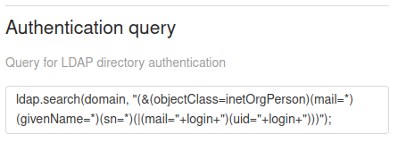
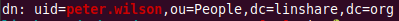

##  How to login into LinShare without email

#### 1) Introduction

LinShare is configured by default to accept only emails while login.  
The aim of this documentation is to give you the keys in order to configure that.


#### 2) Configuration

The configuration handling this property is in the `linshare-ui-user` component,  
in the `linshare-ui-user/config/config.js` file:

```
...
      loginWithMailOnly: true,
...
```

you just have to change its value to `false`. 

Then LinShare users will be able to login without email (`peter.wilson` instead of `peter.wilson@linshare.org`).  
The value used in order to authenticate a user comes from the `uid` field in the LDAP filter configuration.  



Here is the LDAP record corresponding to the previous example:


