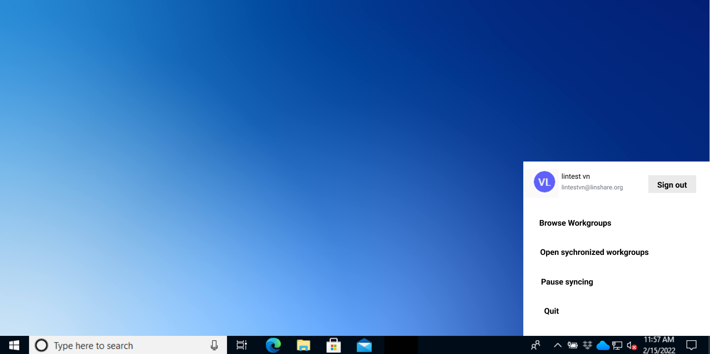
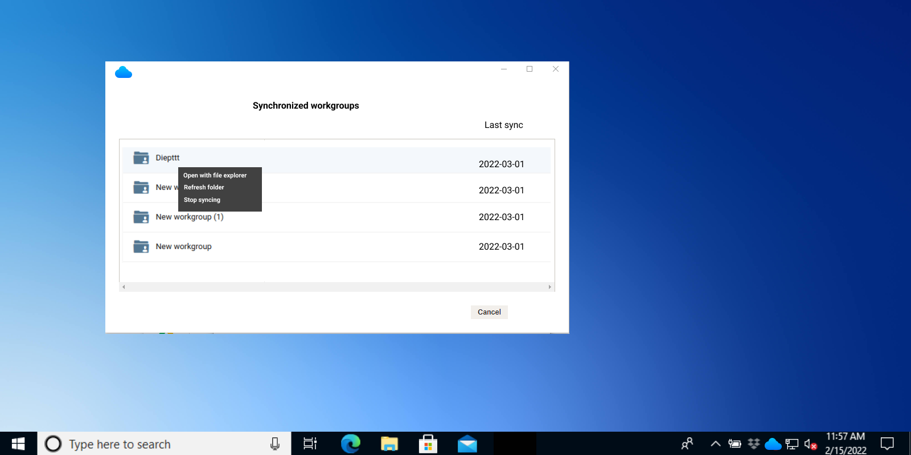

# Summary

* [Related EPIC](#related-epic)
* [Definition](#definition)
* [UI Design](#ui-design)
* [Misc](#misc)

## Related EPIC

* [Desktop synchronization client](./README.md)

## Definition

#### Preconditions

- Given that I have installed LinShare desktop app in my computer
- I have a LinShare account and log-in successfully to LinShare desktop app

#### Description

- When I click on LinShare icon LinShare at the bottom right or top right, I can see a menu and I select option: Open sychronized workgroups
- The screen listing synchronized workgroups will be opened
- on this screen, I can see all the workgroups which are currently synchronized in this computer with the last sync date 
- When I right-click on one workgroup, I can see a menu with options: 
   - Open with file browser: When I select this option, the synchronized workgroup will be opened with the file browser
   - Synchronize Workgroup: When I select this option, the synchronization of this Workgroup will be trigger immediately except if there is already a synchronization task running in background (auto or manual) . I can see the status symbol when syncing is in process and completed
   - Stop syncing: When I select this option, there will be a confirmation message:" The synchronization link of this workgroup will be removed in this computer. It will still be available on the web and other devices." 
      - If I choose Yes, the synchronization link  of this workgroup will be stopped. Now when I open screen Browse workgroup, I can see this workgroup is available to synchronize

#### Postconditions

[Back to Summary](#summary)

## UI Design

#### Mockups

#### Final design

[Back to Summary](#summary)

## Misc

[Back to Summary](#summary)

