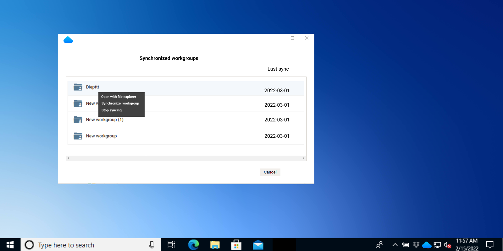
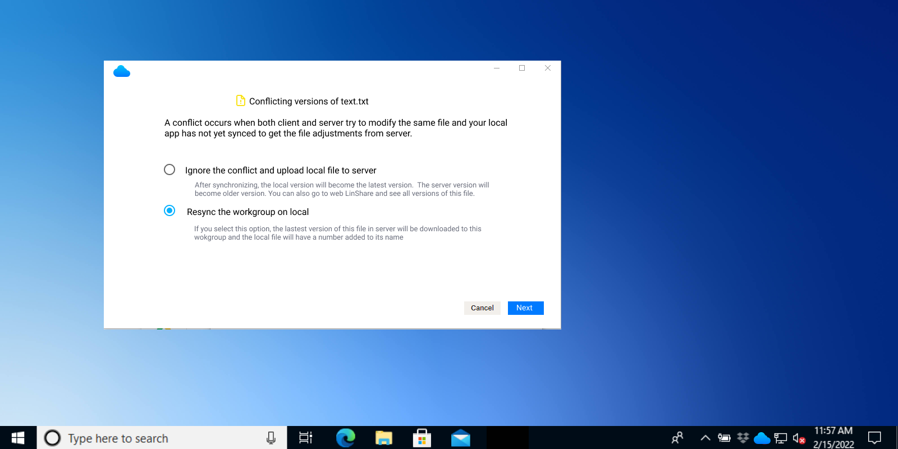

# Summary

* [Related EPIC](#related-epic)
* [Definition](#definition)
* [UI Design](#ui-design)
* [Misc](#misc)

## Related EPIC

* [Desktop synchronization client](./README.md)

## Definition

#### Preconditions

- Given that I have installed LinShare desktop app in my computer
- Given that I had LinShare account and have synchronized workgroups on my computer 

#### Description

- After login successfully to LinShare desktop app, I am redirected automatically to screen: "Synchronized Workgoups"
- Or I can click on LinShare icon at the top or bottom right of screen (depending on OS) and select option "Open synchronized workgroups" 
- I right-click on a workgroup and select option: "Open with file explorer", then the synchronized workgroup will be opened.

**UC1. Adding file to the synchronized workgroup**

- I can add files to synchronized workgroup as normally in file system of my computer: Create a file directly in the folder, Copy/move files from another place, Drag/Drop files...
- After file(s) is added, It will be synchronized to the server in 3 ways:
   - 1. Automatically: There will be a synchronization task running in background every hour. This task will update all the changes of the client in that 1 hour app to the server. 
   - 2. Manually: I can right-click on the synchronized workgroup and select option :" Synchronize Workgroup": The synchronization of this Workgroup will be trigger immediately except if there is already a synchronization task running in background (auto or manual) . I can see the status symbol when syncing is in process and completed
   - 3. When I start the app on my computer, the synchronization of all workgroups will be trigger. 
- When a file has more than one version on the web, the client app only get the latest version. 
- When a new file is added on local and it has same name with a file on web, there will be a notification for user that it will become the latest version of that file 

**UC2. Edit a file in synchronized workgroup**

- I can open a file on my synchronized workgroup on my computer and edit then save that file with the same name as original 
- When the workgroup is synchronized (automatically or mannually), the system will validate: 
   - If the updated file in local is not updated on server, it will be synchronized to the server as the latest version. 
   - If there is a conflict between local and server:  
      - A conflict occurs when both client and server try to modify the same file at the same time. When client uploads file to the server, it will recognize that the server version has also changed.
      - In this case, there will be a notification message, user can select 1 of these options and click button Next 
         - Ignore the conflict and upload local file to server: After synchronizing, the local version will become the latest version. The server version will become older version. You can also go to web LinShare and see all versions of this file.
         - Resync the workgroup on local: If you select this option, the latest version of this file in server will be downloaded to this workgroup and the local file will have a number added to its name
      - If I click button Cancel, the synchronization of this workgroup will be canceled.

**UC3. Adding folder to the synchronized workgroup**

- I can add folder to synchronized workgroup as normally in file system of my computer: Create a new folder directly in the synchronized workgroup , Copy/move folder from another place, Drag/Drop folder 
- After folder is added, It will be synchronized to the server in 3 ways:
  - 1. Automatically: There will be a synchronization task running in background every hour. This task will update all the changes of the client in that 1 hour app to the server.
  - 2. Manually: I can right-click on the synchronized workgroup and select option :" Synchronize Workgroup": The synchronization of this Workgroup will be trigger immediately except if there is already a synchronization task running in background (auto or manual) . I can see the status symbol when syncing is in process and completed
  - 3. When I start the app on my computer, the synchronization of all workgroups will be trigger.
  
#### Postconditions

- After the synchronization has been completed, I can see the new file/folder is added to the corresponding workgroup on the web
- On the other side, If there is a new file/Folder is added to the workgroup on web, it will be updated in my synchronized workgroup in my computer.

[Back to Summary](#summary)

## UI Design

#### Mockups

#### Final design

[Back to Summary](#summary)

## Misc

[Back to Summary](#summary)

