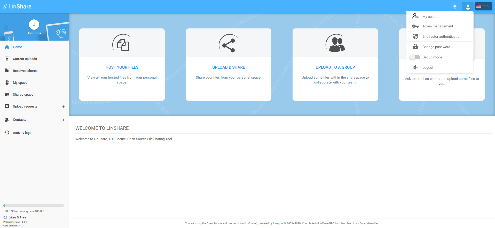

# Summary

* [Related EPIC](#related-epic)
* [Definition](#definition)
* [UI Design](#ui-design)
* [Misc](#misc)

## Related EPIC

* [Name of the epic](./README.md)

## Definition

#### Preconditions

- Given that I am a LinShare user
- After log-in successfully, I click on human icon and see a list of option
- I select the first option "My account", a new screen will be displayed.

#### Description

**UC1. Internal user can see My account screen**
- On My account screen, I can see section Profile with following information:
    - First name: Plain-text 
    - Last name : Plain-text
    - Email: Plain-text
    - Creation date: Plain-text
    - Modification date: Plain-text
    - Notification language: A drop-down list with options: English/French/Russian
- When I select another language, there will be a toast message: "You have been selected [language] as notification language"

**UC2. Guest can see My account screen**
- On My account screen, I can see 2 sections:
- Profile with following information:
    - First name: Plain-text
    - Last name : Plain-text
    - Email: Plain-text
    - Owner: Plain-text. Displays Full name - email address of my guest account's creator. 
    - Creation date: Plain-text
    - Modification date: Plain-text
    - Expiration date: Plain-text . This date is set by the owner can be changed by the owner.
    - Notification language: A drop-down list with options: English/French/Russian
    - When I select another language, there will be a toast message: "You have been selected [language] as notification language"
- Restricted contact list:
    - When the owner enables Restricted contact for my guest account, The rule is defined in story 2. Guest account can view restricted contact list
    - When restricted contact is disabled, this section is hidden.

#### Post-conditions

[Back to Summary](#summary)

## UI Design

#### Mockups

#### Final design

[Back to Summary](#summary)

## Misc

[Back to Summary](#summary)