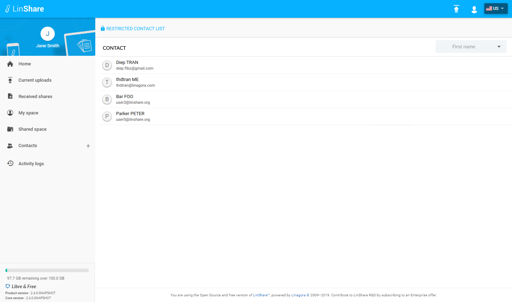

# Summary

* [Related EPIC](#related-epic)
* [Definition](#definition)
* [Screenshots](#screenshots)
* [Misc](#misc)

## Related EPIC

* [Name of the epic](./README.md)

## Definition

#### Preconditions

- Given that i am a guest from LinShare 
- Given that the author of the guest has enabled the Restricted Contact List for guest account.
#### Description

- when i log-in to LinShare, I click on Human icon on the top right of screen and see the option Restricted Contact List
- I click on this option and screen Restricted Contact List will be shown 
- In new view, i can see the list of contacts that the guest creator has assigned for me 
- Each contact contain Fist name - Last name an email. 
- I can sort the list by First name, Last name or Email 
- Default sort is First name 
#### Postconditions

- I can not edit or delete any contact in  Restricted contact list 
- The resticted contacts will be shown when i execute an action that contains Auto-complete popup (share...).
- If the guest creator edit the restricted contact list for my guest account, my Restricted contact list will be updated too.
- If the guest creator disable the function "Restricted contact" for my guest account, the option Restricted Contact List is also hidden from the option list when i click Human icon on top right. 

[Back to Summary](#summary)

## UI Design

#### Mockups

#### Final design

[Back to Summary](#summary)
## Misc

[Back to Summary](#summary)

