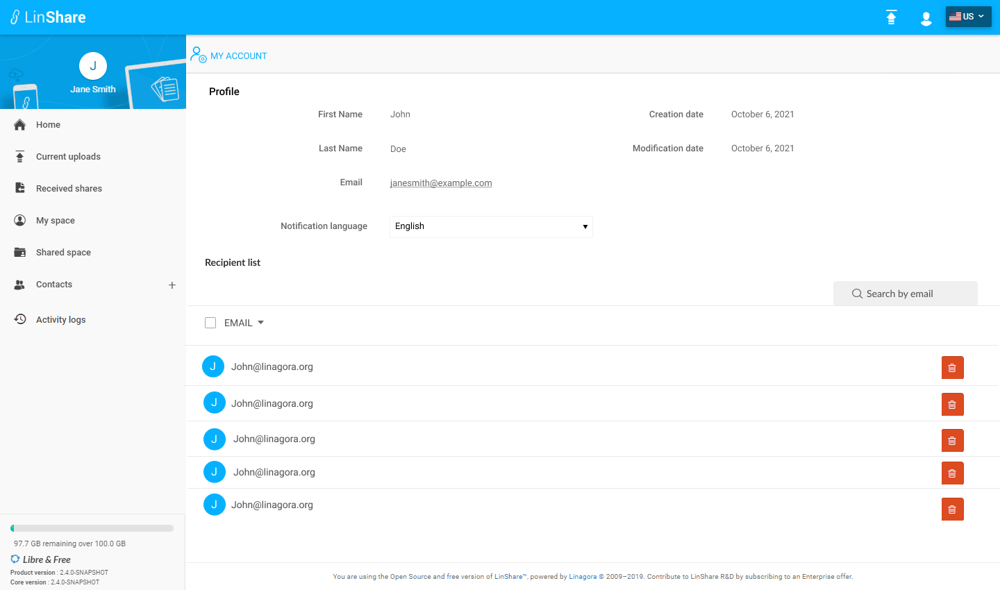

# Summary

* [Related EPIC](#related-epic)
* [Definition](#definition)
* [UI Design](#ui-design)
* [Misc](#misc)

## Related EPIC

* [Name of the epic](./README.md)

## Definition

#### Preconditions

- Given that I am a LinShare user (internal or guest)
- After log-in successfully, I click on human icon and see a list of option
- I select the first option "My account", a new screen will be displayed.

#### Description

- On My account screen:
   - As an internal user, I can only see "Favorite Recipient list"
   - As a guest, I can see "Favorite Recipient list" and "Restricted contact list"
- On this list, I can see a list of recipients who I have shared documents with.
- I can click on arrow in column title "Email" to sort ascending or descending 
- I can click on Delete button of an email, there will be a confirmation message. If I choose Yes, the email will be removed 
- I can delete multiple items by  selecting checkbox beside each email or click checkbox on the collum title "Email" and click button Delete 
- I can input in field " Search by email " then click Enter to see the result.

#### Post-conditions

- On sharing form, when I start to input some character in the field Recipient, I can see suggestion of recipient from this list if it matched 
- When I shared document with a new email successfully, it will be added to this list with expiration date = current date + expiration period (managed by admin)
- When an email in this list expires, it is removed from the list and user cannot see it in auto-completion fields.

[Back to Summary](#summary)

## UI Design

#### Mockups

#### Final design

[Back to Summary](#summary)

## Misc

[Back to Summary](#summary)