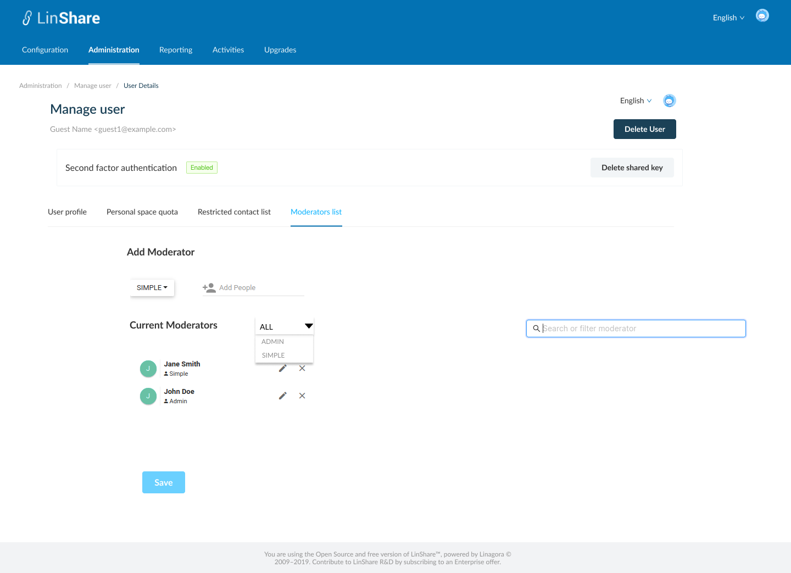

# Summary

* [Related EPIC](#related-epic)
* [Definition](#definition)
* [UI Design](#ui-design)
* [Misc](#misc)

## Related EPIC

* [Guests](./README.md)

## Definition

#### Preconditions

- Given that I am a LinShare root admin or nested admin 
- I logged-in LinShare Admin portal successfully and select menu tab :"Administration" then select user list
- In the user list, I click in a guest user, the Manage user page will be opened.

#### Description

- On Guest details screen, there are 4 tabs:
   - User profile
   - Personal space quota
   - Restricted contact list
   - Moderator list 
- In Moderators list tab, I can see the current Moderators list of that guest
- On moderator list, I can see a filter "Role" with the default option is "All"
- When I click on this filter, there wil be a drop-down list with options: All/Simple/Admin
- If I select one role and click enter, the system will display the moderators with selected role
- I can type in search bar to search moderators by email/first name/ Last name.

**UC1. Add a Moderator**

- To add a moderator for this guest, I need to:
   - Select moderator's role from the drop-down list with options: Simple or Admin. 
   - Add people: After select a role, I need to input a user in this field (I can select from suggestion list). It can only be an internal LinShare user (not guest account).
- Then The selected user will be added to the moderator list below with selected role. 

**UC2. Delete an moderator**

-To delete a moderator, I click on "x" icon of the moderator then the moderator will be removed from the list

**UC3. Edit a moderator**

- I can change the moderator's role by clicking on Edit icon of the moderator, then the roles drop-down list will be opened.
- I can select new role for the moderator: Admin or Simple
- Then the drop-down list is closed and the moderator is updated with new role

#### Postconditions

- Only when I click button Save, all updates above are saved to that guest.
- When a user is added as a moderator with admin role , he can edit a guest's information, add or remove moderator or Delete that guest.
- When a user is added as a moderator with simple role, he can edit guest's information and cannot add/remove moderator or Delete that guest
- When a moderator is removed, he only has Read right to that guest.

[Back to Summary](#summary)

## UI Design

#### Mockups

#### Final design

[Back to Summary](#summary)
## Misc

[Back to Summary](#summary)
