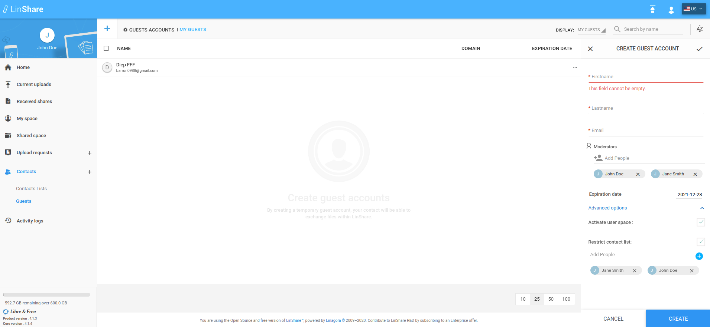

# Summary

* [Related EPIC](#related-epic)
* [Definition](#definition)
* [Screenshots](#screenshots)
* [Misc](#misc)

## Related EPIC

* [Sharing file](./README.md)

## Definition

#### Preconditions

- Given that I am a LinShare user and I logged-in LinShare successfully

#### Description

- From menu, I go to Contacts => Guests
- I click on Create guest button, the guest creating form will be shown
- I can see a new field: "Moderators" and I am automatically added as a moderators.
- On Add people field, I type some characters then there will be a suggestion list. This list only contains internal users 
- If there is no match, the message "Unknown user" will be shown
- I select a user from suggestion, it is added to the moderators list below
- I can see a button "Add" on field "Add people"
- When I hover this button, I can see an explanation: "Add moderators as restricted contacts"
- If I click this button, all moderators above will be added to restricted contact list
- If moderators list is blank, the field will be highlighted in red and there will be an error message below: "This field requires at least one contact"
- I can continue input other fields as normal and click Create button

#### Postconditions

- I can remove users from moderator list by clicking icon "x" in each contact 
- I can add someone to the restricted contact list which won't be a moderator
- After adding all moderators as restricted contact, I can remove some of them from the restricted contact list. 
- The information of Guest owner is still kept in Guest detail 
- When I am added as a moderator of a guest, I can the that guest on my Guest list. 

[Back to Summary](#summary)

## UI Design

#### Mockups

#### Final design

[Back to Summary](#summary)
## Misc

[Back to Summary](#summary)
