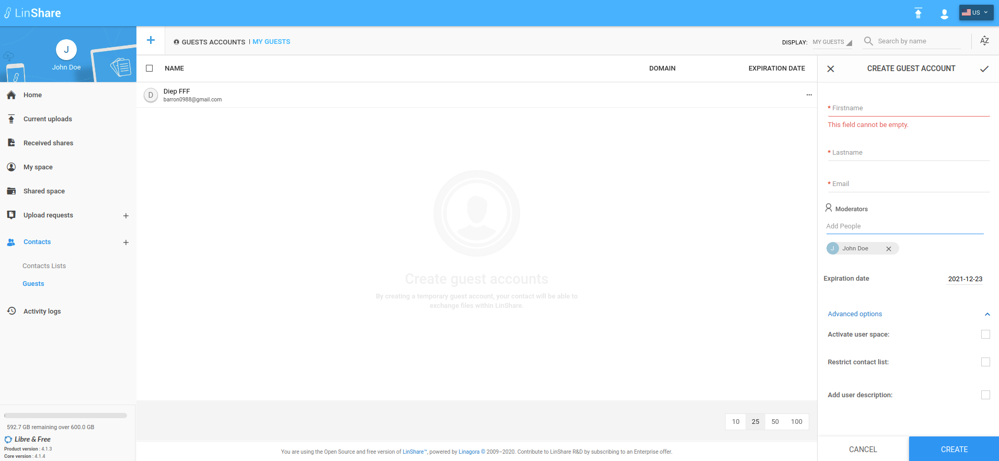
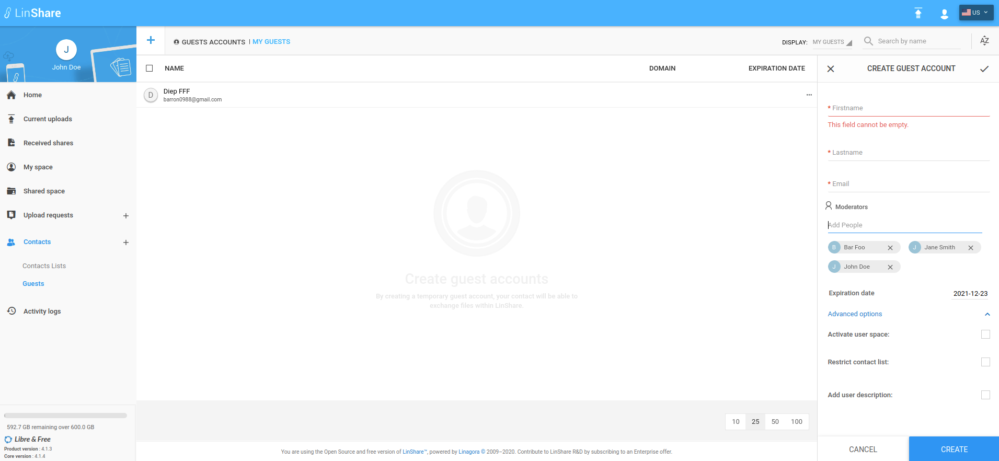

# Summary

* [Related EPIC](#related-epic)
* [Definition](#definition)
* [UI Design](#ui-design)
* [Misc](#misc)

## Related EPIC

* [Guests](./README.md)

## Definition

#### Preconditions

- Given that I am a LinShare user and I logged-in LinShare successfully

#### Description

- From menu, I go to Contacts => Guests
- I click on Create guest button, the guest creating form will be shown
- I can see a new field:"Moderators", including a drop-down list and "Add people" field
   - I can select roles from the drop-down list: Admin or simple
   - Then in Add people field, I type some characters then there will be a suggestion list. This list only contains internal users 
   - If there is no match, the message "Unknown user" will be shown
   - I select a user from suggestion, it is added to the moderator list below
- I am automatically added as guest's admin moderator.
- If I enable option: "Restricted contact" list, the field "Add people" to restricted contact list is displayed.
- The guest's author (me) is automatically added as restricted contact. 
- I can see a button "cross" on field "Add people"
- When I hover this button, I can see an explanation: "Add moderator list as restricted contacts"
- If I click this button, all  moderators above will be added to restricted contact list
- I can continue input other fields as normal and click Create button

#### Postconditions

- There are 3 roles to a guest: Guest' admin moderator, guest's simple moderator and guest's reader. Every LinShare user has one of these roles to a guest. If a user is not added as a moderator to a guest, he is automatically has "Guest's Reader" role.
- I can remove users from controller list by clicking icon "x" in each contact 
- I can change the role of each user in moderator list by click on edit icon then select role admin/simple from the drop-down list
- I can add someone to the restricted contact list which is not a moderator 
- After adding all moderators as restricted contact, I can remove some of them from the restricted contact list. 
- The information of Guest owner is still kept in Guest detail
- When an user is added as moderator of a guest (except the guest author), the moderator will receive an email notification with information:
  - Guest's email and full name
  - Date of guest creation
  - Moderator Right to that new guest (simple or admin)
  - Full name and email of the person who added you as moderator 
  - And a button link to that guest detail panel.

[Back to Summary](#summary)

## UI Design

#### Mockups

#### Final design

[Back to Summary](#summary)
## Misc

[Back to Summary](#summary)
