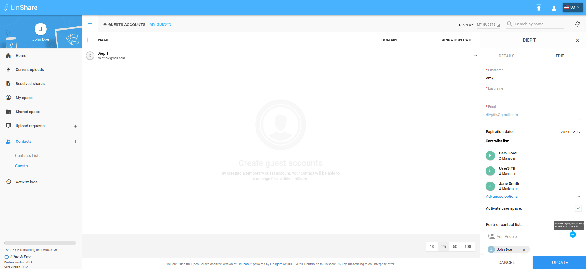
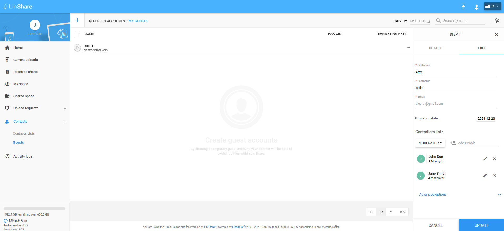
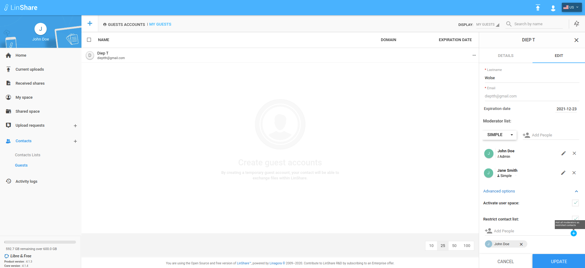

# Summary

* [Related EPIC](#related-epic)
* [Definition](#definition)
* [UI Design](#ui-design)
* [Misc](#misc)

## Related EPIC

* [Guests](./README.md)

## Definition

#### Preconditions

- Given that I am a LinShare user and I logged-in LinShare successfully

#### Description

- From menu, I go to Contacts => Guests
- I can see all guests in my domain

**UC1. Edit a guest as simple moderator** 

- If I am simple moderator of the guest, When I click on three-dot button, I can see options: Detail, Edit
- I select option Edit, then the Edit guest form will be opened. [Screen1](#screen-1)
- I can edit fields:
   - First name: A text field, mandatory. If the field is blank, there will be error message below:"This field cannot be blank".
   - Last name: A text field, mandatory. If the field is blank, there will be error message below:"This field cannot be blank".
   - Expiration date: I can change the expiration date as current rules.
   - Advanced options: Activate user space and restrict contact list: I can edit these field ad current rules 
- I can read but cannot edit guest'Email field.
- I cannot edit or delete moderator list
- I click button update, if there is no error (permission, validation...), the guest is updated with a successful toast notification.

**UC2. Edit a guest as admin moderator**

- If I am admin moderator of the guest, When I click on three-dot button, I can see options: Detail, Edit, Delete
- I select option Edit, then the Edit guest form will be opened.[Screen 2](#screen-2) [screen 3](#screen-3)
- I can edit fields as UC1 and Moderators list :
   - Add guest's moderator : I select role Simple/Admin then input user in "Add people" field. Default role is "Simple"
   - Remove guest's moderator: On the moderator list, I can click icon "x", then the moderator will be removed from the list
   - Edit moderator's role: On the moderator list, I can click icon Edit, a drop-down list will be shown with 2 options: Simple or Admin. I can select the new role.
- I click button update, if there is no error (permission, validation...), the guest is updated with a successful toast notification.

#### Postconditions

- After I click button Update, if there is any new guest's moderator or any current moderator is removed, the moderator list in Guest detail panel is updated too
- If I click button Cancel, every update will not be saved. 

[Back to Summary](#summary)

## UI Design

### Mockups

#### Screen 1

#### Screen 2

#### Screen 3

####Final design

[Back to Summary](#summary)
## Misc

[Back to Summary](#summary)
