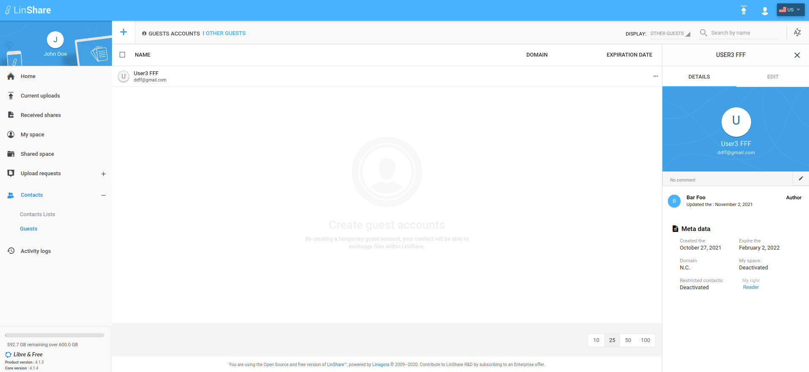
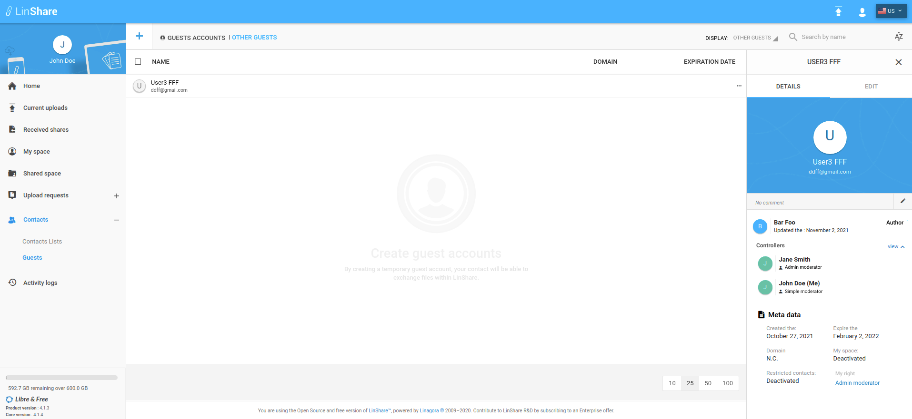

# Summary

* [Related EPIC](#related-epic)
* [Definition](#definition)
* [UI Design](#ui-design)
* [Misc](#misc)

## Related EPIC

* [Guests](./README.md)

## Definition

#### Preconditions

- Given that I am a LinShare user and I logged-in LinShare successfully

#### Description

- From menu, I go to Contacts => Guests
- I can see all guests in my domain
- If I am moderator with admin role for a guest, when I click on three-dot button, I can see options: Detail, Edit, Delete
- If am moderator with simple role for a guest, when  I click on three-dot button, I can see options: Detail, Edit
- If I am reader of the guest, When I click on three-dot button, I can see option: Detail
- When I select option "Detail" of a guest, the detail panel will be opened. 
- On detail panel, I can see new field Moderators list if I am guest's moderators with admin or simple role o. Guest's reader cannot see this field.
- I can see a field: "My role". The role can be Admin moderator/Simple moderator/Reader. 

#### Postconditions

- This moderators list includes avatar icon, full name of user and his role to the guest 
- When a moderator is added or removed, this is list is updated accordingly
- I can see the author of the guest - who created the guest but may or may not be  moderator of that guest

[Back to Summary](#summary)

## UI Design

#### Mockups

#### Final design

[Back to Summary](#summary)
## Misc

[Back to Summary](#summary)
