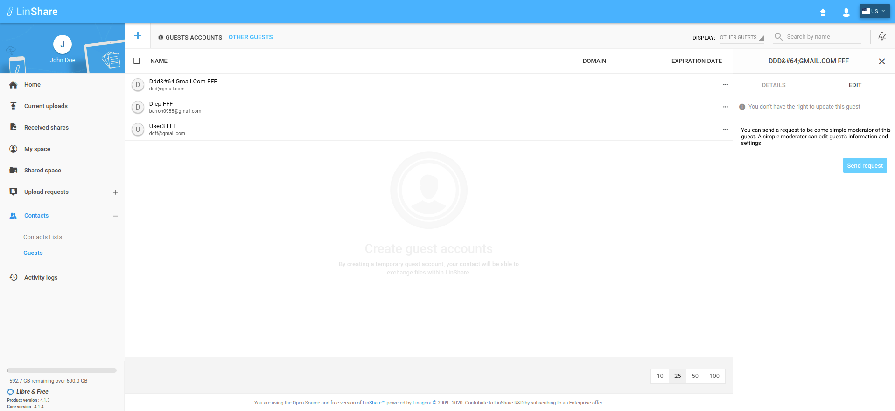
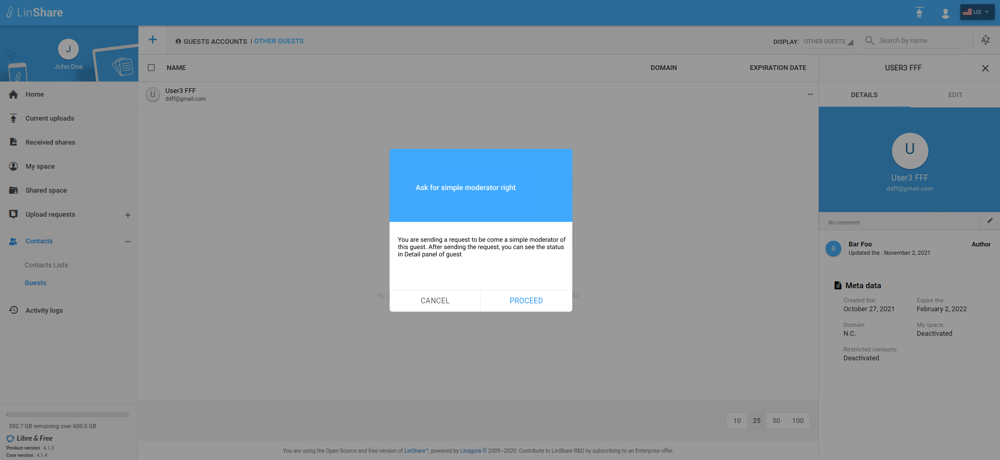
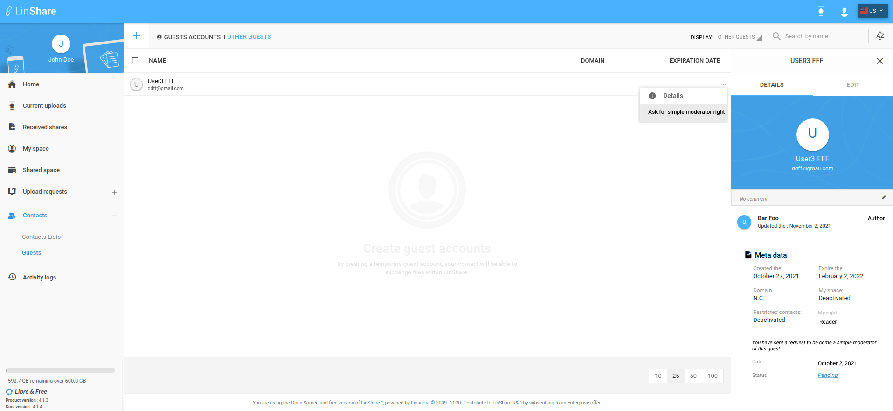
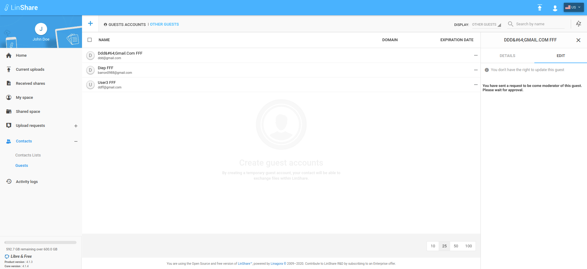

# Summary

* [Related EPIC](#related-epic)
* [Definition](#definition)
* [UI Design](#ui-design)
* [Misc](#misc)

## Related EPIC

* [Guests](./README.md)

## Definition

#### Preconditions

- Given that I am a LinShare user and I logged-in LinShare successfully

#### Description

- From menu, I go to Contacts => Guests
- I can see all guests in my domain
- When I click on three-dot button of a guest that I have read right, I can see option "Ask for simple moderator right"
- When I click on this option, then "Edit" tab will be opened.
- On Edit tab, I can see a text :"You don't have permission to update this guest". 
- I can see a text message: "You can send a request to become simple moderator of this guest. A simple moderator can edit guest’s information and settings" and a button "Send request"
- I click on this button, there will be a popup:"You are about to send a request to become a simple moderator of this guest. Once sent, you can see the request's status in Detail panel of guest" with 2 buttons Cancel and Send
- I select "Proceed", then the request will be sent.
- There will be a toast message when the request was sent successfully
- After sending the request, If I am click option "Ask for simple moderator right" of that guest again, I am navigated to Edit tab of that guest
- Now in the Edit tab, I can see a text message:" You have sent a request to become simple moderator of this guest. Please wait for approval."

#### Postconditions

- When a request is sent, the admin moderator can see this request in the pending request list of this guest 
- When I open Detail panel of the guest, I can see the text: You have sent a request to become a simple moderator of this guest" with creation date and current status of request:
   - If the request is sent successfully, it has status "Pending"
   - If the domain admin or admin moderator add me manually as moderator, this request will have status "Aborted"
   - If the request is rejected, It will have status:"Rejected"
   - If the request is approved, it will have status:"Approved"
   - When I click on Status link, it opened Activities tab of the guest.
   
[Back to Summary](#summary)

## UI Design

#### Mockups

#### Final design

[Back to Summary](#summary)
## Misc

[Back to Summary](#summary)
