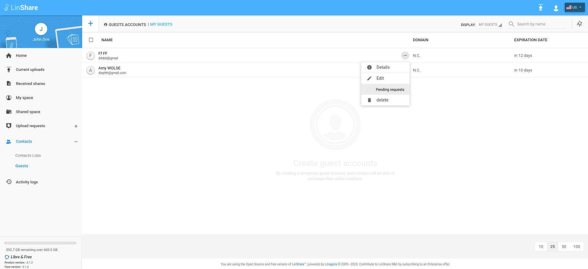
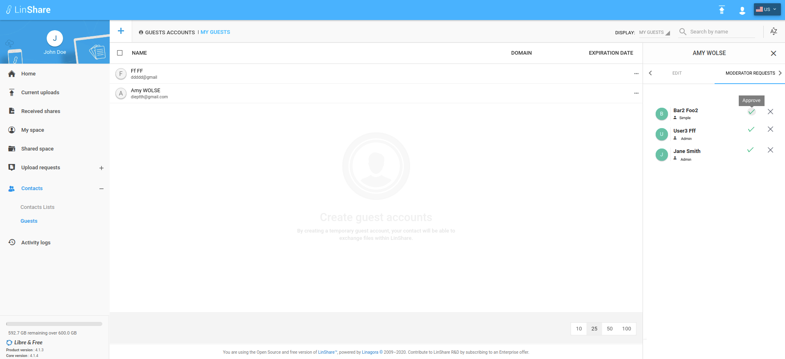
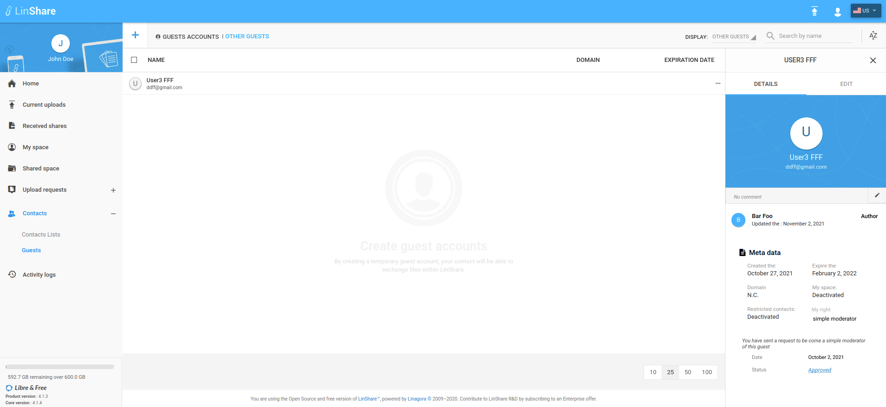
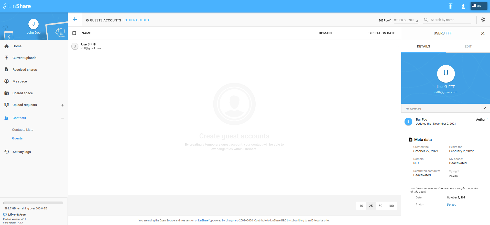

# Summary

* [Related EPIC](#related-epic)
* [Definition](#definition)
* [UI Design](#ui-design)
* [Misc](#misc)

## Related EPIC

* [Guests](./README.md)

## Definition

#### Preconditions

- Given that I am a LinShare user and I logged-in LinShare successfully

#### Description

- From menu, I go to Contacts => Guests
- I can see all guests in my domain
- When I click on three-dot button of a guest that I have admin moderator right, I can see option "Pending request"
- When I click on this option, then "Moderator request" tab will be opened.
- I can see the list of all pending requests to become moderators of this guest 
- Each request include:  Full name of the requester, the role he wants to request ( simple or admin) and 2 options: Approve or Reject icons 
- When I hover the icon, I can see the tooltip to show the button meaning: Approve or Deny 
- When I click on option "Approve", that requester will become the moderator of the guest with the requested right. 
- When I click on option "Reject", there will be a confirmation popup:" You are about to reject this request ! Beware, this action cannot be undone." and 2 button Close and Proceed
- If I choose Proceed, the requested will be denied. 

#### Postconditions

- When there is a new moderator request, every admin moderator of that guest will receive and email notification about that request with information:
   - Requester's full name and email
   - Requested right
   - Date/time of creation
   - Status :Pending 
   - And a button links to navigate to Pending request list of that guest
- When an admin moderator approves or rejects a pending request, other admin moderators of that guest receive an email notification with information:
    - Requester's full name and email
    - Date of creation
    - Requested right
    - Status :Approved or rejected
    - Date/time of approval of rejection
    - Full name and email of the person who approve or reject the request
- When an admin moderator approves or rejects a pending request, the requester also receives an email notification with information:
   - Date of creation 
   - Requested right 
   - Status :Approved or rejected
   - Date/time of approval of rejection
   - Full name and email of the person who approves or rejects the request
- When a request is approved or denied, it will be removed from the pending list. 
- When a requester is approved to become a guest's moderators, he will be appeared in moderator list in Edit tab of that guest.
- After the request is approved or denied, when the requester open Detail panel of the guest, he can see the status of request is updated from "pending" to "Approved" or "Denied" and If the request is approved, his right is also updated too.

[Back to Summary](#summary)

## UI Design

#### Mockups

#### Final design

[Back to Summary](#summary)
## Misc

[Back to Summary](#summary)