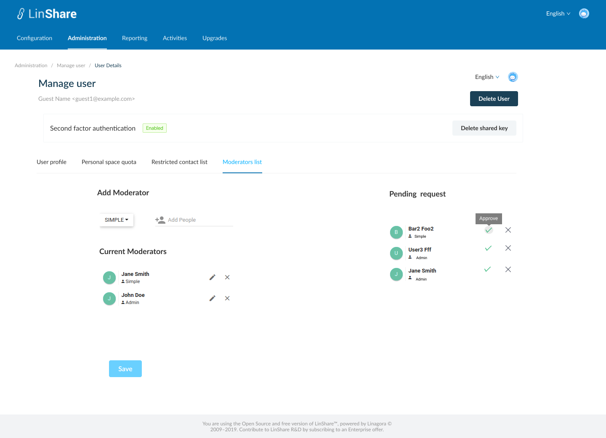

# Summary

* [Related EPIC](#related-epic)
* [Definition](#definition)
* [UI Design](#ui-design)
* [Misc](#misc)

## Related EPIC

* [Guests](./README.md)

## Definition

#### Preconditions

- Given that I am a LinShare root admin or nested admin
- I logged in LinShare Admin portal successfully and select menu tab :"Administration" then select user list
- In the user list, I click in a guest user, the Manage user page will be opened.

#### Description

- On Guest details screen, there are 4 tabs:
    - User profile
    - Personal space quota
    - Restricted contact list
    - Moderator list
- In Moderators list tab, I can see the current Moderators list of that guest and a Pending request list 
- Each request include:  Full name of the requester, the role he wants to request ( simple or admin) and 2 options: Approve or Deny icons
- When I hover the icon, I can see the tooltip to show the button meaning: Approve or Deny
- When I click on option "Approve", that requester will become the moderator of the guest with the requested right:
   - If the request is from guest reader => simple moderator, this new moderator is added to the current moderator list below
   - If the request is from simple moderator => admin moderator, the new role will be updated for that moderator in current moderator list below
- When I click on option "Deny", the request disappears from the pending list

#### Postconditions

- Only when I click button Save, all updates above are saved to that guest.
- When a request is approved or denied, it will be removed from the pending list.
- On UI User:
   - When a requester is approved to become a guest's moderators, he will be appeared in moderator list in Edit tab of that guest. 
   - After the request is approved or denied, when the requester opens Detail panel of the guest, he can see the status of request is updated from "pending" to "Approved" or "Denied" and If the request is approved, his right is also updated too.
   
[Back to Summary](#summary)

## UI Design

#### Mockups

#### Final design

[Back to Summary](#summary)
## Misc

[Back to Summary](#summary)