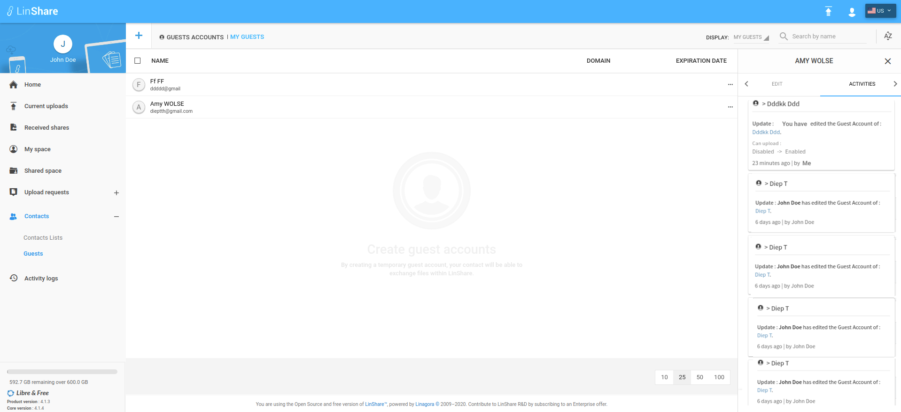

# Summary

* [Related EPIC](#related-epic)
* [Definition](#definition)
* [UI Design](#ui-design)
* [Misc](#misc)

## Related EPIC

* [Guests](./README.md)

## Definition

#### Preconditions

- Given that I am a LinShare user and I logged-in LinShare successfully

#### Description

- From menu, I go to Contacts => Guests
- I can see all guests in my domain
- If I am moderator with admin role for a guest, when I click on three-dot button, I can see options: Detail, Edit, Delete
- If am moderator with simple role for a guest, when  I click on three-dot button, I can see options: Detail, Edit
- If I am reader of the guest, When I click on three-dot button, I can see option: Detail
- When I select option "Detail" of a guest, the detail panel will be opened.
- I select tab "Activities" and see the activities of the guest will be displayed depending on my role:
   - If I am guest's reader, I can only see the audit traces related to my own moderator requests in Activities Tab
   - If I am guest's admin moderator , I can see activities tab of the guest with all audit traces:
      - Create guest
      - Edit guest's name or email
      - Edit guest's restricted contact list: Enable or disable checkbox, Add or remove restricted contact 
      - Edit "Expiration date"
      - Edit checkbox "Activate user space" 
      - Edit moderator list:  Enable or disable checkbox, Add or remove moderator 
      - Moderator request: New request, Approve or deny request of all moderator requests. 
   - If I am guest's simple moderator, I can see activities tab of the guest with all audit traces except the ones related to moderator requests. I can only see audit traces related to my own moderator requests.
- Technical user can perform some actions on behalf of a user, so the actor who performed the action may not be the same as the authenticated user. In this case, in the audit trace, I can see an asterisque near the actor name, which on hovering, I can see a message: "This action was performed by the [authUser name] on behalf of [Actor]"

#### Postconditions

[Back to Summary](#summary)

## UI Design

#### Mockups

#### Final design

[Back to Summary](#summary)
## Misc

[Back to Summary](#summary)
