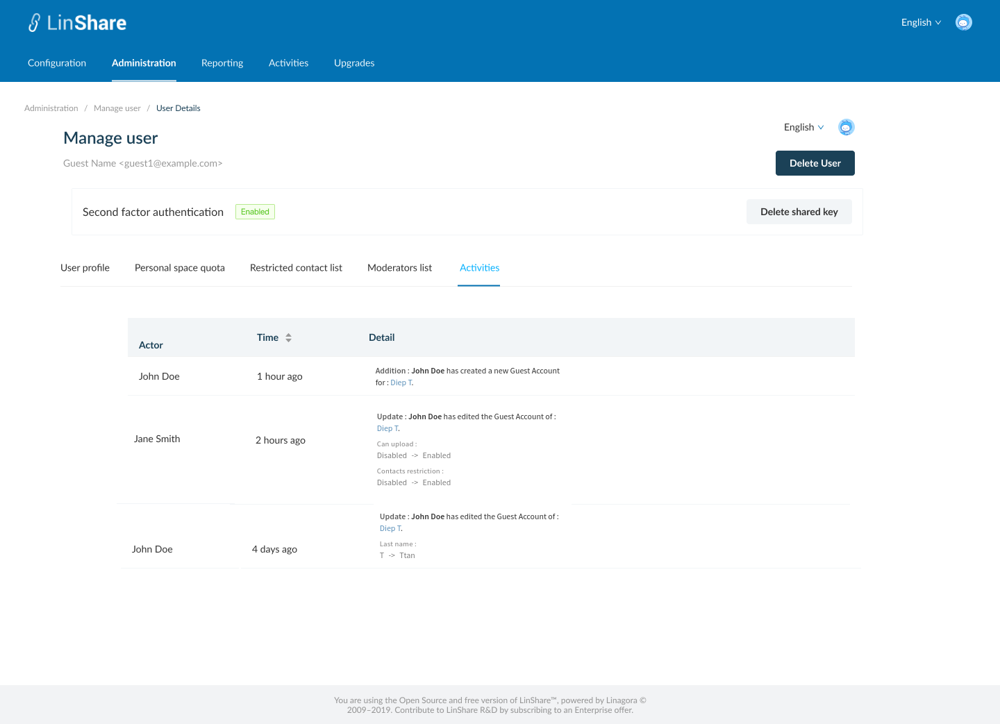

# Summary

* [Related EPIC](#related-epic)
* [Definition](#definition)
* [UI Design](#ui-design)
* [Misc](#misc)

## Related EPIC

* [Guests](./README.md)

## Definition

#### Preconditions

- Given that I am a LinShare root admin or nested admin
- I logged in LinShare Admin portal successfully and select menu tab :"Administration" then select user list
- In the user list, I click in a guest user, the Manage user page will be opened.

#### Description

- On Guest details screen, there are 5 tabs:
    - User profile
    - Personal space quota
    - Restricted contact list
    - Moderators
    - Activities 
- In Activities tab, I can see all activities of the guest in a table, including columns:
   - Actor: The full name of person who performed the action
   - Time: default sorted by lasted time. I can click icon on column's name to sort activities by latest or earliest time 
   - Details: the Detail of action 
   - Technical user can perform some actions on behalf of a user, so the actor who performed the action may not be the same as the authenticated user. In this case, in the audit trace, I can see an asterisque near the actor name, which on hovering, I can see a message: "This action was performed by the [authUser name] on behalf of [Actor]"

#### Postconditions

[Back to Summary](#summary)

## UI Design

#### Mockups

#### Final design

[Back to Summary](#summary)
## Misc

[Back to Summary](#summary)