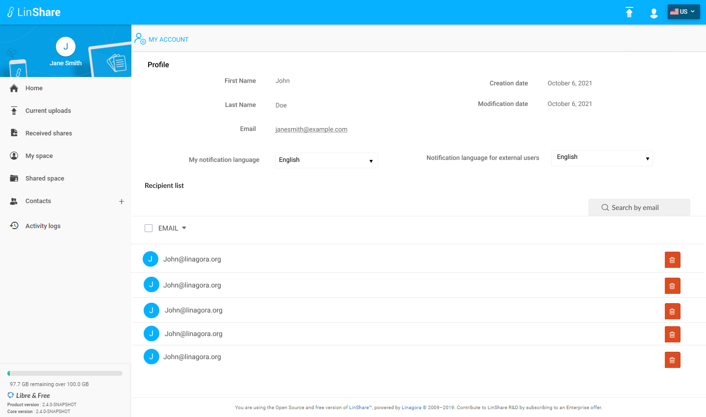
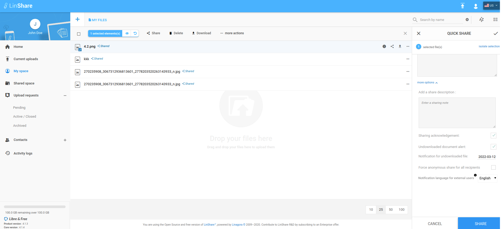

# Summary

* [Related EPIC](#related-epic)
* [Definition](#definition)
* [UI Design](#ui-design)
* [Misc](#misc)

## Related EPIC

* [New admin portal](./README.md)

## Definition

#### Preconditions

#### Description

**UC1. Notification Language setting in Profile page**
 
- Given that I am LinShare user (internal user or guest)
- After log-in successfully, I click on human icon and see a list of option
- I select the first option "My account", a new screen will be displayed.
- On My account page, I can see a new field: "Notification language for external users"
- This is language of email notification when the user shares a file to users without an LinShare account.
- I can select another option from the drop-down list: English, French, Russia
- When I select another language, there will be a toast message: "You have been selected [language] as notification language for external users"

**UC2. Setting notification language on UI User**

- When a user shares files, on share form, he clicks button "more options" and see a new field: "Notification language for external users"
- I can see a tooltip when hovering icon "i": When sharing document to a LinShar user, the email language will be recipient's notification language. This setting is email notification language for users without an LinShare account"
- Default language is value of field "Notification language for external users"  in My account page 
- User can select another option from the drop-down list: English, French, Russia
- When user shares document to external users, the recipient will receive emails about share in above selected language.
- When user shares document to internal users, the recipient will receive email about share in his notification language (which is value of field "My notification language" in recipient's Profile page)
- There are some kinds of emails about share that a recipient can receive:
    - When the share is created
    - When the share is deleted
    - When the password of anonymous share was reset
    - The share has expired and was deleted by the system
    - The file share of the sender is about to expire

#### Post-conditions

[Back to Summary](#summary)

## UI Design

#### Mockups

#### Final design

[Back to Summary](#summary)
## Misc

[Back to Summary](#summary)

