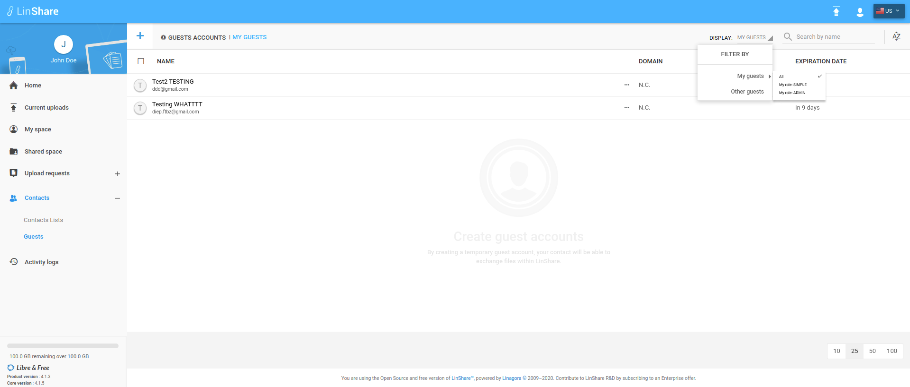

# Summary

* [Related EPIC](#related-epic)
* [Definition](#definition)
* [UI Design](#ui-design)
* [Misc](#misc)

## Related EPIC

* [Guests](./README.md)

## Definition

#### Preconditions

- Given that I am a LinShare user and I logged-in LinShare successfully

#### Description

- From menu, I go to Contacts => Guests and see the list of guests
- On the top right of screen, I can see a filter with default selection is My guest.
- When I click on this filter, I can see a drop-down list with options:
   - Other guests: If I select this option, the system will display list of guests that I do not have moderator right. 
   - My guest: When I click on this option, I can see a second drop-down list:
      - All: I select this option, system will display all guests that I am moderator of 
      - My role: SIMPLE: If I select this option, system will display guests that I have SIMPLE moderator right 
      - My role: ADMIN. If I select this option, system will display guests that I have Admin moderator right 
      
#### Postconditions

[Back to Summary](#summary)

## UI Design

#### Mockups

#### Final design

[Back to Summary](#summary)
## Misc

[Back to Summary](#summary)
