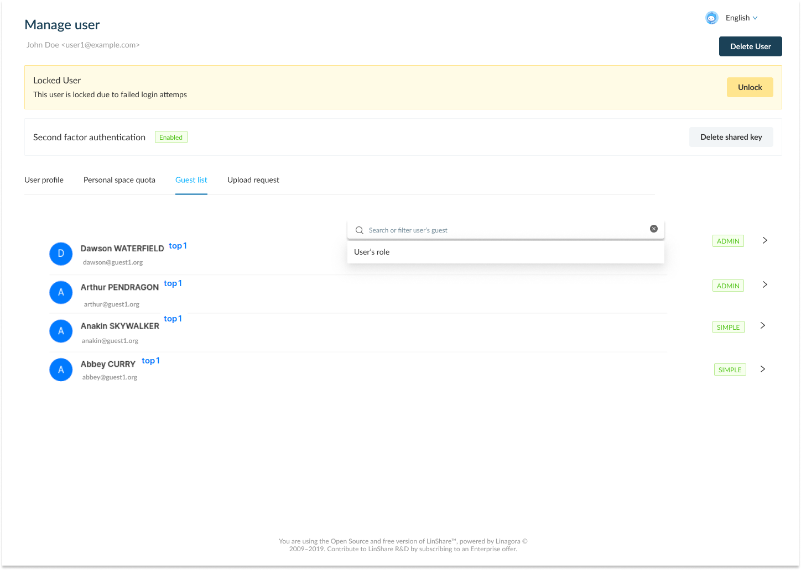

# Summary

* [Related EPIC](#related-epic)
* [Definition](#definition)
* [UI Design](#ui-design)
* [Misc](#misc)

## Related EPIC

* [New admin portal](./README.md)

## Definition

#### Preconditions

*  Given that am an admin (super admin/ nested admin)

#### Description

*  After log-in Admin portal successfully, I select the Administration tab => User lists
*  In the user list, I click on one user, the Manage user page will be opened

#### Postconditions

- I can see a new tab: Guest list 
- I select this new tab, I can see the list of guests of this user, which means the user is moderator of 
- Each guest will include information: avatar, Full name, Email, and his domain
- I can see the user's moderator role for each guest. It can be SIMPLE or ADMIN
- When I click on search bar, I can see a drop-down option: User's role
- When I select this search criteria, I can see options: Simple/Admin. 
- If I select Simple and click Enter, the system will display guest list that user has Simple moderator role of 
- If I select Admin and click Enter, the system will display guest list that user has Admin moderator role of
- If I do not select search criteria and input some character to search bar, the system will search guest by email/first name/last name.
- When I click on a guest in the list, I am navigated to the detail page of that guest.

[Back to Summary](#summary)

## UI Design

#### Mockups

#### Final design

[Back to Summary](#summary)
## Misc

[Back to Summary](#summary)
