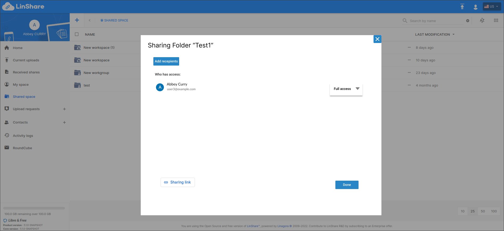
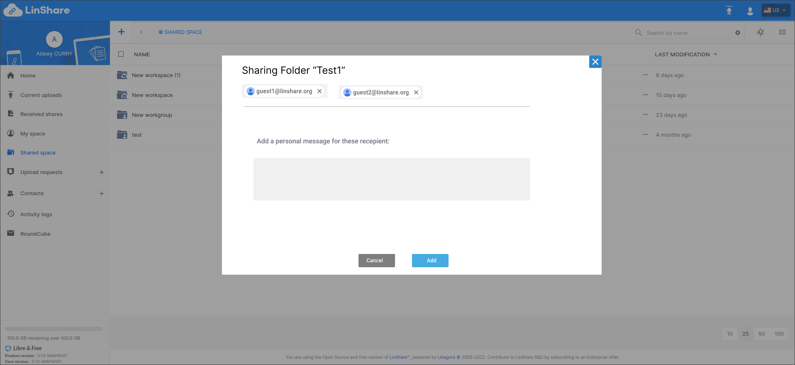
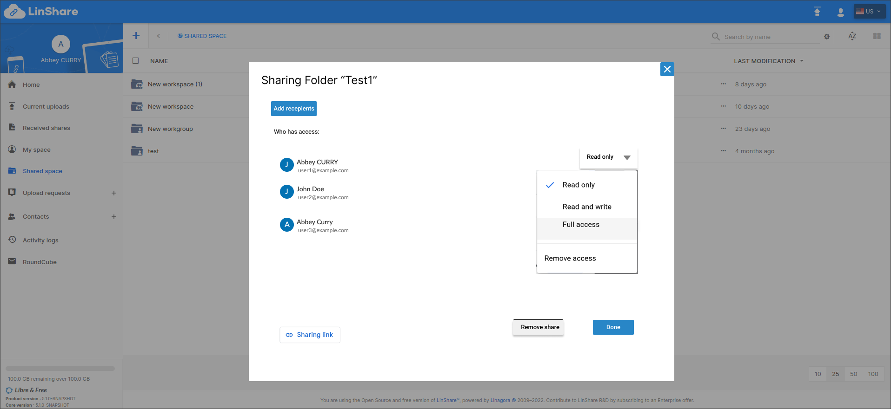

# Summary

* [Related EPIC](#related-epic)
* [Definition](#definition)
* [UI Design](#ui-design)
* [Misc](#misc)

## Related EPIC

* [New admin portal](./README.md)

## Definition

#### Preconditions

* Given that I am a LinShare user
* After logged-in successfully, I go to Shared space and open a workgroup

#### Description

- Given that I have admin/writer role to that workgroup
- When I click on three-dot button of the folder, I can see a new option : Share by link
- I select this option, the sharing folder screen will be opened.
- On the sharing screen, I can see:
   - Button Add Recipient 
   - Who has access: Listing all the users who have access to this folder via sharing
- I click button Add Recipient, then a new screen will be opened.
- I can input an email to the field "Add people" and select a permission
- Permission list includes:
   - Read-only: The receiver can only view and download the files of  shared folder
   - Read and write: The receiver can view, download and upload files to the shared folder 
   - Full access: The receiver can view, upload, download and delete the files of shared folder
- When I start to type in the field "Add recipient", the system will display a suggestion list:
- I can select one user from the list: 
   - If I select one user who is already a member of parent workgroup of the folder, there will be a message:" This user is already had access permission to this folder because a member of Parent workgroup :[workgroup name]."
   - If the user is not a member of parent workgroup of the folder, I can select this user from suggestion list. 
- If I can not find the user I am looking for (because it does not exist), the system should propose to me a specific entry in the auto-complete result list to create an guest account : "Create guest account?"
- I select this button, then there will be a popup:"You will invite [inputted email] to be a guest" and Yes/No button
- If I choose Yes, the inputted email will be added as a guest account automatically, and there will be a toast message :"The guest account was created successfully"
- The external email now become a guest and can access the shared folder. 

#### Postconditions

[Back to Summary](#summary)

## UI Design

#### Mockups

#### Final design

[Back to Summary](#summary)
## Misc

[Back to Summary](#summary)
