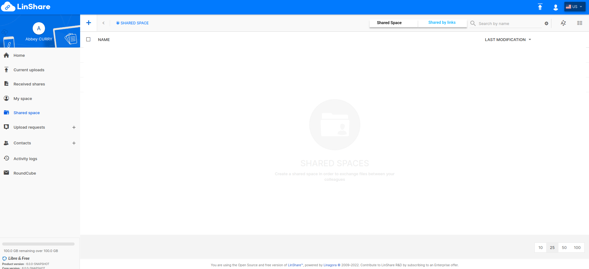

# Summary

* [Related EPIC](#related-epic)
* [Definition](#definition)
* [UI Design](#ui-design)
* [Misc](#misc)

## Related EPIC

* [New admin portal](./README.md)

## Definition

#### Preconditions

* Given that I am a LinShare user
* After logged-in successfully, I go to Shared space

#### Description

- Given that a LinShare user granted me access to a LinShare folder
- If I am already a LinShare user, I received an email notification via email about the share.There will be a link to the shared folder.
- If I am an external user with no LinShare account: I receive 2 emails:
    - The first email to inform that I am invited to a LinShare with a guest account. I need to activate guest account by clicking on the link and change password.
    - The second email is to inform that I am invited to a folder. There will be a link to the shared folder.
- When I click on the link of shared folder in email:
   - If I have not logged in LinShare, the log-in screen will be opened.
   - If I am logging in LinShare, I am redirected to the shared folder. 
- In Shared Space, I can see a toggle with 2 tabs: Shared Space and Shared by links. Shared space contains all of my workspaces and workgroup as currently.
- In Shared by links, I can see the list of  all folders/files which are shared with me through sharing link
- There is a filter that allows me to select to view only files or folders or both
- The table of list contains columns: 
   - Name
   - Type: folder or file
   - Link creation date 
   - Expiration date 
- I can sort by name/link created date/expiration date 
- I can search folder/file by name

#### Postconditions

[Back to Summary](#summary)

## UI Design

#### Mockups

#### Final design

[Back to Summary](#summary)
## Misc

[Back to Summary](#summary)
