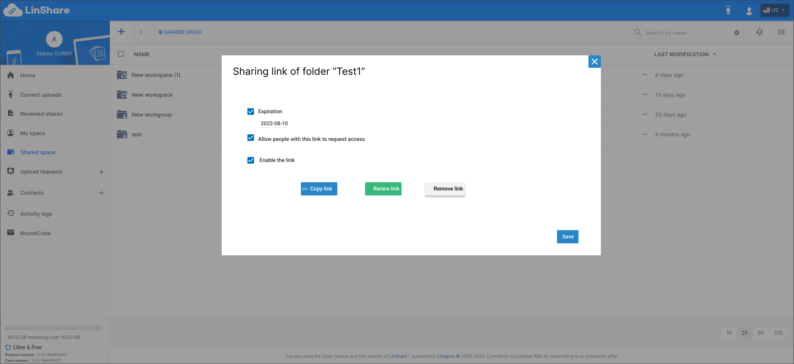

# Summary

* [Related EPIC](#related-epic)
* [Definition](#definition)
* [UI Design](#ui-design)
* [Misc](#misc)

## Related EPIC

* [New admin portal](./README.md)

## Definition

#### Preconditions

- Given that I am a LinShare user and I have shared a folder before

#### Description

**UC1. Get Sharing link**
* On the sharing screen of a folder, I can see a button "Get Sharing link" or:
- When I click on three-dots button of a folder, I can see option :"Get Sharing link"
- Only Admin or writer of parent workgroup of the folder can create  a sharing link. Reader, Contributor  of the parent workgroup cannot create sharing link. 
* I select this option, new screen will be opened: 
* In this new screen, I can see:
    - A link: this link is generated automatically when sharing first time by the system. I can click button Copy next to this link. Another button should let me renew this link.
    - Checkbox "Expiration": Default value of the checkbox is set by domain admin.
      - When I select this checkbox, a date picker will be shown and I can select an expiry date for this share.
        - The expiry date must > today.
        - On the expiry date, the sharing link will be removed.
    - Checkbox: Allow people with this link to request access. Default value of the checkbox is set by domain admin
        - When I select this checkbox, people with this link can send a request to access the folder
        - When the checkbox is un-ticked, when a user who is not shared yet accesses the folder link, he will not be able to create access request to this folder
    - Checkbox: Enable/disable the link: Default value is enabled. When the link is disabled, button "Copy link" is disabled too. User cannot access a disabled link.
- When the folder is shared, there will be a shared icon on the folder (same as shared file in Myspace)

**UC2. Edit a sharing link of a folder**
- Admin/Writer of parent workgroup of the folder can edit a sharing link. Reader, Contributor of the parent workgroup cannot edit sharing link.
- Given that the sharing link of the folder has been created before. 
- When I click on three-dot button of the folder, I can see option :"Get sharing link"
- I select this option, then the sharing link popup will be opened.
- I can edit fields on the popup:
    - Checkbox "Expiration": If the checkbox is ticked, I can untick this checkbox . If the checkbox is not selected, I can select and choose an expiration date > current date
    - Checkbox: Allow people with this link to request access. I can tick/untick this checkbox to allow/not allow people with the sharing link create access request to this folder
    - Checkbox: Enable/disable the link
- After edit, I can click button Save, then the popup will be closed.
- When I click button Renew the link, a confirmation popup will be displayed. If I select Yes, the sharing link will be replaced by a new link all the checkboxes will be set to default values.
- When a link is renewed, an notification email will be sent to the current receivers about this changed with the new link.

**UC3. Remove share/sharing link of folder**

- Given that I am admin/writer of parent workgroup of the shared folder.
- When I click three-dot button of the shared folder, I select option:"Get sharing link", then the sharing link popup will be opened
- On this popup I can see button "Remove"
- When I click this button, there will be a confirmation message
- If I choose Yes, then the sharing link of the folder will be deleted
- All the recipients in the list will be removed access from this folder. 
- Now when the admin/writer of parent workgroup of the folder selects option "Get sharing link" of that workgroup/workspace, a new link will be generated. 

**UC4. Edit role/ Remove access of a user**

- Given that I am admin/writer of parent workgroup of the shared folder.
- When I click three-dot button of the folder and select option:"Get sharing link", then the sharing screen will be opened
- On this screen, I can see the list of recipients with its access permission to the shared folder
- When I click on the permission field of eah recipient, I can see a drop-down list with option: Read, Read and write, and Remove access
- I can select another permission for the recipient or Remove access
- When I Click button Save, the updates is saved, there will be a notification message that the updates are saved. 
- When a recipient is removed access from the shared folder, he cannot see the shared folder on his Received shares category.

#### Postconditions

- A receiver can get the sharing link of workgroup/workspace through email or get directly from the sender.
- Admin or writer of parent workgroup of the folder can create and edit/remove a sharing link and the share
- Parent Worgkoup's reader /contributor can only copy the sharing link of that workgroup. If the link is disabled/not created yet, reader /contributor cannot see the sharing link: The option "Get sharing link" will be disabled when he clicks on three-dot button of the folder. 
- After a sharing link is removed or disabled, when a user access the link, there will be a message that the link is invalid

[Back to Summary](#summary)

## UI Design

#### Mockups

#### Final design

[Back to Summary](#summary)
## Misc

[Back to Summary](#summary)
