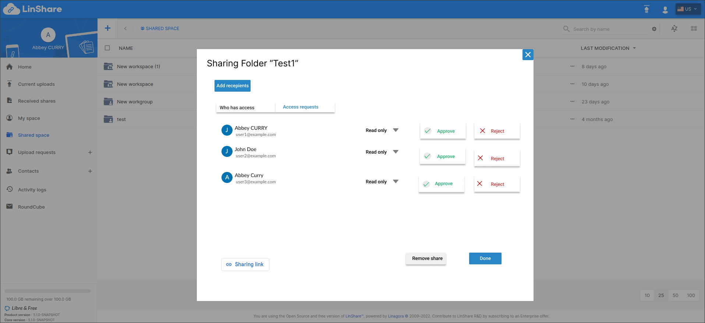

# Summary

* [Related EPIC](#related-epic)
* [Definition](#definition)
* [UI Design](#ui-design)
* [Misc](#misc)

## Related EPIC

* [Guests](./README.md)

## Definition

#### Preconditions

- Given that I am a LinShare user and I logged-in LinShare successfully

#### Description

- I go to shared space
- When I click on three-dot button of a shared folder that I am admin/writer of the parent workgroup, I can see option "Access request"
- When I click on this option, then "Access request" tab will be opened.
- I can see the list of all pending requests to access this shared folder
- Each request include:  Name/Email of the requester, the role and 2 buttons: Approve or Reject
- The default role is reader, I can click on this field, a drop-down list will be shown to select other roles: Read/Read and Write/Full access
- When I click on button "Approve":
    - If the requester is already a LinShare user, that requester will have access to the shared folder with selected role. This folder will appear in the recipient's Shared by links tab
    - If the requester is not a user yet, there will be a notification message:" By approving this request, you will invite [external email] as a guest user". If I choose Yes, a guest account will be created automatically for this email then he will have access to the shared folder with selected role
- When I click on button "Reject", there will be a confirmation popup:" You are about to reject this request ! Beware, this action cannot be undone." and 2 button Close and Proceed." If I choose Proceed, the request will be denied.

#### Postconditions

- When there is a new request to a folder, every admin/writer of the parent workgroup will receive and email notification about that request with information:
    - Requester full name (if any - in case the requester is already a LinShare user) and email
    - Date/time of creation
    - Status : Pending
    - And a button links to navigate to Pending request list of that shared folder
- When an admin/writer approves or rejects a pending request to a shared folder, other admins/writers of that workgroup will receive an email notification with information:
    - Requester full name (if any - in case the requester is already a LinShare user) and email
    - Date of creation
    - Status :Approved or rejected
    - Date/time of approval of rejection
    - Full name and email of the admin/writer who approve or reject the request
- When an admin/writer approves or rejects a pending request, the requester also receives an email notification with information:
    - Date of creation
    - Status :Approved or rejected
    - Date/time of approval of rejection
    - Full name and email of the admin/writer who approves or rejects the request
- In case that a requester is not yet a LinShare user and the request is approved, he received 2 email:
    - The first email to inform that I am invited to a LinShare with a guest account. I need to activate guest account by clicking on the link and change password.
    - The second email is to inform that I am granted access to the shared by link folder. 
- When a request is approved or denied, it will be removed from the pending list.

[Back to Summary](#summary)

## UI Design

#### Mockups

#### Final design

[Back to Summary](#summary)
## Misc

[Back to Summary](#summary)