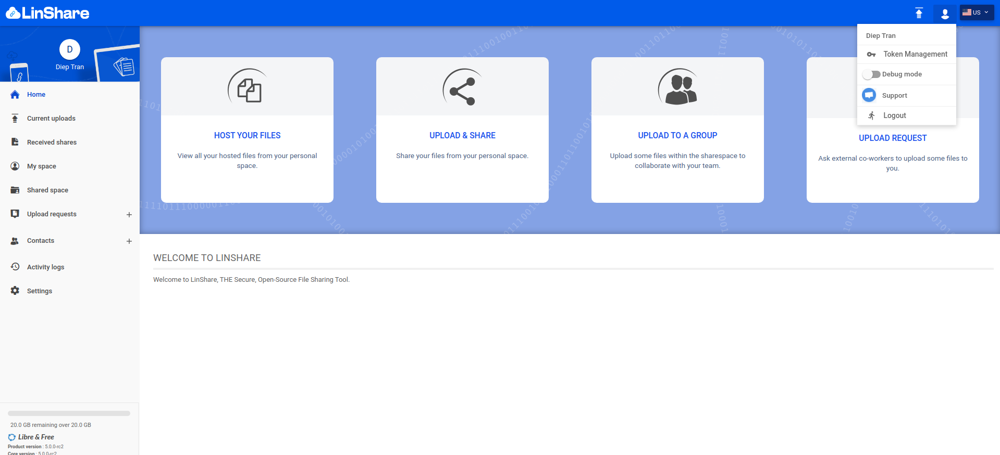

# Summary

* [Related EPIC](#related-epic)
* [Definition](#definition)
* [UI Design](#ui-design)
* [Misc](#misc)

## Related EPIC

* [SAAS](./README.md)

## Definition

#### Preconditions

- Given that I am LinShare SaaS user
- Given this function is enabled.

#### Description

**UC1. UI-User**
- After logged in successfully, I click on Hunman icon on top right of screen
- I can see a drop-down list
- I select option "Support', then I am redirected to the support page in a new Tab

**UC2. Enable/disable this function**
- To enable, disable this function, I need to configure in  ui-user/config/config.js file:
   - The boolean parameter:
      - If the function is enabled, when user of this domain already logged in then click on Human button on top right of screen, he can see option "Support" from drop-down list
      - If the function is disabled, when user of this domain already logged in then click on Human button on top right of screen, the option "Support' will be hidden on drop-down list
   - Provider
   - Url toward the chat website
- If provider is crisp, extra parameters like user email, language will be added to the link.

#### Postconditions

- In support page, I can see the welcome message chat:"How can we help with LinShare" and I can start to chat with the supporter.

[Back to Summary](#summary)

## UI Design

#### Mockups

#### Final design

[Back to Summary](#summary)
## Misc

[Back to Summary](#summary)

