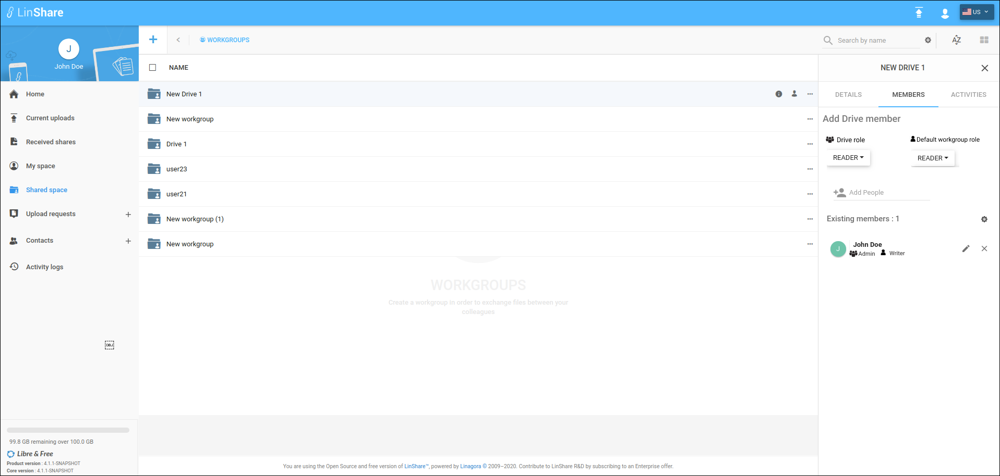

# Summary

* [Related EPIC](#related-epic)
* [Definition](#definition)
* [Screenshots](#screenshots)
* [Misc](#misc)

## Related EPIC

* [drive](./README.md)

## Definition

#### Preconditions
*  Given that i am a Linshare user 
*  Given that the functionality of Drives is enabled in Admin setting
#### Description
**UC1.View existing member list**

*  After logged-in successfully, i go to Shared Space 
*  I can see the list of my drives and workgroups that are not inside any drive.
*  When i hover any drive, i can see the icon Member and i click on this icon, the member tab (second tab) will be opened. 
*  In member tab, i can see the list of drive's member with each member's role to the drive and his default role to workgroups inside the Drive 
*  If the i am Drive's admin, be side the Existing member list,  i can see the section Add a member and icon Delete/Edit next to each member. 

**UC2. Search/sort/filter member list**

*  Given that i am on Member tab of a Drive 
*  When i click on icon Setting, the search box will be opened 
*  I can input text in search box to find member by member's name, role (drive role), email 
*  I can click icon sort, a drop-down list will be opened that including 2 part:
   *  Sort by: List the sort criteria that i can choose: First name, last name, user rights. I can double click on any criteria to change between descending or ascending sort
   *  Filter by: List the filter criteria that i can choose: Reader right, admin right, contributor right 
#### Postconditions

[Back to Summary](#summary)

## UI Design

#### Mockups

#### Final design
https://www.figma.com/file/uEjMnsiLPSByz7m6wfTLLA/LinShare-Web?node-id=2459%3A0
[Back to Summary](#summary)
## Misc

[Back to Summary](#summary)
