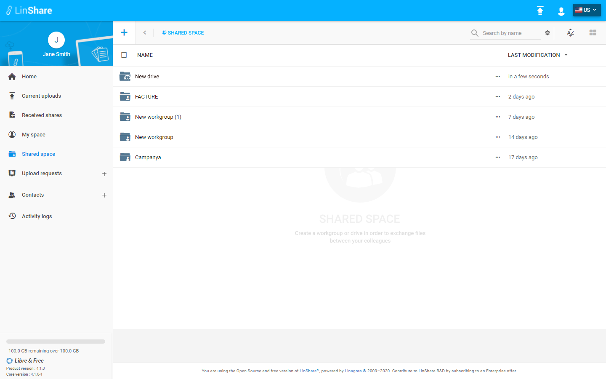

# Summary

* [Related EPIC](#related-epic)
* [Definition](#definition)
* [Screenshots](#screenshots)
* [Misc](#misc)

## Related EPIC

* [drive](./README.md)

## Definition

#### Preconditions
*  Given that i am a Linshare user 
*  Given that the functionality of Drives is enabled in Admin setting
#### Description

*  After logged-in successfully, i go to Shared Space 
*  I can see the list of my drives and workgroups that are not inside any drives 
*  When i  click button "++ on top left of screen, there will be 2 options: Create a drive / Create a workgroup
*  If the functionality of Drives is disabled in Admin setting, when i click button +, the option Create a drive is not shown

#### Postconditions
*  I can see the list of drives that i am a member. 
[Back to Summary](#summary)

## UI Design

#### Mockups

#### Final design

[Back to Summary](#summary)
## Misc

[Back to Summary](#summary)
