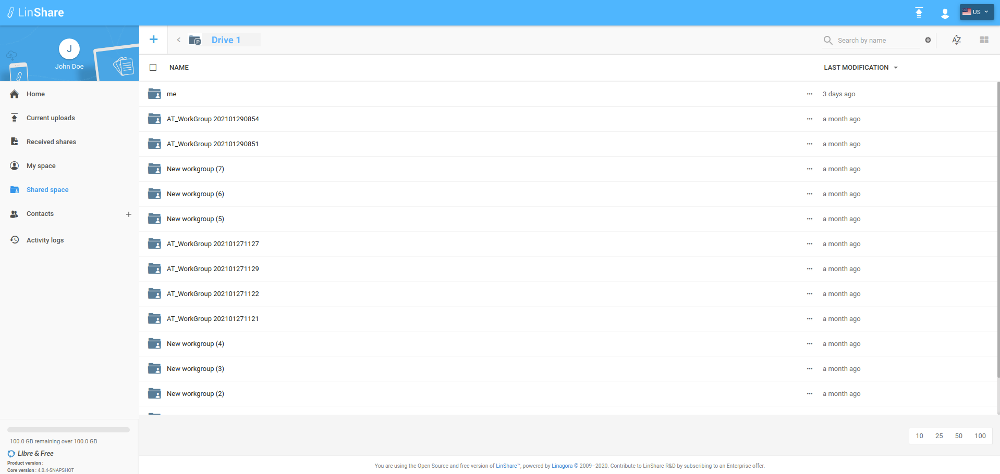
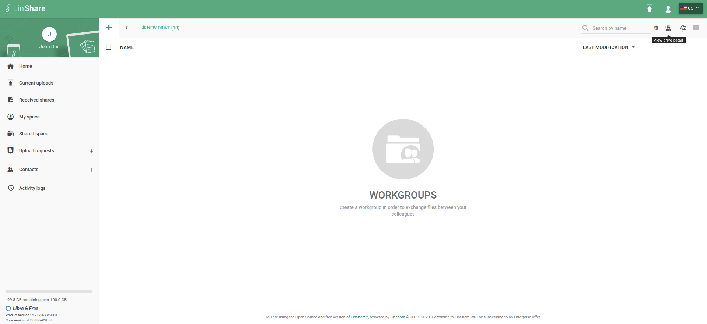
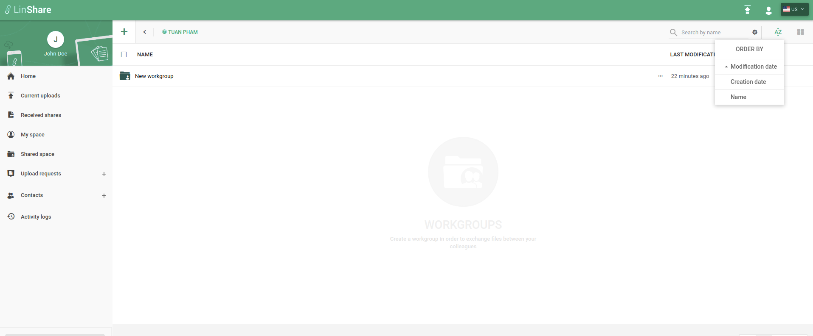
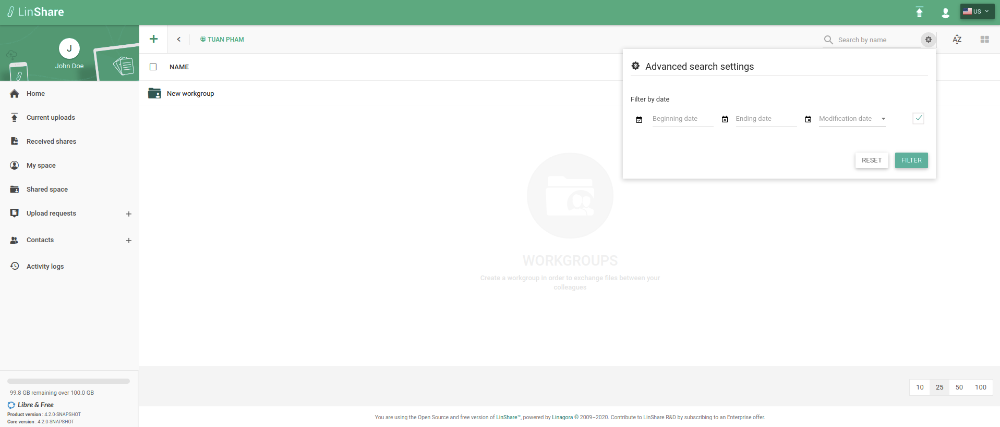
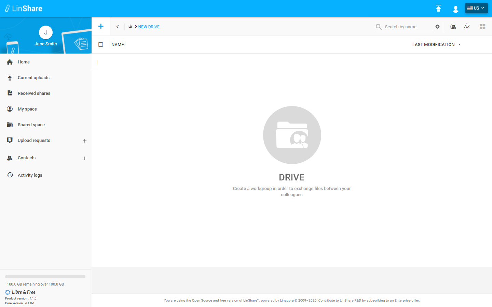
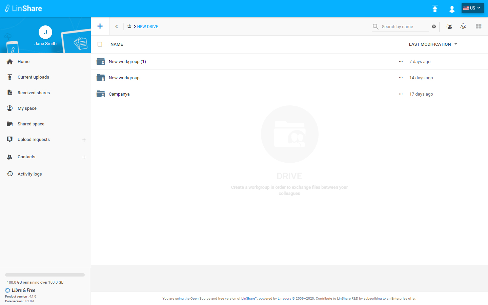

# Summary

* [Related EPIC](#related-epic)
* [Definition](#definition)
* [Screenshots](#screenshots)
* [Misc](#misc)

## Related EPIC

* [drive](./README.md)

## Definition
#### Preconditions

*  Given that i am a Linshare user 
*  Given that the functionality of Drives is enabled in Admin setting

#### Description

**UC1.View list of workgroups**

*  After logged-in successfully, i go to Shared Space 
*  I can see the list of my drives and workgroups that are not inside any drives 
*  I click on a drive.
*  I see the list of all workgroups inside my drive. (drives that i am a member of)
*  On top right of screen, I can see a human icon beside sorting icon
*  when i hover this human icon, i can see a tooltip "View drive detail"
*  When i click on this icon, the Drive detail panel will be opened. 
*  On i can see both workgoups list and detail information of the drive.

**UC2. Sorting list of workgoups**

*  On top right of screen, I can see a sorting icon
*  when i click on this icon, i can see dropdown list of sorting criteria:
   - Modification date
   - Creation date 
   - Name
*  I can choose one of these sorting criteria and double click to change the sorting order 
*  The workgroup list will change accordingly

**UC3. Search workgoups**
 
 * On top right of screen, i can see  a search bar "Search by name"
 * I can type in this field and the system will display matching result instantly 
 * I can click on icon setting beside Search bar, the Advanced Search setting popup will be opened 
 * I select checkbox, other fields in popup will be enabled.
 * I can choose type of date: Modification date or Creation date
 * I select begining date and ending date then click button Filter or Reset to cancel. 

[Back to Summary](#summary)

## UI Design

#### Mockups

#### Final design

[Back to Summary](#summary)
## Misc

[Back to Summary](#summary)
