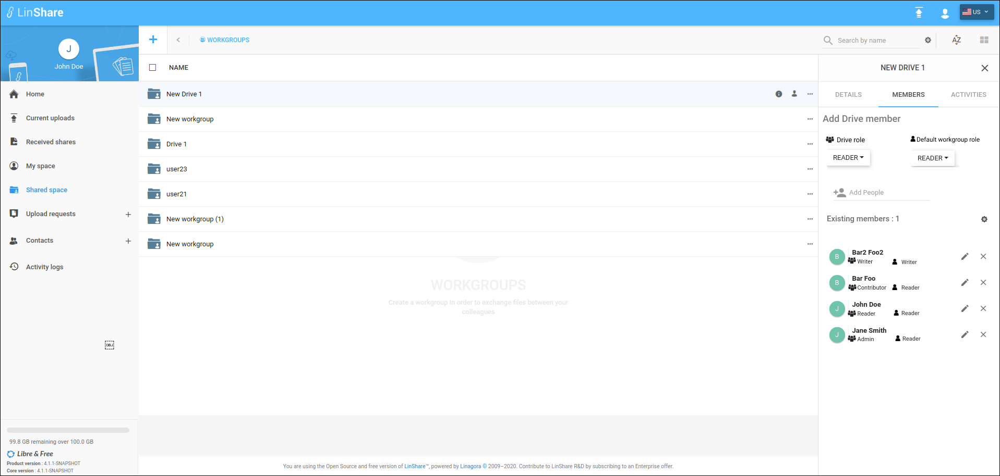

# Summary

* [Related EPIC](#related-epic)
* [Definition](#definition)
* [Screenshots](#screenshots)
* [Misc](#misc)

## Related EPIC

* [Drive](./README.md)

## Definition

#### Preconditions
*  Given that I am a LinShare user 
*  Given that the functionality of Drives is enabled in Admin setting

#### Description

*  After logged-in successfully, I go to Shared Space 
*  I can see the list of my drives and workgroups that are not inside any drive.
*  When I hover any drive name on the list, I can see the icon Member and I click on this icon, the member tab (second tab) will be opened. 
*  Or when I click on three-dot button of a drive, if I am the admin of drive, the option Add member will be enabled. If I am not the admin of Drive, this option will be disabled. I choose Add a member, the Member tab will be opened on the right. 
*  In Existing member section, if I am the admin of Drive, I can see icon Delete next to each member's name 
*  I click on Delete icon, there will be a confirmation popup
*  I confirm deletion, the member will be removed. 

#### Postconditions
*  Selected member is removed from the Drive member list and all the workgroups inside the drive.
*  I can see a toast notification message of successful deletion.
*  I can see this action on the Drive audit

[Back to Summary](#summary)

## UI Design

#### Mockups

#### Final design

[Back to Summary](#summary)

## Misc

[Back to Summary](#summary)
