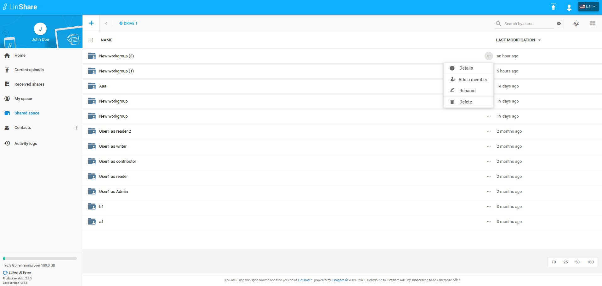
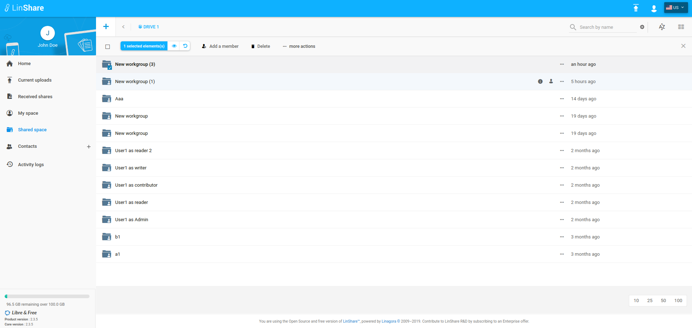
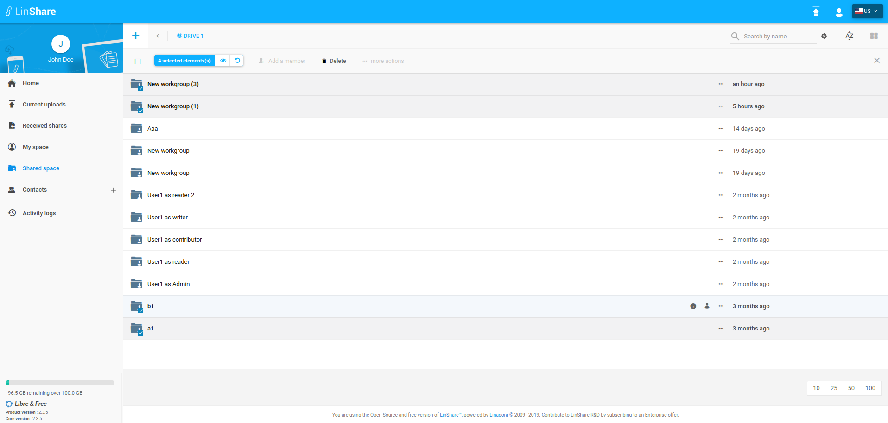

# Summary

* [Related EPIC](#related-epic)
* [Definition](#definition)
* [Screenshots](#screenshots)
* [Misc](#misc)

## Related EPIC

> Links to the epic document in the epic folder, normally README.

* [Drive](./README.md)

## Definition

#### Preconditions
*  Given that i am a Linshare user
#### Description
*  After logged-in successfully, i go to Shared Space section. 
*  I can see the list of Drives/Workgroups.
*  I click on a Drive, i can see the list of workgroups inside that Drive
*  When i click on three-dots button of a Workgroup that i have admin role, a drop-down list of actions will be shown.
*  If i am workgroup admin, the option Delete will be enabled. If i am not workgroup admin, the option Delete will be disabled. 
*  Or when i select checkbox of one or multiple workgroups that i have admin role, i can see the action bar with Delete option enabled
*  I click on button Delete, there will be a confirmation popup 
*  I click button to confirm deletion

#### Postconditions
*  If the selected workgroup is deleted successfully, there will be an notification message. 
*  If the workgroup is not deleted successfully, there will be an error message. 
*  I can delete one or multiple workgroups in once.
*  I can see this action on the current Drive audit.

[Back to Summary](#summary)

## UI Design

#### Mockups

#### Final design

[Back to Summary](#summary)
## Misc

[Back to Summary](#summary)
