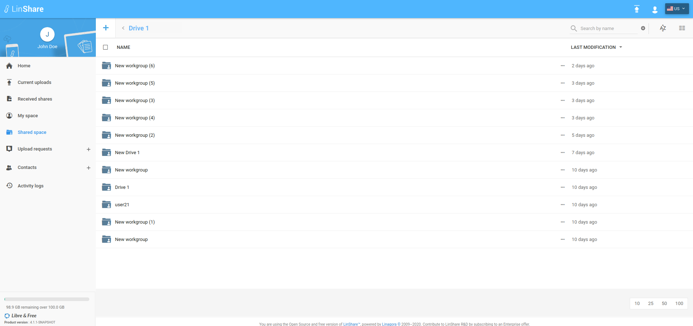
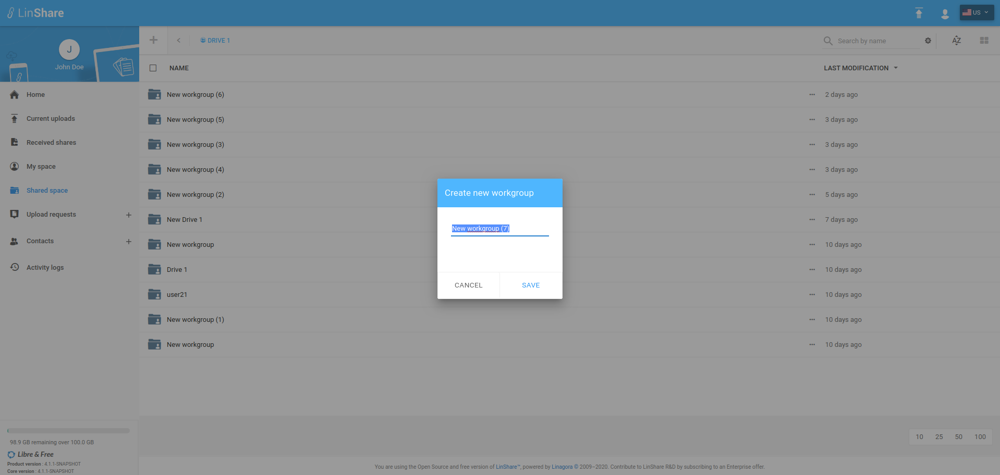
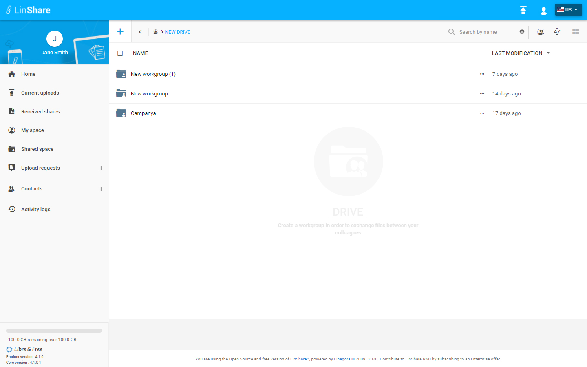
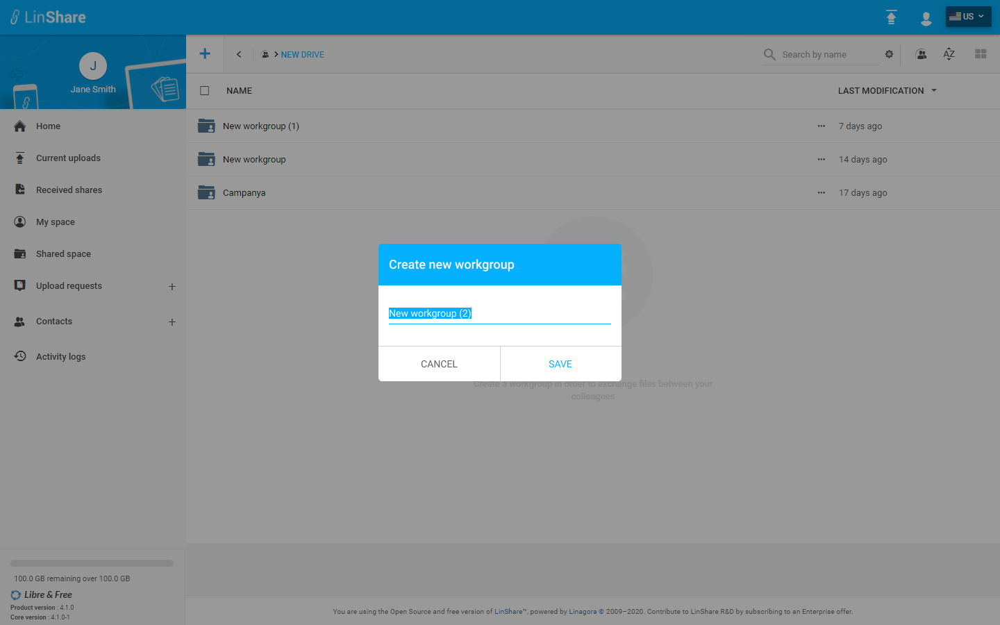
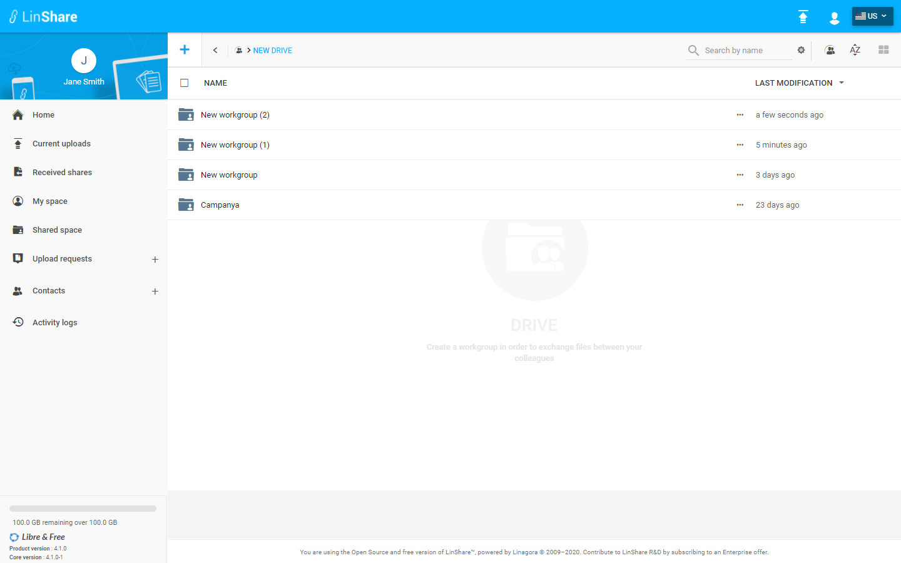

# Summary

* [Related EPIC](#related-epic)
* [Definition](#definition)
* [Screenshots](#screenshots)
* [Misc](#misc)

## Related EPIC

* [Drive](./README.md)

## Definition

#### Preconditions

*  Given that I am a LinShare user 
*  Given that the functionality of Drives is enabled in Admin setting

#### Description

*  After logged-in successfully, I go to Shared Space 
*  I can see the list of my drives and workgroups that are not inside any drive.
*  I click on a Drive  and the the list of workgroups inside
*  If I have role Admin/writer to the Drive, I can see the icon "+" is enabled on top left of screen. If not, the icon is disabled 
*  I click on this icon, the popup Create a workgroup is opened with a default name
*  I can edit workgroup name or not then click button Save

#### Postconditions

*  The new workgroup is created , there will be a successful notification message 
*  If there is any error, there will be an error message. (Invalid Workgroup's name, network error...)
*  All the Drive'members are added automatically to the new created workgroup with his default role to Workgroup
*  The creator of the workgroup is workgroup's admin by default.
*  I can see this action on the Drive audit and Workgroup audit. 
*  When i access an Drive, i can see the breadcrumb on top of screen : Share Space > Drive's name 
*  When i access one Workgroup inside the Drive, i can see the breadcrumb on top of screen: Shared Space > Drive's name > Workgroup's name.

[Back to Summary](#summary)

## UI Design

#### Mockups

#### Final design

[Back to Summary](#summary)

## Misc

[Back to Summary](#summary)
