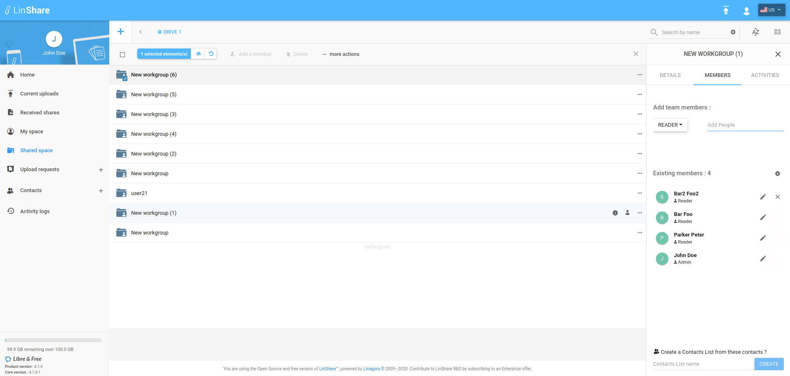
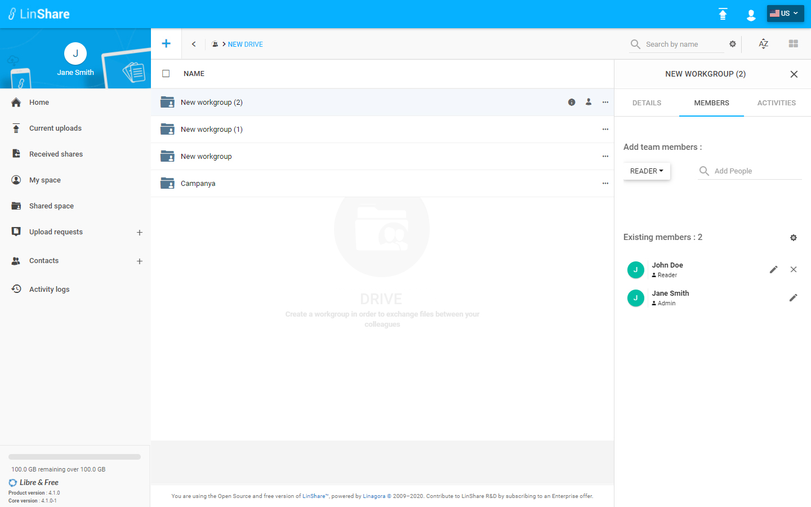
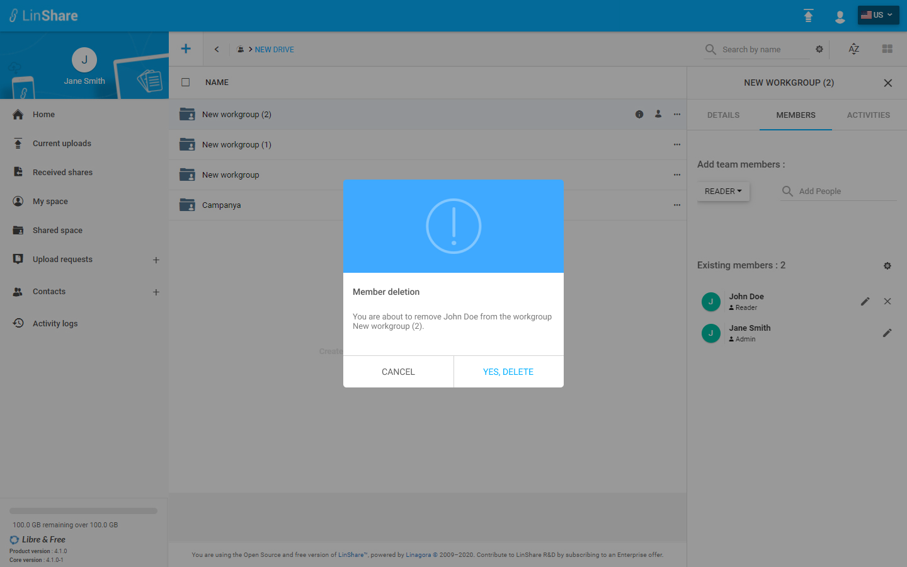
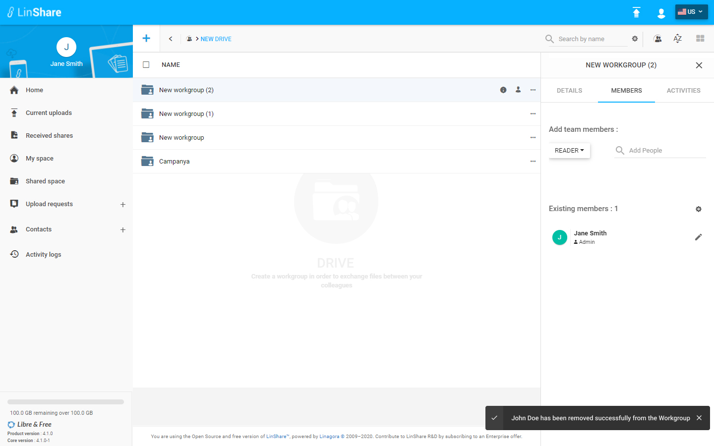

# Summary

* [Related EPIC](#related-epic)
* [Definition](#definition)
* [Screenshots](#screenshots)
* [Misc](#misc)

## Related EPIC

* [Drive](./README.md)

## Definition

#### Preconditions
* Given that i am a Linshare user
* Given that the functionality of Drives is enabled in Admin setting
#### Description
* After logged-in successfully, i go to Shared Space
* I can see the list of my drives and workgroups that are not inside any drive.
* I click on a Drive and the the list of workgroups inside
* when i hover a workgroup that i have Admin role, i can see an icon human or click three dot button of that workgroup, i can see the option Add a member is enabled, i click on this option and Member tab of workgroup will be opened. 
*  On Member tab, i can see the list of current workgroup members
*  When i am admin of Drive, i can see beside external members, there will be 2 icon Delete and Edit 
*  I click on button Delete 
*  There will be a confirmation popup
*  I click button Delete to confirm
#### Postconditions
*  The external member will be deleted and removed from the Workgroup's Existing member section
*  There will be a successful notification message
*  If the deletion is not executed, there will be an error message 
*  I can see this action Drive and workgroup audit 

[Back to Summary](#summary)

## UI Design

#### Mockups

#### Final design

[Back to Summary](#summary)
## Misc

[Back to Summary](#summary)
