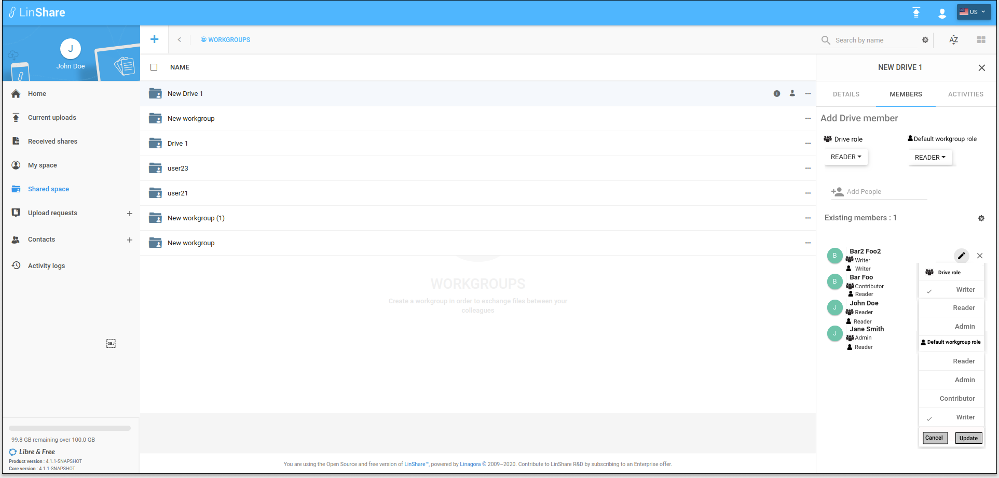
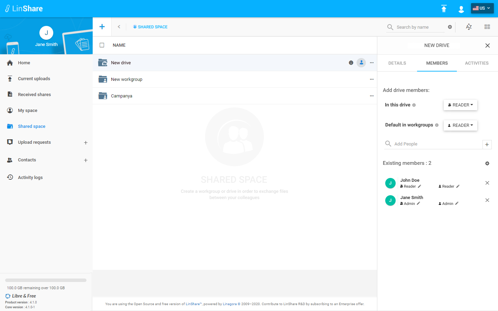
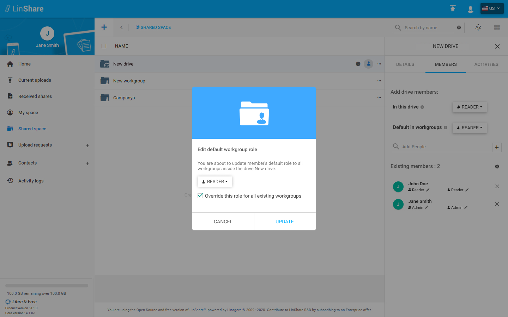

# Summary

* [Related EPIC](#related-epic)
* [Definition](#definition)
* [Screenshots](#screenshots)
* [Misc](#misc)

## Related EPIC

* [Drive](./README.md)

## Definition

#### Preconditions
*  Given that i am a Linshare user 
*  Given that the functionality of Drives is enabled in Admin setting
#### Description
*  After logged-in successfully, i go to Shared Space 
*  I can see the list of my drives and workgroups that are not inside any drive.
*  When i hover any drive name on the list, i can see the icon Member and i click on this icon, the member tab (second tab) will be opened. 
*  Or when i click on three-dot button of a drive, if i am the admin of drive, the option Add member will be enabled. If i am not the admin of Drive, this option will be disabled. I choose Add a member, the Member tab will be opened on the right. 
*  In Existing member section, if i am the admin of Drive, i can see icon Edit default workgroup role next to each member's name 
*  I click on Edit default workgoup role icon, a popup will prompt . 
*  I can see a drop dow list of Default workgroup roles including Admin, Writer,Contributor, Reader and member's current default role to workgoupsis selected. 
*  I can choose another Workgroup role for this member.
*  I can tick the check box "Override this role for all existing workgroups then click button Update.
#### Postconditions
*  If i select checkbox Override current setting, the member's role of all workgoups inside this drive will be updated with the new role. 
*  If i do not select checkbox Override current setting, new role of the member will be applied to the workgroups inside the Drive, except the workgroups in which this members' role were updated before. 
*   I can see this action on the Drive audit and on the audit of workgroup inside this Drive.

[Back to Summary](#summary)

## UI Design

#### Mockups

#### Final design

[Back to Summary](#summary)
## Misc

[Back to Summary](#summary)
