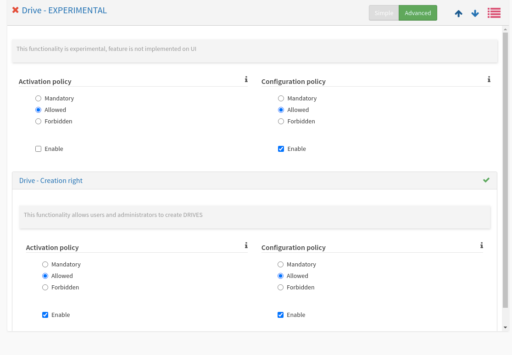

# Summary

* [Related EPIC](#related-epic)
* [Definition](#definition)
* [Screenshots](#screenshots)
* [Misc](#misc)

## Related EPIC

* [Drive](./README.md)

## Definition

#### Preconditions
*  As administrator : i'm logged in the admin interface
#### Description
* I go to parameters on the side menu. 
* I click on functionalities.
* I click on the Drive functionality.
* I can now enable or disable Drive functionality and enable/disable Creation right: 
   *  When the functionality is enabled, the Drives are displayed on User interface. 
   *  When the functionality is disabled, the Drives are hidden on User interface   
   *  When the functionality is enabled and Creation right is enabled, the button create Drive (button "+" at top left of Listing drives screen) is enabled.
   *  When the unctionality is enabled and Creation right is disabled, the button Create Drive is disabled on USer interface. 

#### Postconditions

[Back to Summary](#summary)

## UI Design

#### Mockups

#### Final design

[Back to Summary](#summary)
## Misc

[Back to Summary](#summary)
