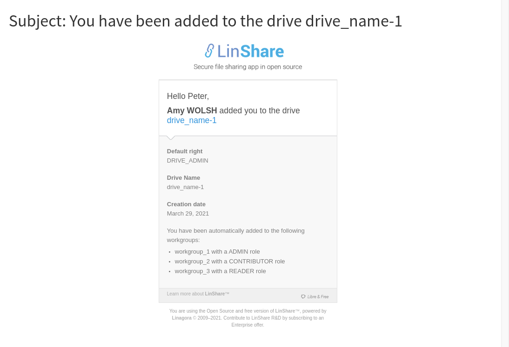
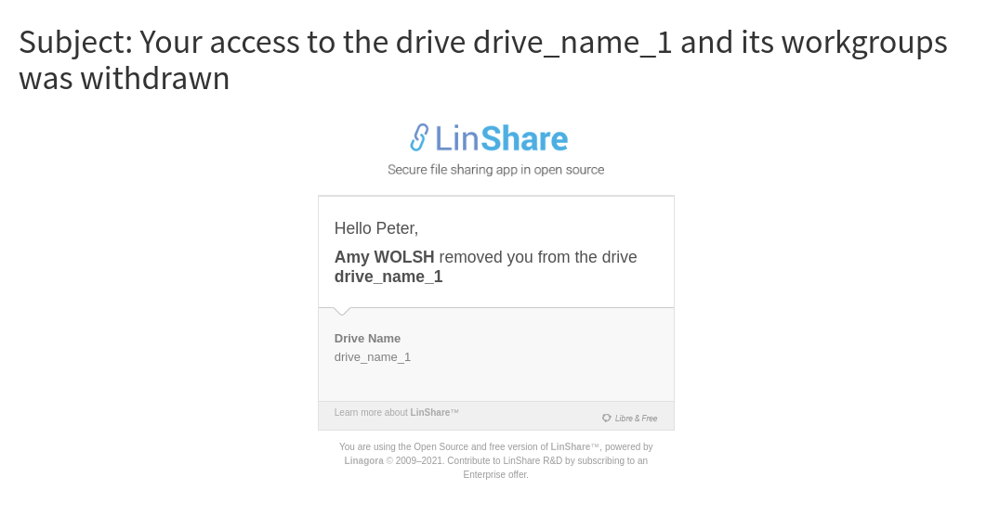
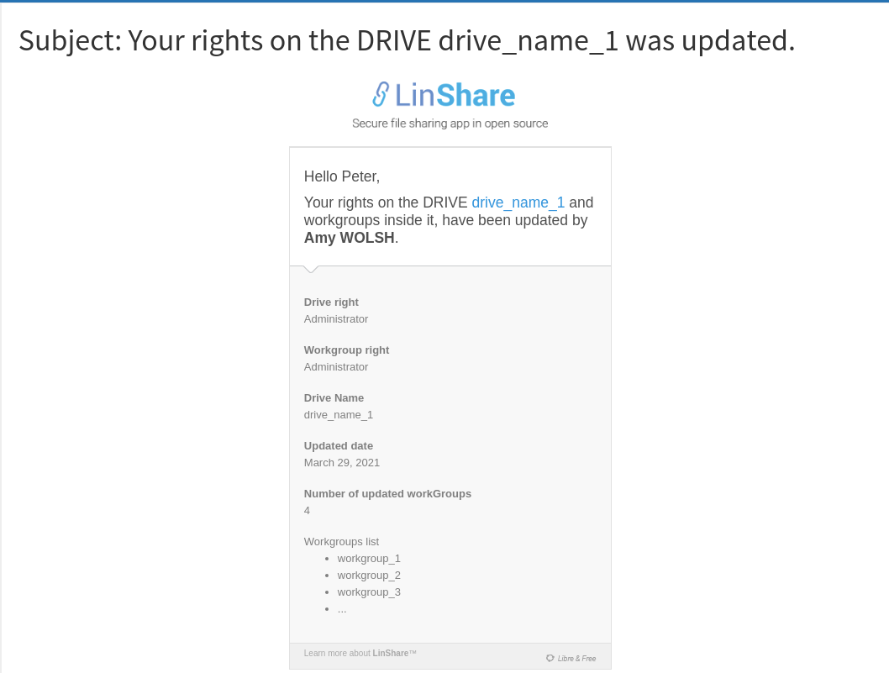

# Summary

* [Related EPIC](#related-epic)
* [Definition](#definition)
* [Screenshots](#screenshots)
* [Misc](#misc)

## Related EPIC
* [Drive](./README.md)

## Definition

#### Preconditions
*  Notifications related to Drives for user are enabled by admin
#### Description
**UC1. Send notification when an user is added to a Drive**
*  When a Linshare user is added to a drive, he will receive an email notification with the following content: 

**UC2: Send notifiction when an user is removed from a Drive**
*  When a  member is removed from the Drive, he will receive an email notification with the following content: 

**UC3: Send notification when an Drive member is updated**
*  When a drive member's role or default workgroup' role is updated, he will receive an email notification with the following content:
 

#### Note 
*  When the list of workgroups in UC1/UC3 are more than 5, in email content, the system will only list 5 latest updated workgroups' name and the icon "..." for the rest. 

[Back to Summary](#summary)

## UI Design

#### Mockups

#### Final design

[Back to Summary](#summary)
## Misc

[Back to Summary](#summary)
