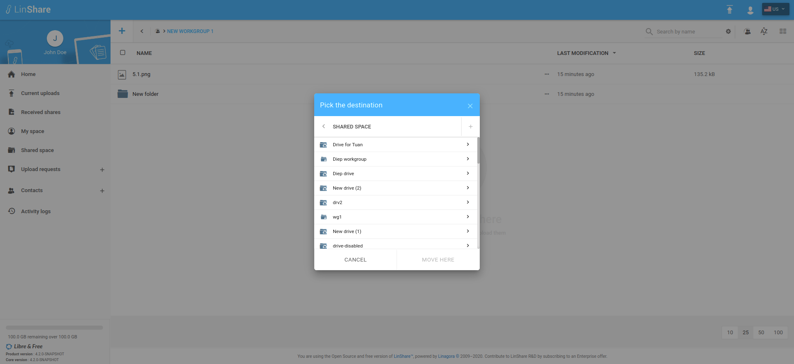

# Summary

* [Related EPIC](#related-epic)
* [Definition](#definition)
* [Screenshots](#screenshots)
* [Misc](#misc)

## Related EPIC

* [Drive](./README.md)

## Definition

#### Preconditions

-  Given that I am a LinShare user 
-  Given that the functionality of Drives is enabled in Admin setting
-  Given that i have permission to copy/move files/folder in workgroup 

#### Description

-  After logged-in successfully, I go to Shared Space.
-  I can see the list of my drives and workgroups that are not inside any drive.
-  I click on a Drive  and the the list of workgroups inside that Drive
-  I click on one workgroup and see the list of files/folders inside the workgroup
-  When i select a file/folder and  move to Shared Space or copy file to Shared Space, i can see the Pick destination screen. 
-  I can see the list of Drives and workgroups which are not inside any Drive. 
-  The workgroups that i dont have permission to copy/move are disabled.  

#### Postconditions

-  When i click on one Drive, i can see the list of workgroups inside that drive: Only workgroups that i have permission to copy/moved are enabled and i can continue choosing these workgroups as destination.
-  If functionality of Drives is disabled in Admin setting, i cannot see drives list in Pick destination screen 

[Back to Summary](#summary)

## UI Design

#### Mockups

#### Final design

[Back to Summary](#summary)
## Misc
