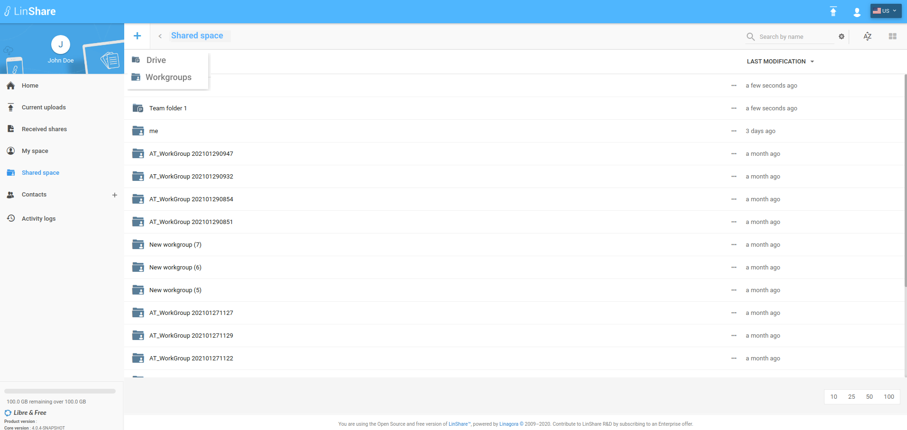
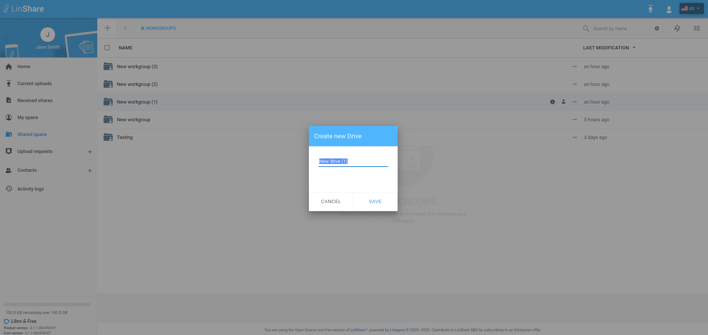

# Summary

* [Related EPIC](#related-epic)
* [Definition](#definition)
* [Screenshots](#screenshots)
* [Misc](#misc)

## Related EPIC

* [drive](./README.md)

## Definition

#### Preconditions
*  Given that i am a Linshare user 
*  Given that the functionality of Drives is enabled in Admin setting
#### Description
*  After logged-in successfully, i go to Shared Space 
*  I can see the list of my drives and workgroups that are not inside any drives 
*  When i  click button "+" on top left of screen, there will be 2 options: Create a drive / Create a workgroup
*  I choose create a Drive 
*  A popup will be displayed with a default drive name 
*  I can edit the name or not then click button Create  
#### Postconditions
*  If The Drive is created successfully, the system will display a successful notification message. If there is any error (invalid name, permission, network...), system will display an error message.
*  My role to the new created drive is Admin and my default role on the workgroups inside the drive is admin 
*  I can see this action on the Drive audit.

[Back to Summary](#summary)

## UI Design

#### Mockups

#### Final design
https://www.figma.com/file/uEjMnsiLPSByz7m6wfTLLA/LinShare-Web?node-id=2450%3A1
[Back to Summary](#summary)
## Misc

[Back to Summary](#summary)
