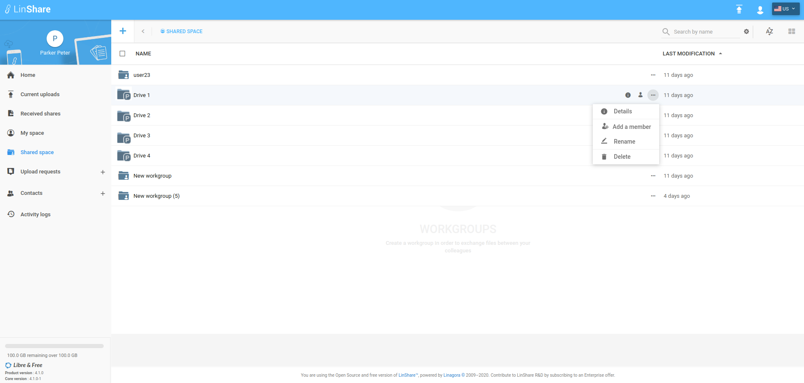
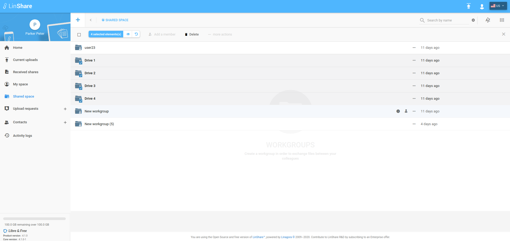
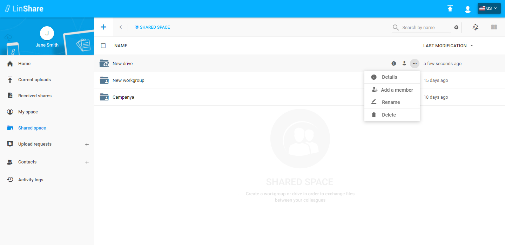
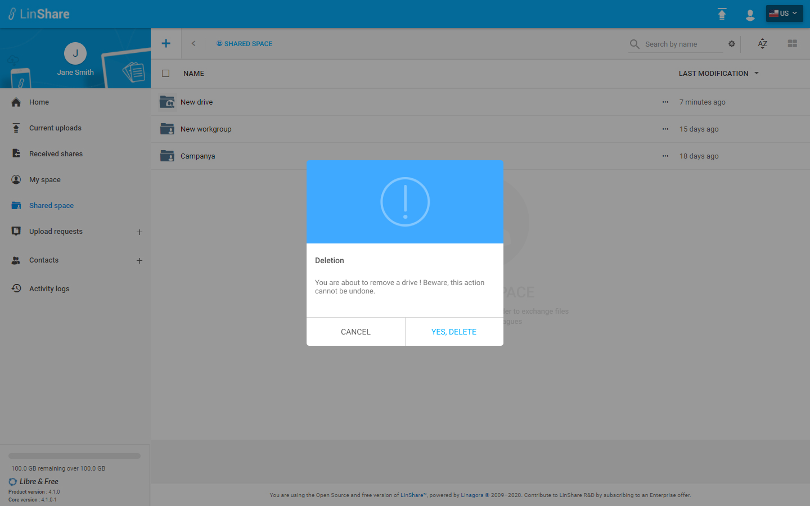
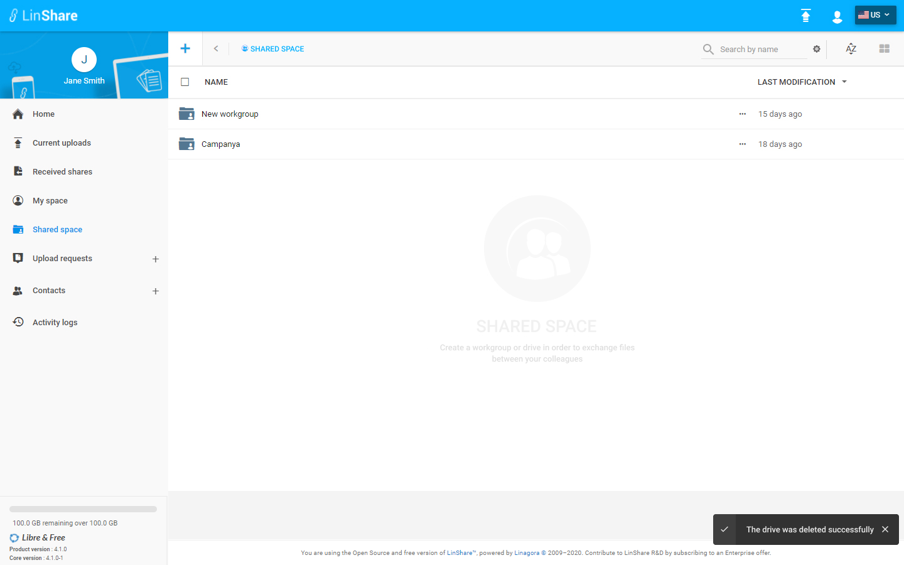
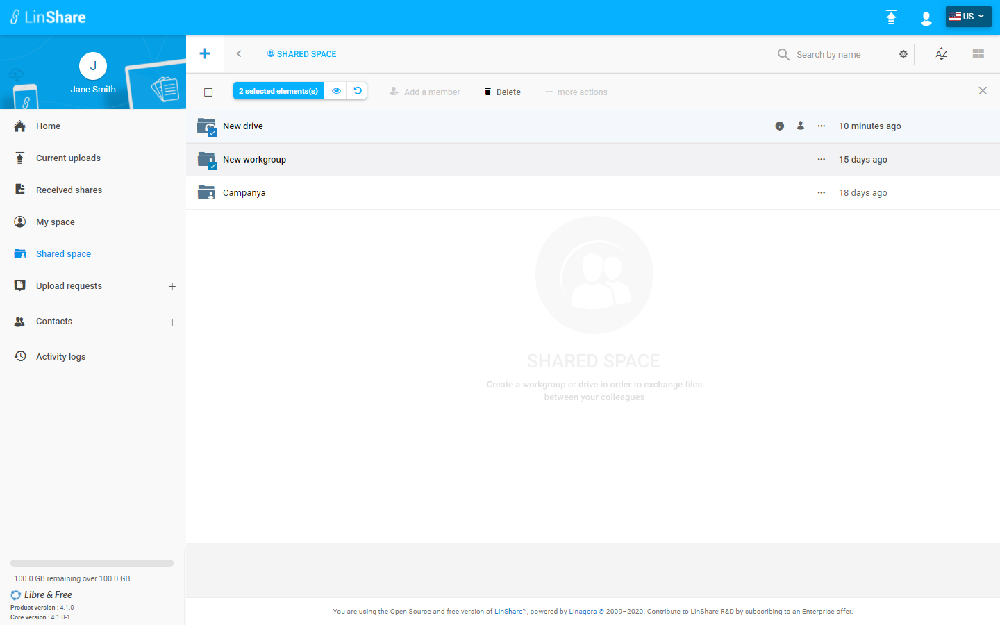

# Summary

* [Related EPIC](#related-epic)
* [Definition](#definition)
* [Screenshots](#screenshots)
* [Misc](#misc)

## Related EPIC

> Links to the epic document in the epic folder, normally README.

* [Name of the epic](./README.md)

## Definition

#### Preconditions
*  Given that i am a Linshare user 
*  Given that the functionality of Drives is enabled in Admin setting
*  After logged-in successfully, i go to Shared Space 
*  I can see the list of my drives and workgroups that are not inside any drive.
#### Description
**UC1. Delete one drive**
*  when i click on three-dot button of a drive, if i am the admin of drive, the option Delete will be enabled. 
*  Or when i click checkbox to select a drive that i am admin, i can see the action bar displayed on top of screen.
*  I click button Delete, a confirmation popup will prompt
*  I confirm deletion, the selected Drive will be removed from the list. All the workgroups inside the drive are also deleted

**UC2. Delete multiple Drives and workroups**

*  When i click checkbox to select multiple drives/workgroups that i have admin role, on the action bar, i can see the option Delete is enabled
*  I click on this option, the confirmation popup will be displayed 
*  I confirm the deletion, all the selected drives/workgroups will be removed .

#### Postconditions
*  The selected Drive(s) will be removed from the list. All the workgroups inside the drive are also deleted 
*  I can see this action on my Activity Logs.
[Back to Summary](#summary)

## UI Design

#### Mockups

#### Final design
**Delete one drive**

**Delete multiple drives**

[Back to Summary](#summary)
## Misc

[Back to Summary](#summary)
