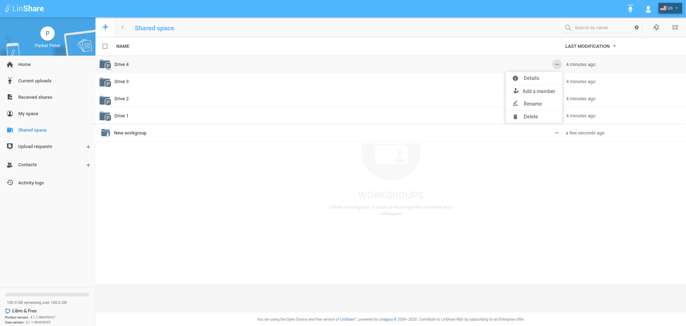
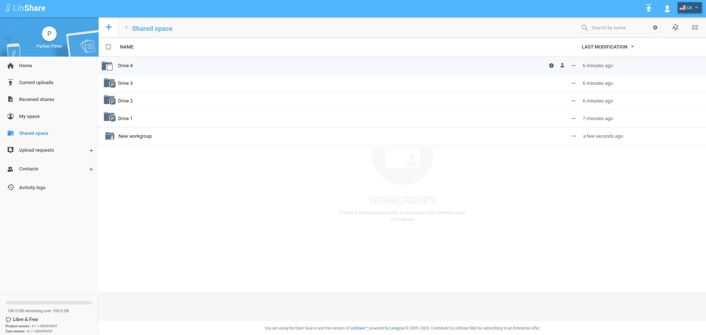
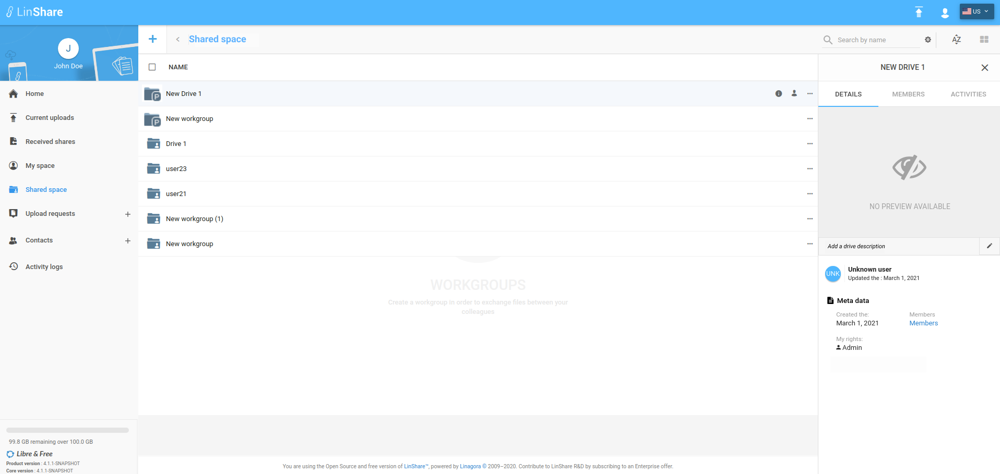
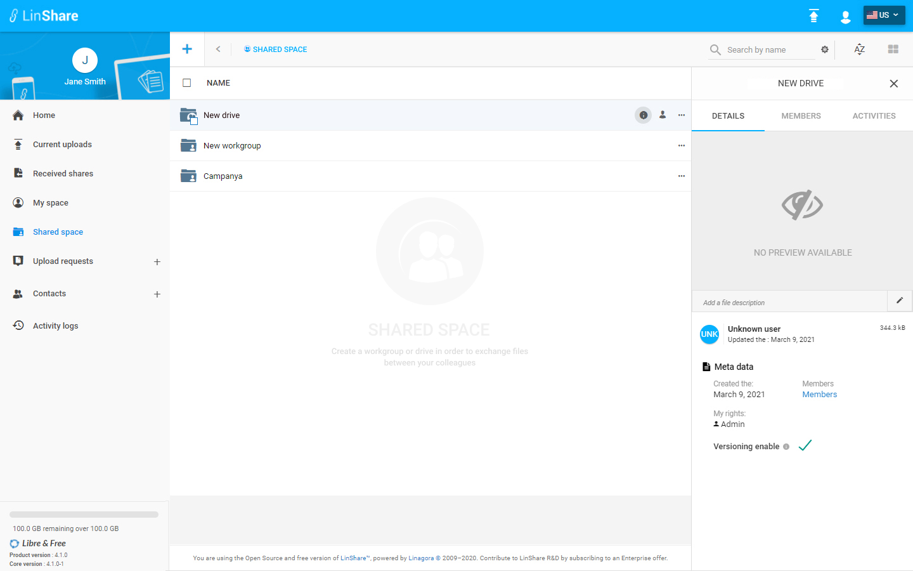
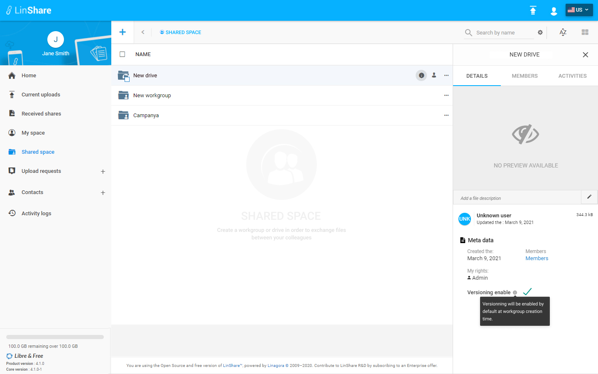

# Summary

* [Related EPIC](#related-epic)
* [Definition](#definition)
* [Screenshots](#screenshots)
* [Misc](#misc)

## Related EPIC

* [Drive](./README.md)

## Definition

#### Preconditions
*  Given that i am a Linshare user 
*  Given that the functionality of Drives is enabled in Admin setting
*  After logged-in successfully, i go to Shared Space 
*  I can see the list of my drives and workgroups that are not inside any drive.
#### Description
**UC1. View detailed information of a drive.**
*  After logged-in successfully, i go to Shared Space 
*  I can see the list of my drives and workgroups that are not inside any drive.
*  When i hover the drive name, i can see the icon information, i click on this icon, the Detail panel will be opened on the right 
*  Or when i click on thee-dots button of a drive, i can see a drop-down list of actions, and i choose option "Details", then the Detail panel will be opened on the right. User with any role to the drive (admin/writer/reader) can view detail tab. 
*  On detail tab, i can see the following information:
   *  Drive name
   *  Description (if any)
   *  Creation time
   *  Update time
   *  Update person
   *  My rights to the drive
   *  Members: When i click on this link, it will open Member tab
   *  Versioning enable: Default setting for inside workgroups versioning. When this checkbox is ticked , all the workgroups inside will be default versioned . When this checkbox is not ticked, the all the workgroups inside will be not versioned by default (when workgroup is created).

**UC2. Edit description **
  
*  On Detail tab of a Drive, i can see the field " Description" below the Drive's name 
*  If i am the Drive reader, i can only see the field as non editable text 
*  If i am the admin/writer of the drive, i can see the icon Edit next to the field
*  When i click on icon Edit, i can change the description then save.

[Back to Summary](#summary)

## UI Design

#### Mockups

#### Final design

[Back to Summary](#summary)
## Misc

[Back to Summary](#summary)
