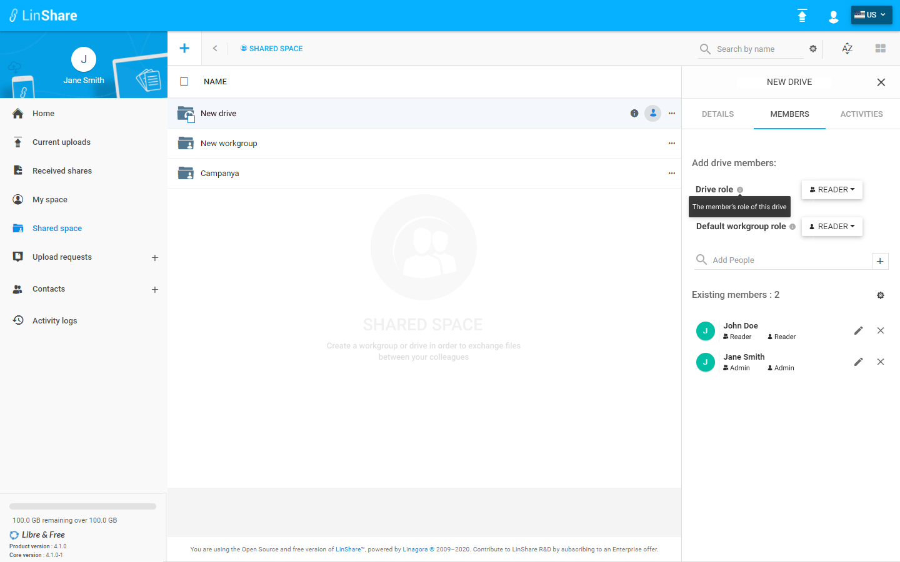
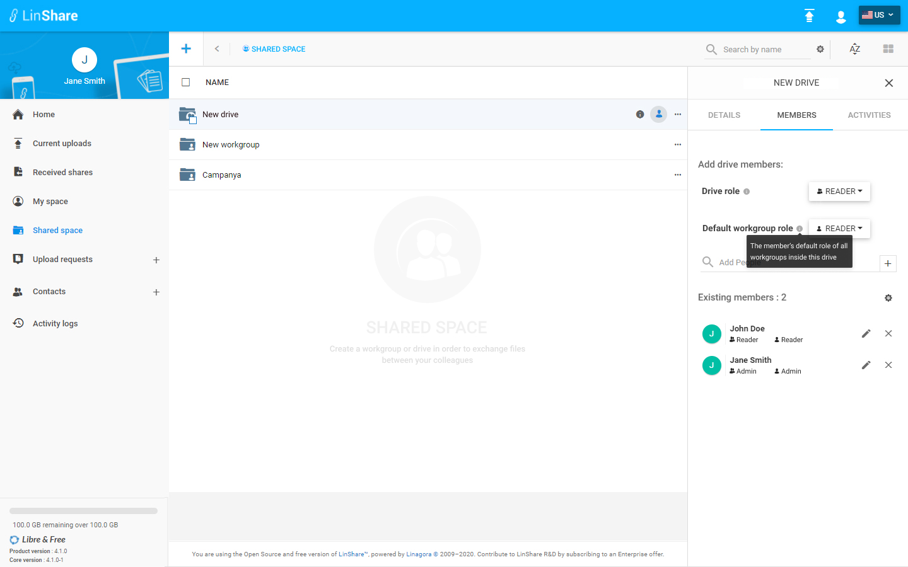
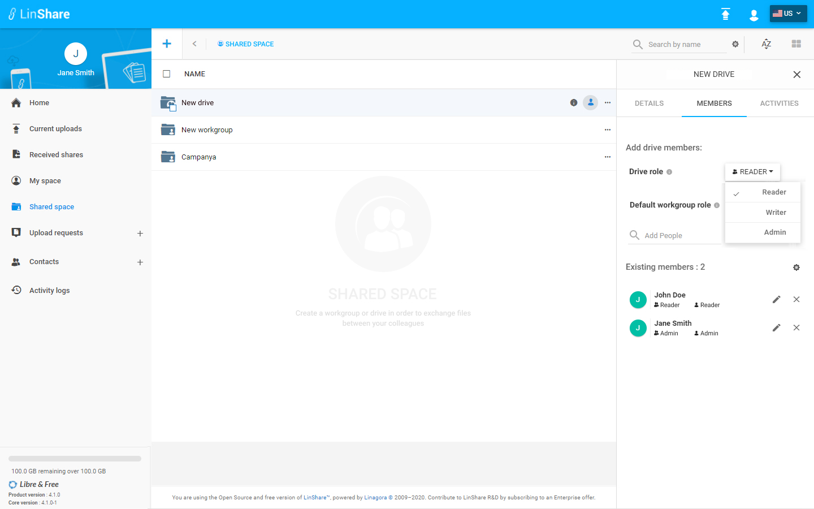

# Summary

* [Related EPIC](#related-epic)
* [Definition](#definition)
* [Screenshots](#screenshots)
* [Misc](#misc)

## Related EPIC

* [drive](./README.md)

## Definition

#### Preconditions
*  Given that i am a Linshare user 
*  Given that the functionality of Drives is enabled in Admin setting

#### Description

*  After logged-in successfully, i go to Shared Space 
*  I can see the list of my drives and workgroups that are not inside any drive.
*  When i hover any drive, i can see the icon Member and i click on this icon, the member tab (second tab) will be opened. 
*  Or when i click on three-dot button of a drive, if i am the admin of drive, the option Add member will be enabled. If i am not the admin of Drive, this option will be disabled. I choose Add a member, the Member tab will be opened on the right. 
*  I can see the the Add a member section that includes fields: 
   *  Drive role: A drop-down list including options: Admin, Writer, Reader. The default selection is Reader 
   *  Default Workgroup role: A drop-down list including options: Admin, writer, Contributor, Reader. The default selection is Reader 
   *  Add people: I can input text in this field to search Linshare user (internal users and guests) by name or email. The system will display result instantly and i can choose one user from the list. 
   *  If the selected user is already a member of drive, there will be an error toast message. 
   *  If not, That user will be added to the drive. Now he will be listed in section Existing member of the Drive.

#### Postconditions
*  The new member is added to the dirve  with selected role
*  He is added to all workgroups inside the Drive with the default workgroup role 
*  I can see this action on the Drive audit

[Back to Summary](#summary)

## UI Design

#### Mockups

#### Final design

[Back to Summary](#summary)
## Misc

[Back to Summary](#summary)
