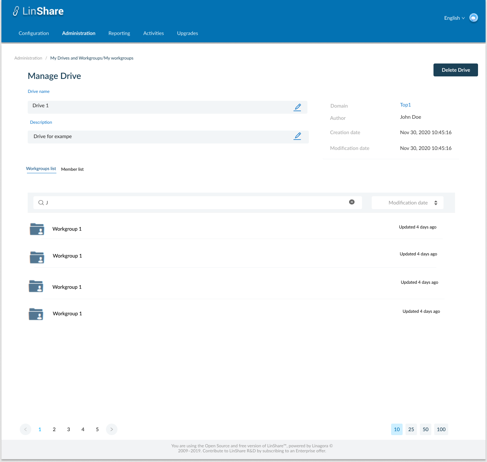

# Summary

* [Related EPIC](#related-epic)
* [Definition](#definition)
* [Screenshots](#screenshots)
* [Misc](#misc)

## Related EPIC

* [New admin portal](./README.md)

## Definition

#### Preconditions

- Given that i am super-admin in Linshare 
- I logged-in to Amin portal successfully

#### Description

**UC1.View and Edit Drive information**
- After log-in Admin Portal successfully, i go to Administration tab
- On Administration tab, i can see the list of links to screens: My users, My Drives/workgroups, My contact lists, Inconsistent users, loggers 
- I click on My Drives/ Workgroups, the screen My Drives and Workgroups list will be opened.
- I click on a Drive in the list, the screen Manage Drive will be opened. 
   - On the right part i can see uneditable fields including: 
      - Creation date
      - Modification date 
      - Author: Creator of the Drive
      - Domain: The link displays domain name of the current workgroup. When I click on this link, the domain detail page will be opened
   - On the left part i can see the editable fields including:
      - Drive's name: Text field. This field cannot be blank or contains special characters. When click icon Edit, i can change the name and click Enter to Save, if the name is invalid, i can see an error message. If the name is valid, the field will be updated. 
      - Description: a text field displaying current Drive's desctiption. When i click on icon Edit, i can change the name and click Enter to Save. This field can be blank. 

**UC2. Delete Drive**
- On the top right of screen, i can see a button "Delete Drive"
   - When i click on this button, there will be a confirmation message.
   - When i choose Yes to confirm, the Drive will be removed. Now the Drive's members cannot find that Drive in User app.
   - I will see a toast notification and back to the Workgroups/Drive list screen. 
#### Postconditions

[Back to Summary](#summary)

## UI Design

#### Mockups

#### Final design

[Back to Summary](#summary)
## Misc

[Back to Summary](#summary)
