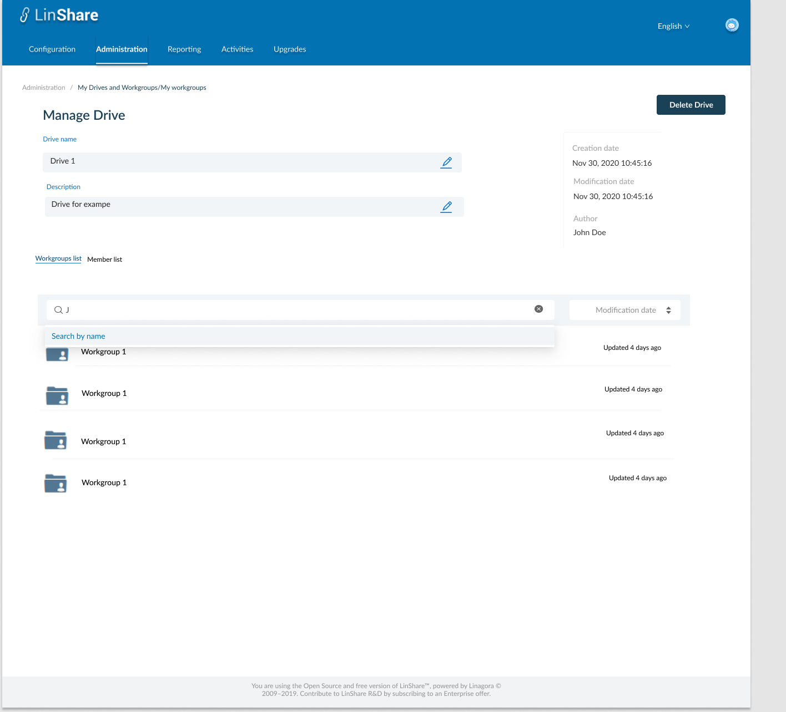
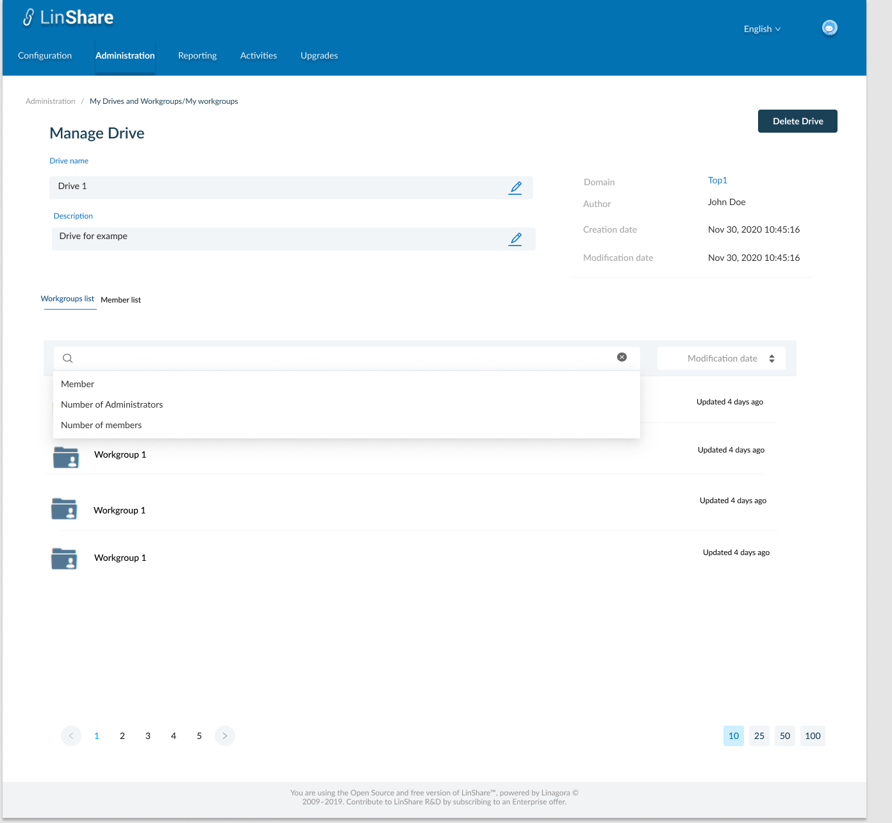

# Summary

* [Related EPIC](#related-epic)
* [Definition](#definition)
* [Screenshots](#screenshots)
* [Misc](#misc)

## Related EPIC

* [New Admin portal](./README.md)

## Definition

#### Preconditions

- Given that i am super-admin in Linshare 
- I logged-in to Amin portal successfully

#### Description

- After log-in Admin Portal successfully, i go to Administration tab
- On Administration tab, i can see the list of links to screens: My users, My Drives/workgroups, My contact lists, Inconsistent users, loggers 
- When I click on My Drives/ Workgroups, I can see My Drives and Workgroups list.
- I click on a Drive in the list, the screen Manage Drives is opened. 
- Under Drive information part, i can see 2 tabs, and the First one is Workgroups list, including all workgoups created inside this Drive
- Each role represents a workgroup with Workgroup icon, Workgroup name and modification date. 
- The default order of worksgroup is last modification time.
- I can change the sort criteria by selecting from drop-down list: Modification date, Creation date, Name 
- Search bar:
   - When i click on the search bar, a drop-down list of search criteria will be displayed including options: Member, Number of administrators, Number of members. I can select one criteria: 
      - If i select Member:  When i select this search citeria, the search bar will display: Member = "text input". When i start typing, i can see the suggestion list of Linshare user (internal and guest account) which have first name, last name or email contains text inputted. I can select member from the list. When i click Enter, the system will search and display workgroups that contain that selected user as a members.
      - Number of administrators: When i select this search criteria, the search bar will display Number of Administrators = "Dropdown list". Options are: None/More than 0.
      - Number of members: When i select this search criteria, the search bar will display Number of Members = "Dropdown list". Options are: None/More than 0.
      - When i start typing on search bar without select any search criteria from the dropdown list, the system will show default search criteria is Workgroup's name.
- When i click in one workgroup, the Screen Manage that workgoup will be opened.

#### Postconditions

[Back to Summary](#summary)

## UI Design

#### Mockups

#### Final design

[Back to Summary](#summary)
## Misc

[Back to Summary](#summary)
