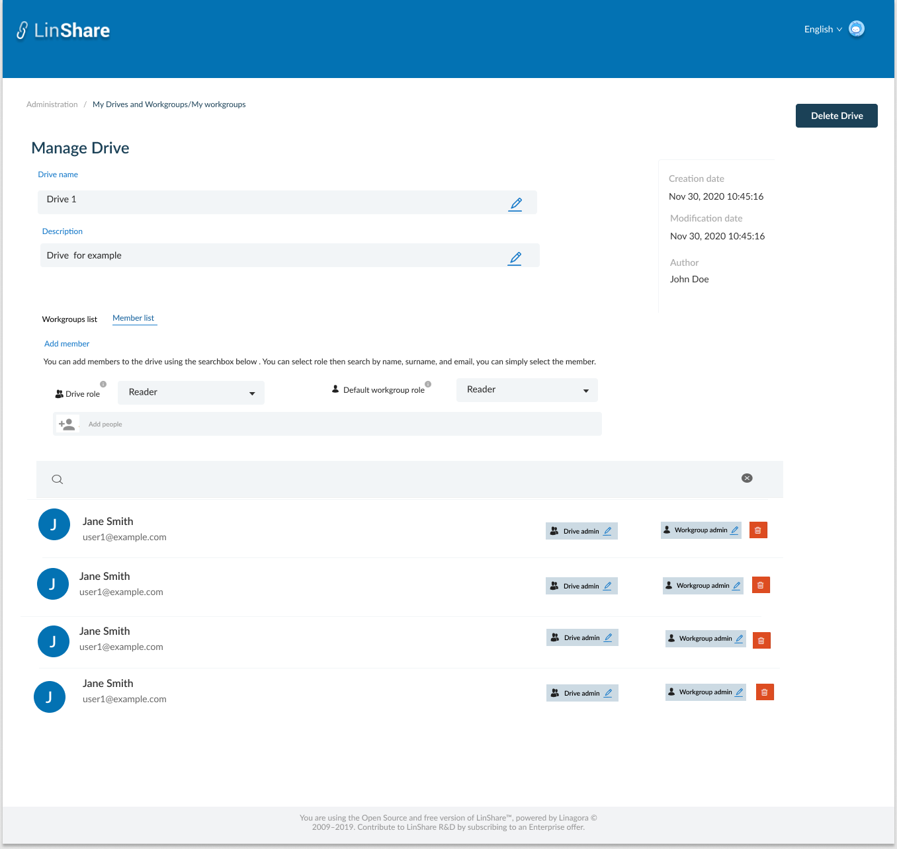
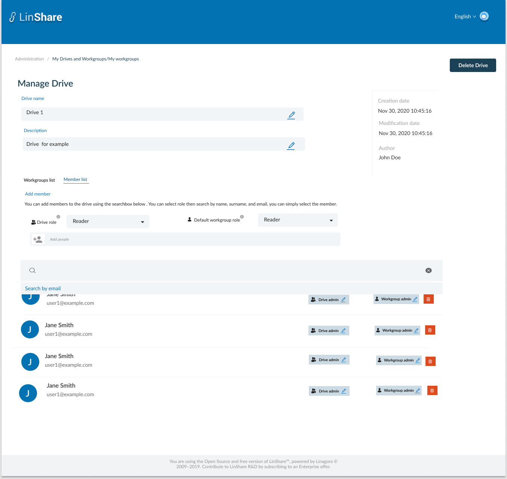
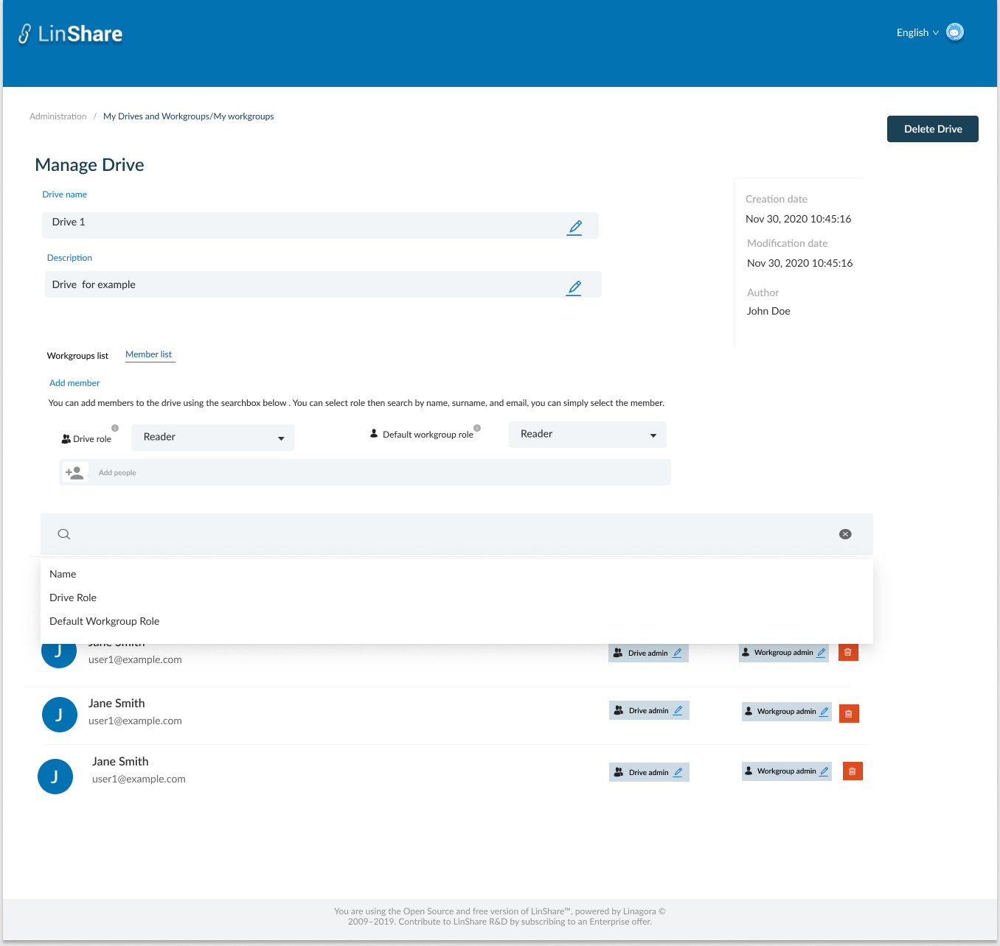

# Summary

* [Related EPIC](#related-epic)
* [Definition](#definition)
* [Screenshots](#screenshots)
* [Misc](#misc)

## Related EPIC

* [New admin portal](./README.md)

## Definition

#### Preconditions

- Given that i am super-admin in Linshare 
- I logged-in to Amin portal successfully

#### Description

- After log-in Admin Portal successfully, i go to Administration tab
- On Administration tab, i can see the list of links to screens: My users, My Drives/workgroups, My contact lists, Inconsistent users, loggers 
- When I click on My Drives/ Workgroups, I can see My Drives and Workgroups list.
- I click on a Drive in the list, the screen Manage Drives is opened. 
- Under Drive information part, i can see 2 tabs, and the First one is Workgroups list, i click on the second tab: Member list

**UC1. Add member to the Drive**
- To add a member to the Drive, i need to fill in 3 fields:
   - Drive role: A drop-down list with options: Admin, Writer, Reader. The default value is Reader. when i hover the tooltip, i can see a message:"The member’s role of this drive"
   - Default workgroup role: A drop-down list with options: Admin, Writer, Contributor, Reader. The default valuw is Reader. When i hover the tooltip, i can see a message:" The member’s default role of all workgroups inside this drive"
   - Add member: when i type characters, the suggestion list of Linshare users (internal and guest user) will be displayed. I can select one user and he will be come the Drive member with above selected roles. 
   - This new user will be listed on the member list. He is also noticed by an email notification. 

**UC2. Search members**

- When i click on Search bar, i can see a drop-down list that allows me to choose Search criteria: 
   - Name: When i select Name, the search bar will display: "Name = "text input" When i start typing, i can see the suggestion list of Linshare user (internal and guest account) which have first name, last name or email contains text inputed. 
      - If i select a member, the result list below will display only that selected member. 
      - If i click Enter, the result list below will displayed all matched members of the Drive 
   - Drive role: If I choose Role, the search bar will display: Drive Role = "Dropdown list". Options include: Admin, Writer, Reader
   - Default workgroup role: If i select this criteria, the search bar will display Default Workgroup Role="Dropdown list". Options includes Admin, Writer, Contributor, Reader.
- If i do not choose search criteria and type in the search bar, the default search will be email.

**UC3. Update/Delete member**
- Each member is displayed in one row in the list and includes information:
   - User icon
   - First name and last name
   - Email
   - Drive role: Display current Drive role of the member. I can assign another role for member by click on Edit icon and select new role from the Drop down list. 
   - Default workgroup role: Display current default workgroup role. When i click icon Edit, there will be a popup, in which i can choose another role from drop-down list and a check box to override the new role for all existing workgroups inside of Drive
- I click on icon Delete, there will be a confirmation popup
- If i choose Yes, that member will be removed out of Drive and all workgroups inside. 
   
#### Postconditions

[Back to Summary](#summary)

## UI Design

#### Mockups

#### Final design

[Back to Summary](#summary)
## Misc

[Back to Summary](#summary)
