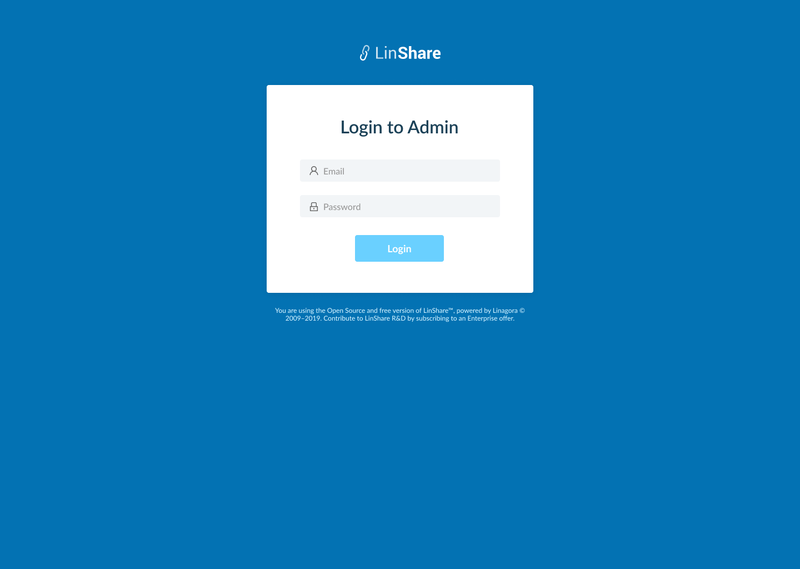
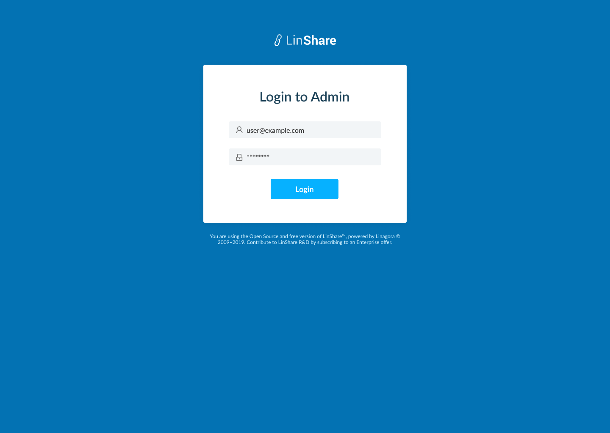
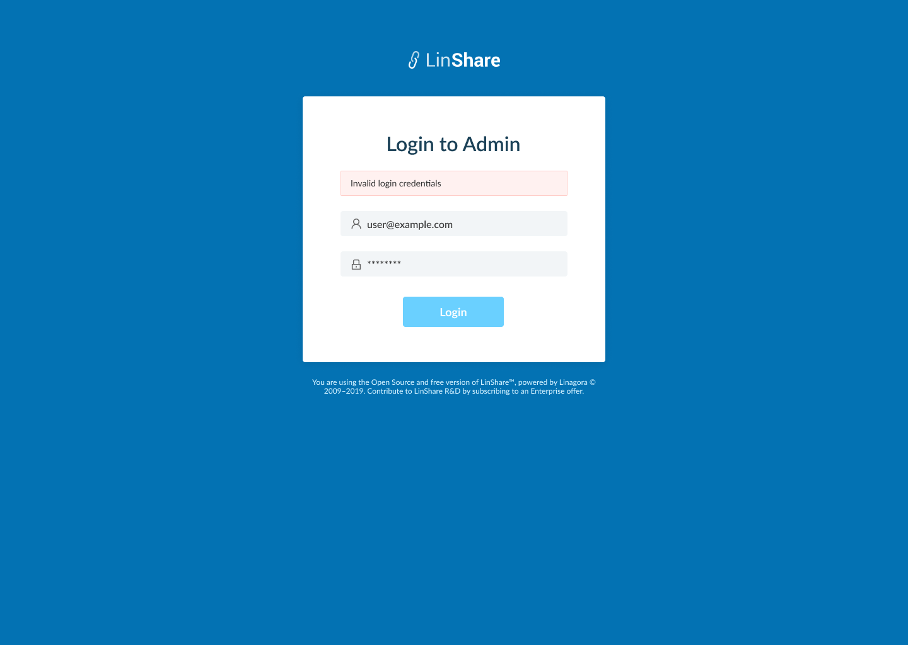
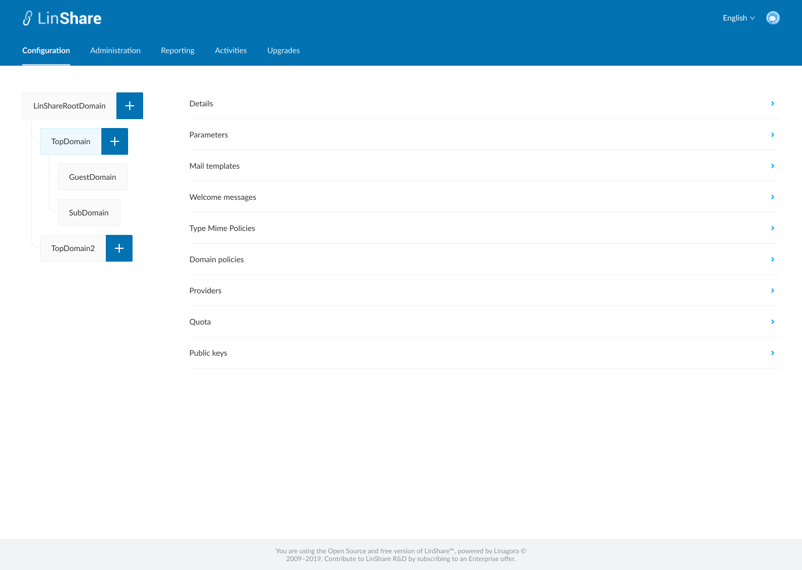
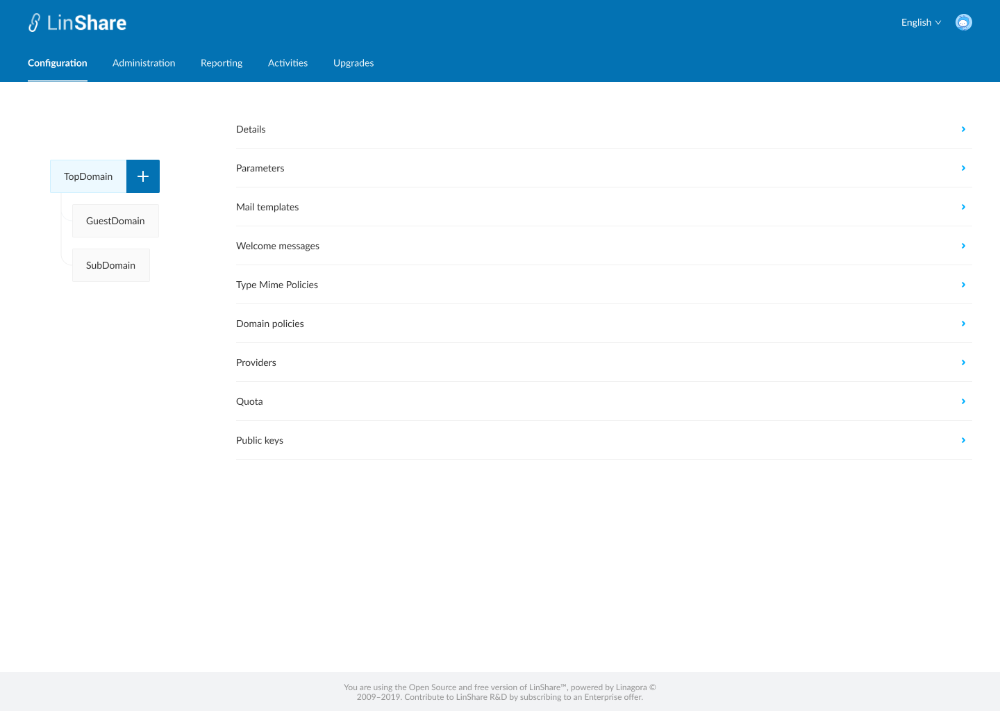

# Summary

* [Related EPIC](#related-epic)
* [Definition](#definition)
* [Screenshots](#screenshots)
* [Misc](#misc)

## Related EPIC

* [New admin portal](./README.md)

## Definition

#### Preconditions

#### Description

**UC1. As a Super admin (root domain admin), i want to log-in Admin portal**

*  Given that i am a root domain admin
*  I access the Admin portal URL 
*  I can see the Log-in screen, including fields:
   *  Email: text field
   *  Password: text field - hidden by dots
*  After inputting log-in credentials and click button Sign-in, the system will validate:
   *  If the log-in credentials are valid, i am redirected to the admin portal home page for Super admin 
   *  If email and/or password is invalid, system will prompt error toast message.
*  In Super admin homepage, i can see the below information: 
          *  Language flag: When i click on, i can see the language options: Enlish, Français, Русский. When i choose a language, the whole page will be displayed on the selected one 
          *  Human icon: When I click on, i can see my email and 2 options: Change password and Logout
*  I can see top-menu includes tabs: Configuration, Administration, Reporting, Activities, Upgrades
*  A domain tree menu on the Left: I can see full domain tree with Root domain and other lower level domains. 

**UC2. As a nested admin, i want to log-in Admin portal**

*  Given that i am nested domain admin
*  I access the Admin portal URL 
*  I can see the Log-in screen, including fields:
   *  Email: text field
   *  Password: text field - hiden by dots
*  After inputting log-in credentials and click button Sign-in, the system will validate:
   *  If the log-in credentials are valid, i am redirected to the admin portal home page for nested admin 
   *  If email and/or password is invalid, system will prompt error toast message.
*  In nested admin homepage, i can see the below information:    
          *  Language flag: When i click on, i can see the language options: Enlish, Français, Русский. When i choose a language, the whole page will be displayed on the selected one 
          *  Human icon: When I click on, i can see my email and button Logout
*  I can see top-menu includes tabs: Configuration, Administration, Reporting, Activities.
*  A domain tree menu on the Left: I can only see my domain and other lower level domains, and cannot see the higher-level domain.
#### Postconditions

[Back to Summary](#summary)

## UI Design

#### Mockups

#### Final design

[Back to Summary](#summary)
## Misc

[Back to Summary](#summary)
