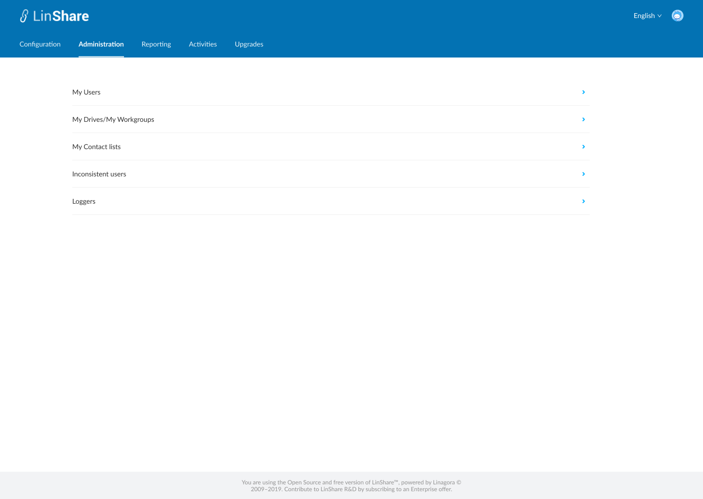
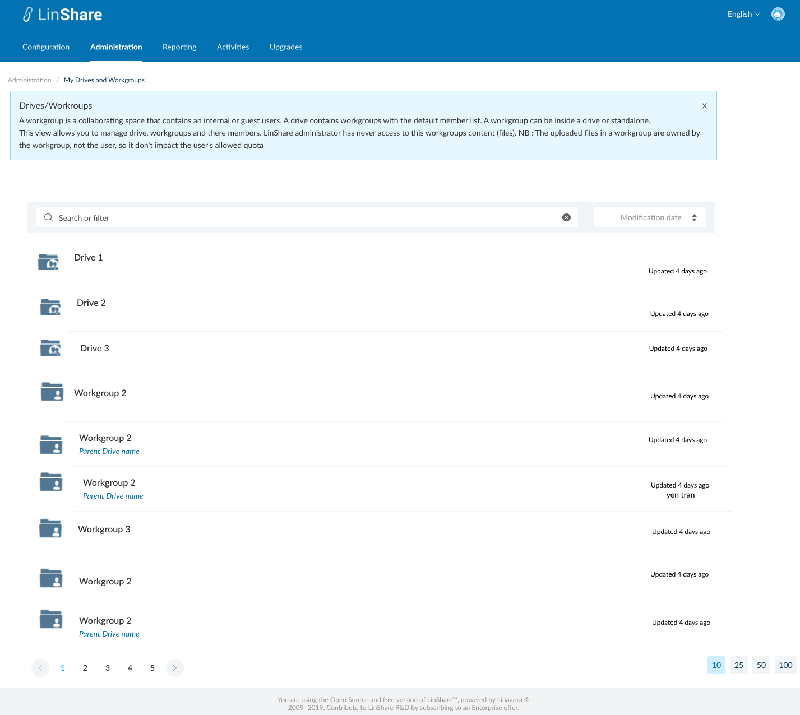
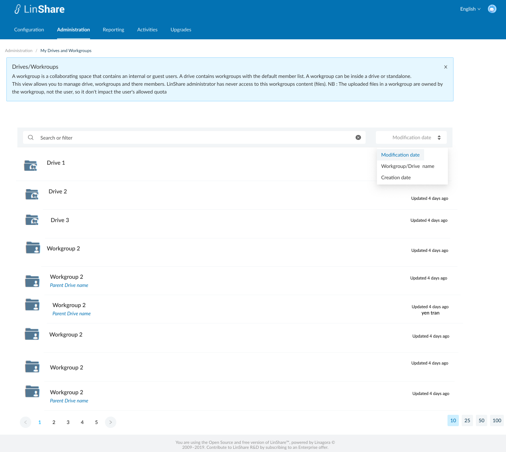

# Summary

* [Related EPIC](#related-epic)
* [Definition](#definition)
* [Screenshots](#screenshots)
* [Misc](#misc)

## Related EPIC

* [New admin portal](./README.md)

## Definition

#### Preconditions

- Given that i am supper admin of New Admin Portal

#### Description

- After log-in Admin Portal successfully, i go to Administration tab
- On Administration tab, i can see the list of links to screens: My users, My Drives/workgroups, My contact lists, Inconsistent users, loggers 
- I click on My Drives/ Workgroups, the screen My Drives and Workgroups will be opened. 
- In new view I can and see the following information:
     - A Search bar 
     - A Sort field
     - A list of all workgroups/drives 

#### Postconditions

- Each Workgroup/Drive is is displayed as an item with name
- If workgroup is inside an Drive, the parent Drive name is shown under the workgroup name 
- Default sort criteria is Modification date 
- When i click on Sort field, there will be drop-down list containing sort criteria: Modification date, Creation date, Workgroup/Drive name.
- I can select sort criteria from the list and use the arrow up and down to change order of sorting.
- The default number of displayed items is 25, i can change the number of iems at the bottom of page.
- When i click on a Workgroup item, the Manage Workgroup  detail screen will be opened. 
- When i click on a Drive item, the Mange Drive detail will be opened. 

[Back to Summary](#summary)

## UI Design

#### Mockups

#### Final design

[Back to Summary](#summary)
## Misc

[Back to Summary](#summary)
