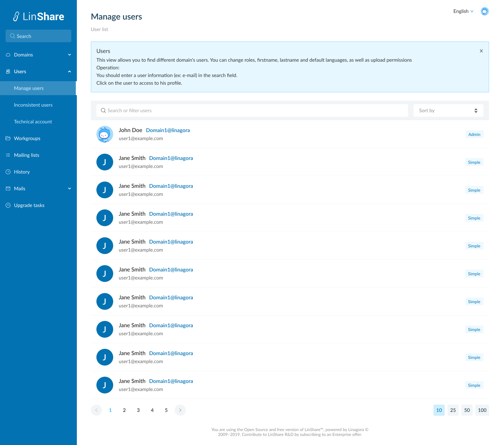
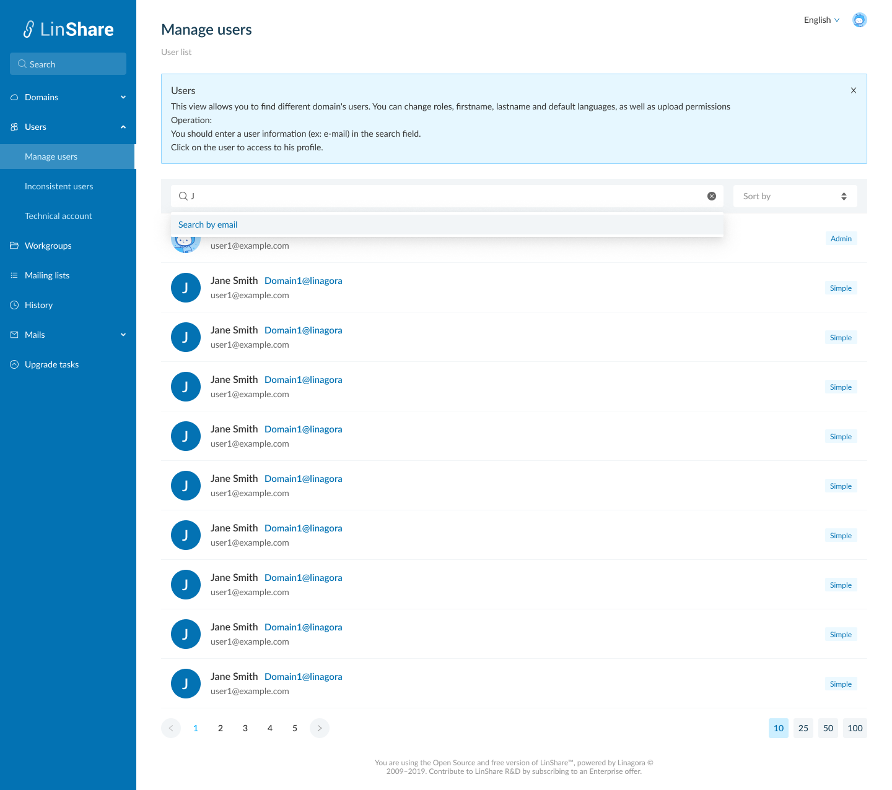
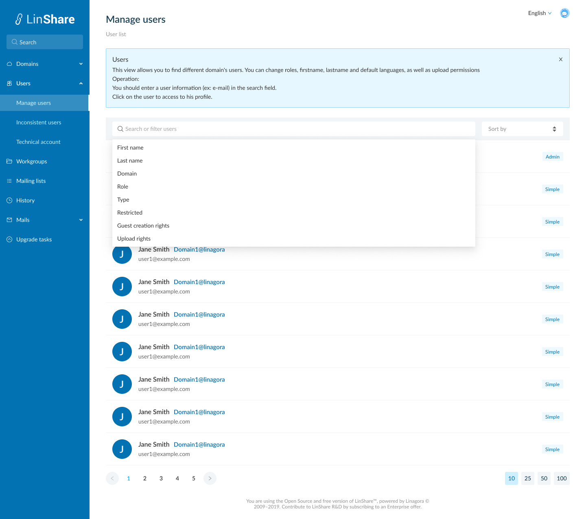
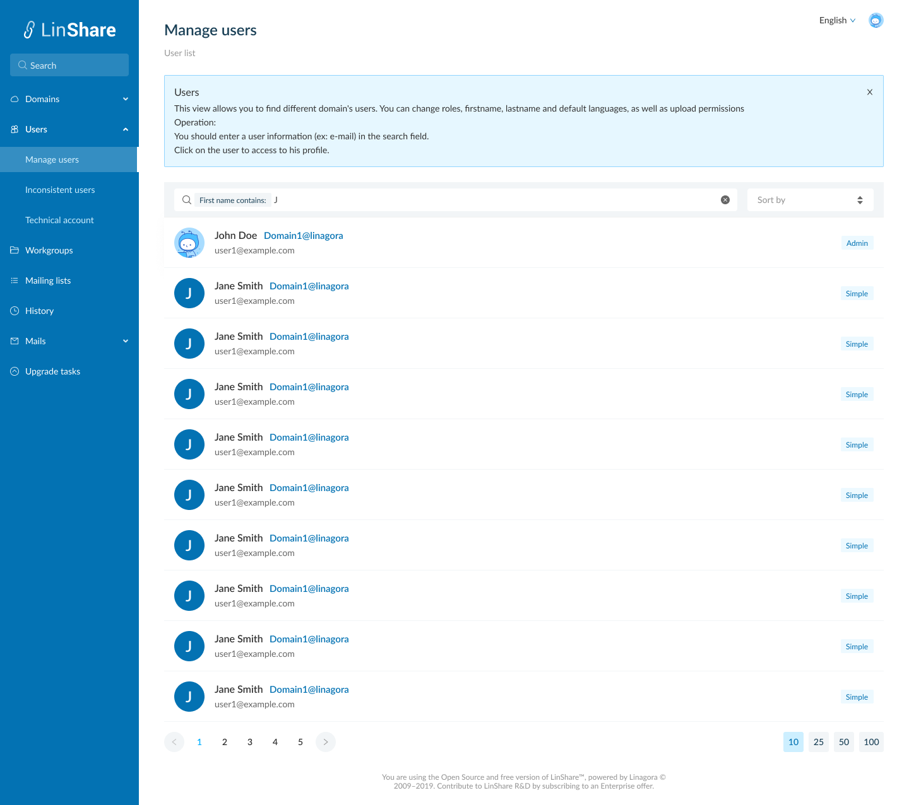
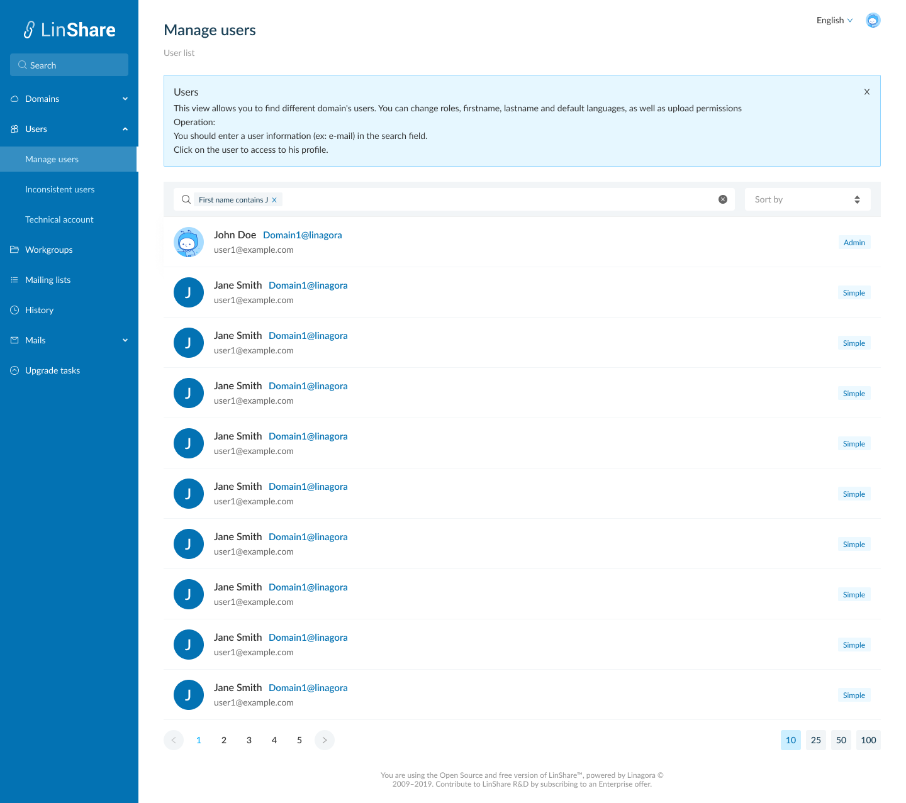
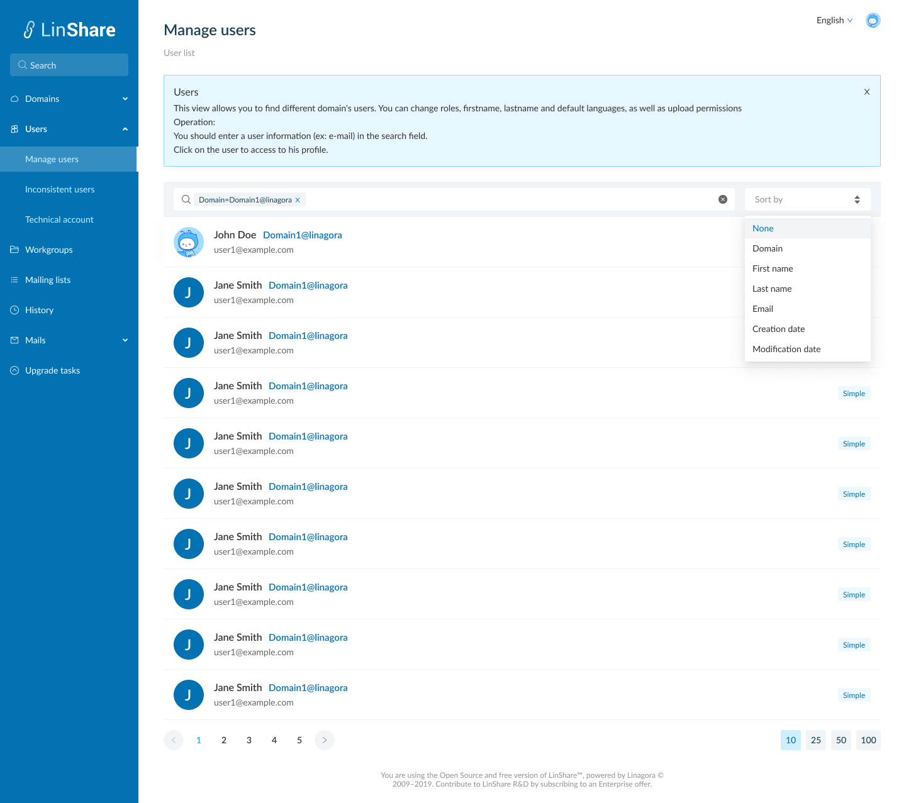

# Summary

* [Related EPIC](#related-epic)
* [Definition](#definition)
* [Screenshots](#screenshots)
* [Misc](#misc)

## Related EPIC

* [New admin portal](./README.md)

## Definition

#### Preconditions

*  Given that I am an admin of Linshare
*  After log-in successfully to Admin portal from the left menu, i click on the option "User" 

#### Description

*  The screen User list will be opened, i can see:
   *  Information tooltip: When i click on the icon information, a page description will be shown, then i click on the icon again, the description will be collapsed. 
   *  User list including:
      *  User icon
      *  First name
      *  Last name
      *  Email
      *  User's role
* A search bar
* A sort field 

#### Postconditions

* When I click on the search bar, there will be a drop-down list of search criteria including:
   * First name:  When i select this search citeria, the search bar will display: First name contains = "text input". I click Enter, the search tag is completed and an icon Detele. Then I click enter the system will search users which have first name contains text inputted.
   * First name:  When i select this search citeria, the search bar will display: First name contains = "text input". I click Enter,the search tag is completed and an icon Detele. Then I click enter the system will search users which have last name contains text inputted.
   * Domain: When select this search citeria, the search bar will display: First name contains = "dropdown list" List of options contain all domains. I select one domain, the search tag is completed with a delete icon.Then I click enter the system will search users which have selected domain.
   * Role: When i select this search criteria, the search bar will display Role = "Dropdown list". The options are: Admin/Simple. I select one role, the search tag is completed with a delete icon.Then I click enter the system will search users which have selected role
   * Type: When i select this search criteria, the search bar will display Type = "Dropdown list". The options are: Internal/Guest. I select one role, the search tag is completed with a delete icon.Then I click enter the system will search users which have selected type.
   * Restriected/ Guest creation right/Enable personal space: When i select one of these search criteria, the search bar will display Criteria name = "Boolean". I select Yes or No, the search tag is completed with a delete icon.Then I click enter the system will search users which have selected criteria value.
* When i start typing on search bar without select any search criteria from the dropdown list, the system will show default search criteria is email

- I can search users by one of above criteria or combine them
- Each search criteria in the search bar is seperated by a delete icon. I can click this icon to delete the criteria
- After select one criteria in search bar, that option is hidden in the dropdown list of search criteria.
- For example:
     - I chose First name as a search criteria
     - I type some character ex: Joe and click enter
     - Now the search bar is: First name contain John
     - When i click Space on search bar, i can see the list of criteria excluding First name. 
* When i click on Sort field, there will be drop-down list containing sort criteria: None, Domain, First name, Last name, Email, Creation date, Modification date.  
* I can select sort criteria from the list and use the arrow up and down to change order of sorting.
* The default number of displayed items is 25, i can change the number of iems at the bottom of page.
* If i am nested admin, i can only search domains in which that i am admin.
* If i am super admin, the result contain all users in all domain.

[Back to Summary](#summary)

## UI Design

#### Mockups
#### Final design

[Back to Summary](#summary)
## Misc

[Back to Summary](#summary)
