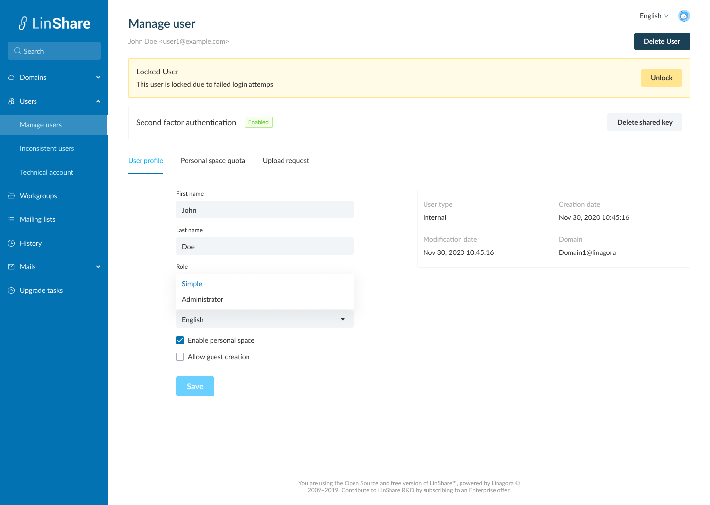
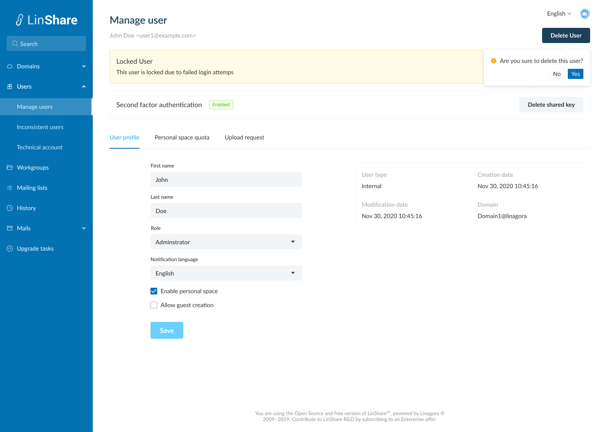
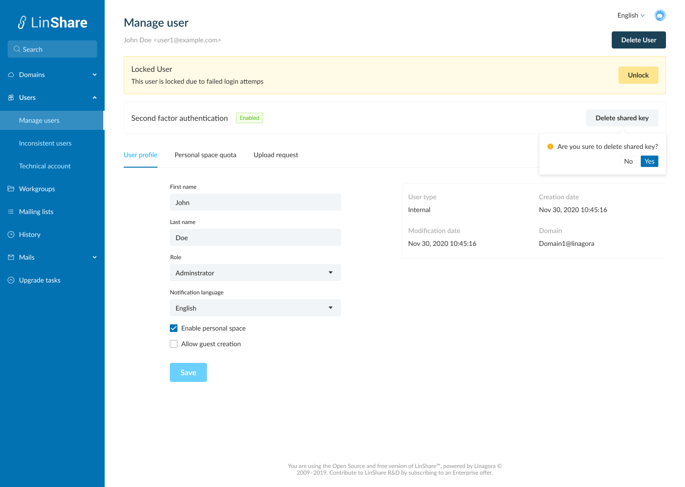

# Summary

* [Related EPIC](#related-epic)
* [Definition](#definition)
* [Screenshots](#screenshots)
* [Misc](#misc)

## Related EPIC

* [New admin portal](./README.md)

## Definition

#### Preconditions

*  Given that am an admin (super admin/ nested admin)

#### Description

*  After log-in Admin portal successfully, i go to User search page
*  I input search criteria and the system will display the result list
*  In the user list, i click on one user, the Manage user page will be opened 

#### Postconditions

*  The Manage user page will include:
   *  User name + email and button Delete this user. When i click on this button, there will be a confirmation message. If i choose Yes, then the user will be deleted.
   *  If this user is locked due to failed login attempts, he will be locked and there will be a session that said This user is locked due to failed login attempts, and a button Unlock. If i click on this button, there will be a confirmation message. If i choose Yes, the system will unlock this user and the session is disappeared from the current view.
   *  Second factor authentication:  If the status is enabled, there will be a button Delete shared key. When i click on this button, there will be a confirmation message. IF i choose Yes, the shared key will be removed and the 2FA is also disabled on the user UI and the status label changes to disabled. Now the Remove shared key button is disappeared.  
   *  Three tabs: User profile, Personal space quota, Upload request.
*  In Personal profile page, i can see: 
   *  In the right part, these fields are not editable: User type, Creation date, modification date, domain. 
   *  The editable fields on the left including:
      *  First name: text 
      *  Last name: text 
      *  Role: Drop-down. Options list: Simple, Administrator
      *  Notification language: Drop-down. Option list: English, French, Russian
      *  Enable personal space: Check box. If i untick this box, the user cannot see Myspace section and cannot upload file to Myspace 
      *  Guest creation: If i untick this box, the user cannot see the Guest section in Contact 
      *  When i click button Save, all the updates in the tab will be saved.
      *  When i click button Cancel, the system will not save any updates. 

[Back to Summary](#summary)

## UI Design

#### Mockups
#### Final design

[Back to Summary](#summary)
## Misc

[Back to Summary](#summary)
