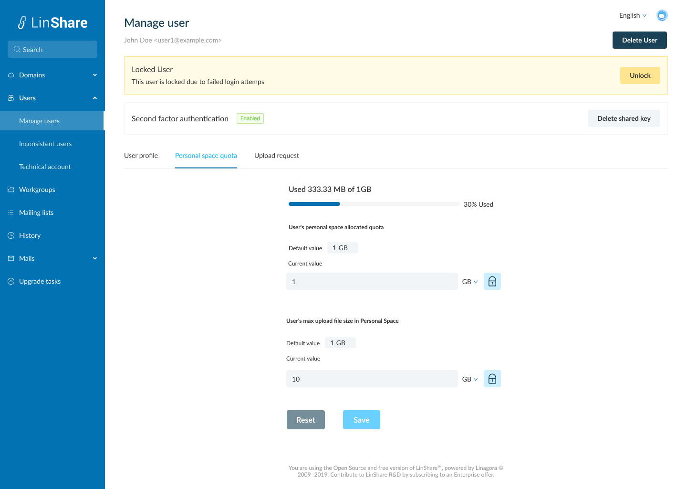
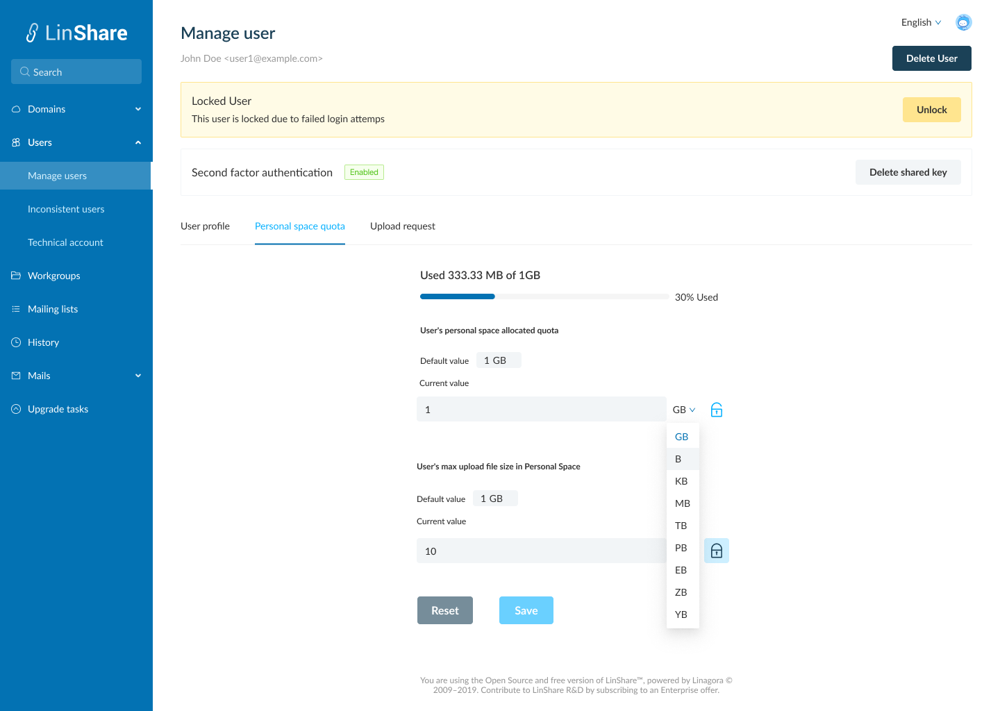
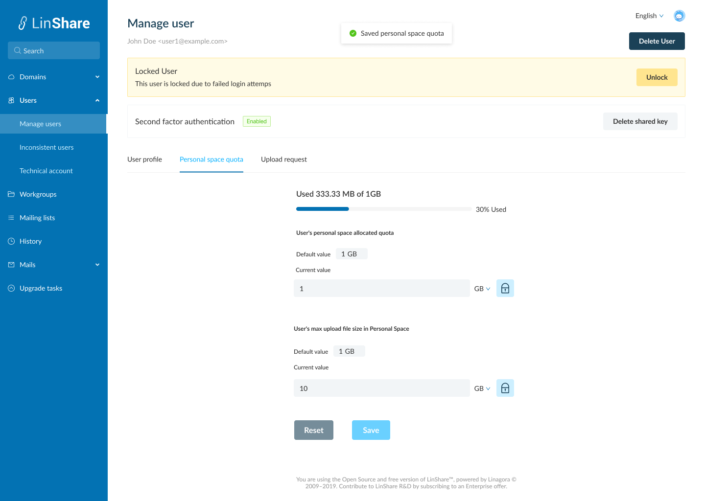

# Summary

* [Related EPIC](#related-epic)
* [Definition](#definition)
* [Screenshots](#screenshots)
* [Misc](#misc)

## Related EPIC

* [New admin portal](./README.md)

## Definition

#### Preconditions

* Given that am an admin (super admin/ nested admin)

#### Description

* After log-in Admin portal successfully, i go to User search page
* I input search criteria and the system will display the result list
* In the user list, i click on one user, the Manage user page will be opened
* I click on Personal space quota page tab

#### Postconditions

* On this tab i can see :
   *  Used Space/Remaining quota chart: When i change the personal quota, this chart is also changed. 
   *  User's personal space allocated quota: I can see 2 fields Default value is 100 GB and non-editable. and Current value that can be overrided. When i click button Override default value, the field is editable now (number only) and i can choose the unit in the dropdown list (B, KB,MB,GB,TB,PB,EB,ZB,YB). Total files size in user's myspace cannot exceed this values. 
   *  User's max upload file size in Personal Space:  I can see 2 fields Default value is 10 GB and non-editable. and Current value that can be overrided. When i click button Override default value, the field is editable now (number only) and i can choose the unit in the dropdown list (B, KB,MB,GB,TB,PB,EB,ZB,YB). User cannot upload file with the size exceed this value. 
   *  The user's max upload file size in Personal space need to be smaller than User'personal space allocated quota. If not, there will be an error message and the field is highlight. 
* When i click on button Use default, the User's personal space allocated quota and User's personal space allocated quota will be set to default value
*  When i click button Save, all the changes will be updated 
*  When i click button Reset, all the changed will not be saved. 

[Back to Summary](#summary)

## UI Design

#### Mockups
#### Final design

[Back to Summary](#summary)
## Misc

[Back to Summary](#summary)
