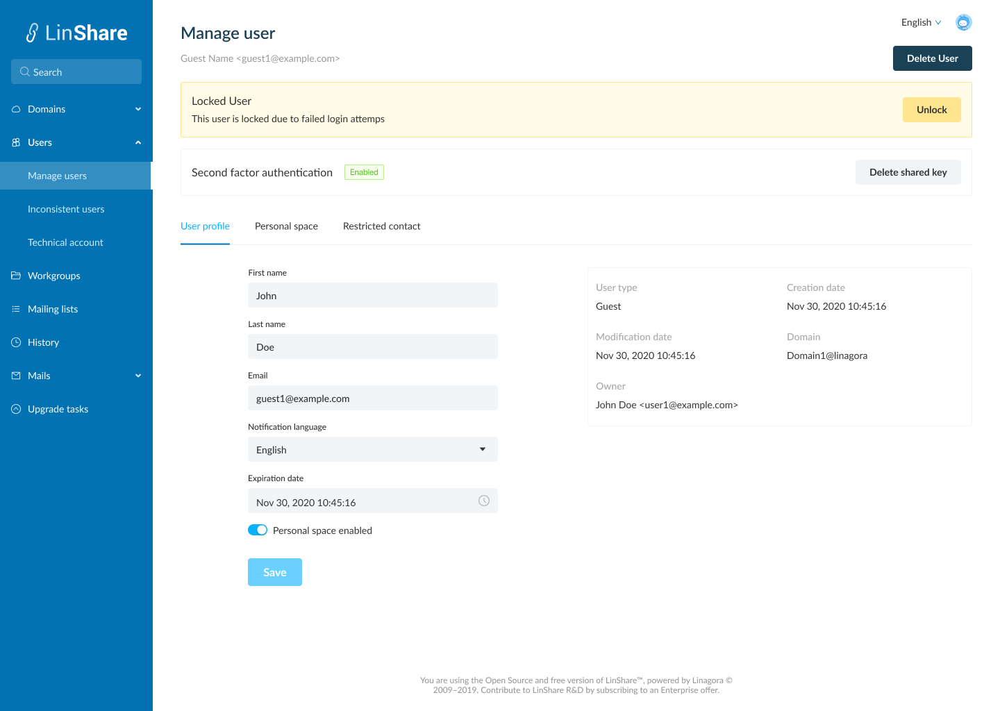
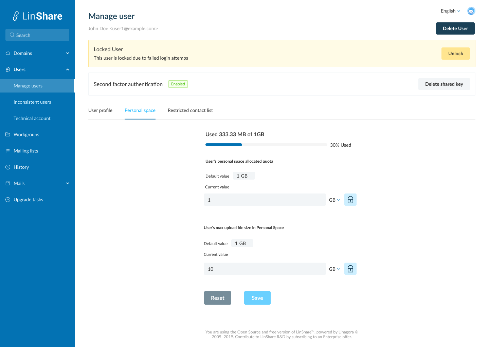
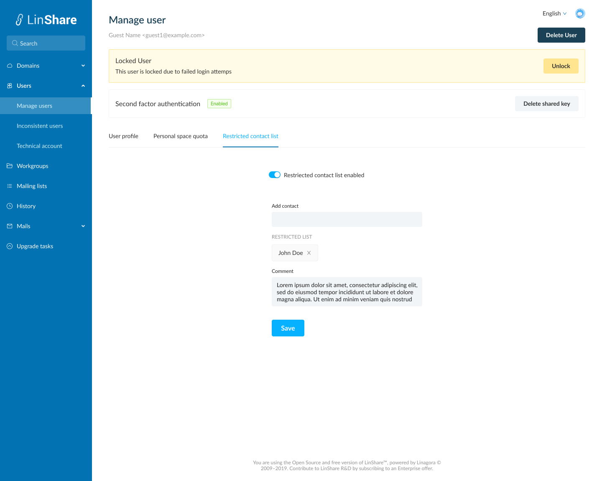

# Summary

* [Related EPIC](#related-epic)
* [Definition](#definition)
* [Screenshots](#screenshots)
* [Misc](#misc)

## Related EPIC

> Links to the epic document in the epic folder, normally README.

* [Name of the epic](./README.md)

## Definition

#### Preconditions

* Given that am an admin (super admin/ nested admin)

#### Description

* After log-in Admin portal successfully, i go to User search page
* I input search criteria and the system will display the result list
* In the user list, i click on one guest account, the Manage user page will be opened

#### Postconditions

* The Manage user page will include:
  * User name + email and button Delete this user
  * If this user is locked due to failed login attempts, he will be locked and there will be a session that said This user is locked due to failed login attempts, and a button Unlock. If i click on this button, there will be a confirmation message. If i choose Yes, the system will unlock this user and the session is disappeared from the current view. Now user can log-in User portal as normal. 
  * Second factor authentication: If the status is enabled, there will be a button Delete shared key. When i click on this button, there will be a confirmation message. IF i choose Yes, the shared key will be removed and the 2FA is also disabled on the user portal and the status label changes to disabled. Now the Remove shared key button is disappeared.
  * Three tabs: User profile, Personal space quote, Restricted contact 
* In Personal profile page, i can see:
  * In the right part, these fields are not editable: User type, Creation date, modification date, Owner, Domain.
  * The editable fields on the left including:
    * First name: text that shows current'user first name, this field cannot be blank
    * Last name: text that shows current's user last name, this field cannot be blank
    * Notification language: Drop-down. Option list: English, French, Russian
    * Expiration date: Display current expiration date. 
       * When i click on date picker, i can chooose another expiration date. I cannot choose the expiration date <= today. When i click Save button, the new expiration date will be updated.
       * On date picker, the maximum expiration date is displayed with a tooltip. The value is computed with the Guest functionality of the author's domain.
       * When i hover the tooltip, i can see the message :" The author of this guest is limited by the maximum expiration date. As an admin, you can override this date."
    * Email: text that show current's user email.
    * Enable personal space: Check box. If i untick this box, the user cannot see Myspace section and cannot upload file to Myspace
    * When i click button Save, all the updates in the tab will be saved.
    * When i click button Cancel, the system will not save any updates.

*  In the Personal space quota, the same as normal user.
*  On expiry date, the guest account will be deleted and admin cannot search that guest, the guest cannot log-in to user Portal. 

[Back to Summary](#summary)

## UI Design

#### Mockups
#### Final design

[Back to Summary](#summary)
## Misc

[Back to Summary](#summary)
