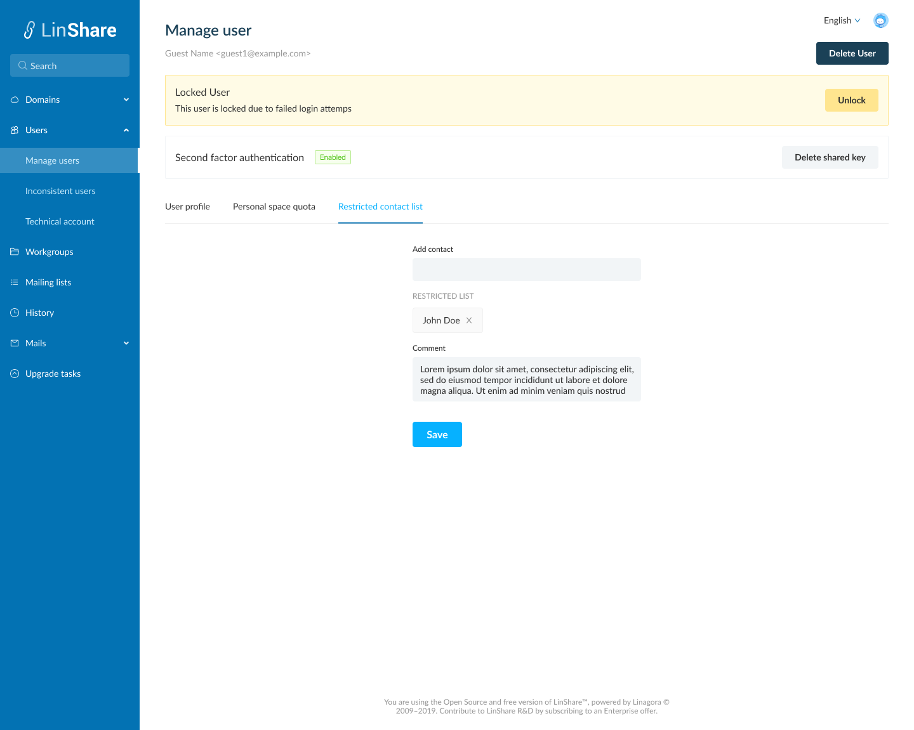
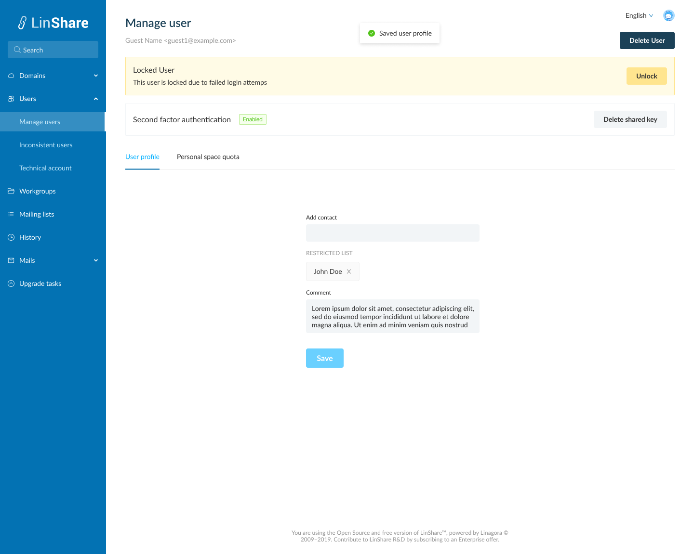

# Summary

* [Related EPIC](#related-epic)
* [Definition](#definition)
* [Screenshots](#screenshots)
* [Misc](#misc)

## Related EPIC

> Links to the epic document in the epic folder, normally README.

* [Name of the epic](./README.md)

## Definition

#### Preconditions

*  Given that am an admin (super admin/ nested admin)

#### Description

*  Given that am an admin (super admin/ nested admin)
*  After log-in Admin portal successfully, i go to User search page
*  I input search criteria and the system will display the result list
*  In the user list, i click on one guest, the Manage user page will be opened 
*  Guest account will have 3 tabs: I click on third tab Restricted contact list

#### Postconditions

* On this tab i can see:
   *  Add contact field
   *  Restricted contact list: Show the current restricted contact of the guest
   *  Comment: Text input 
*  When i input in the "Add contact" field, the system will search in DB and display result list below, i can choose one of them and the selected person will be added to the Restricted contact list.
*  I can click on button X to remove restricted contact out of the list.
*  I click button Save, system will validate: 
   *  If the field Restricted contact is ticked but there is no contact in field Restricted contact list, there will be an error message: "You can not update a restricted guest without a list of contacts"
   *  If there is >= 1 contact in the Restricted contact list, system will display message: " Update successfully" 
*  The owner of the guest ( an internal Linshare user)  is also can manage that guest's restricted contact list. When admin updates a guest'restricted contact list in Admin site, it will affect the guest'owner site (User portal), and vice versa. For example, if user A create guest B, and he set up that guest B has restricted contact that contains only user A. Domain addmin go to Admin portal and add user C to guest B's restricted contact list, now user A go to see detail of guest B, he can see guest B's restricted contact list contains user B and User C. 

*  When a guest has a restricted contact list, he can only see/interact/share with persons in this list. When the restricted contact list is disabled, he can see/interact/share as a normal user.

[Back to Summary](#summary)

## UI Design

#### Mockups
#### Final design

[Back to Summary](#summary)
## Misc

[Back to Summary](#summary)
